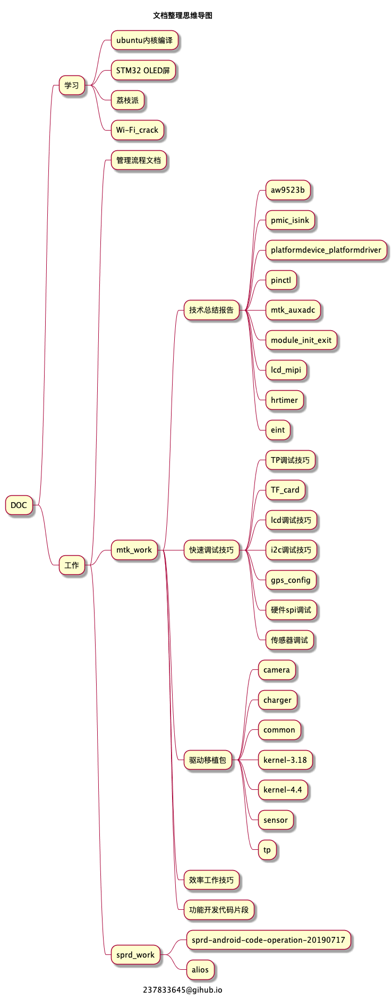

# DOC

## 工作

[工作文档总目录](work/index.md)

## 学习

[学习文档总目录](study/index.md)

## 导图

@startmindmap
caption 237833645@gihub.io
title 文档整理思维导图

* DOC

** 学习
*** ubuntu内核编译
*** STM32 OLED屏
*** 荔枝派
*** Wi-Fi_crack

** 工作
*** 管理流程文档
*** mtk_work
**** 技术总结报告
***** aw9523b
***** pmic_isink
***** platformdevice_platformdriver
***** pinctl
***** mtk_auxadc
***** module_init_exit
***** lcd_mipi
***** hrtimer
***** eint
**** 快速调试技巧
***** TP调试技巧
***** TF_card
***** lcd调试技巧
***** i2c调试技巧
***** gps_config
***** 硬件spi调试
***** 传感器调试
**** 驱动移植包
***** camera
***** charger
***** common
***** kernel-3.18
***** kernel-4.4
***** sensor
***** tp
**** 效率工作技巧
**** 功能开发代码片段
*** sprd_work
**** sprd-android-code-operation-20190717
**** alios
@endmindmap
