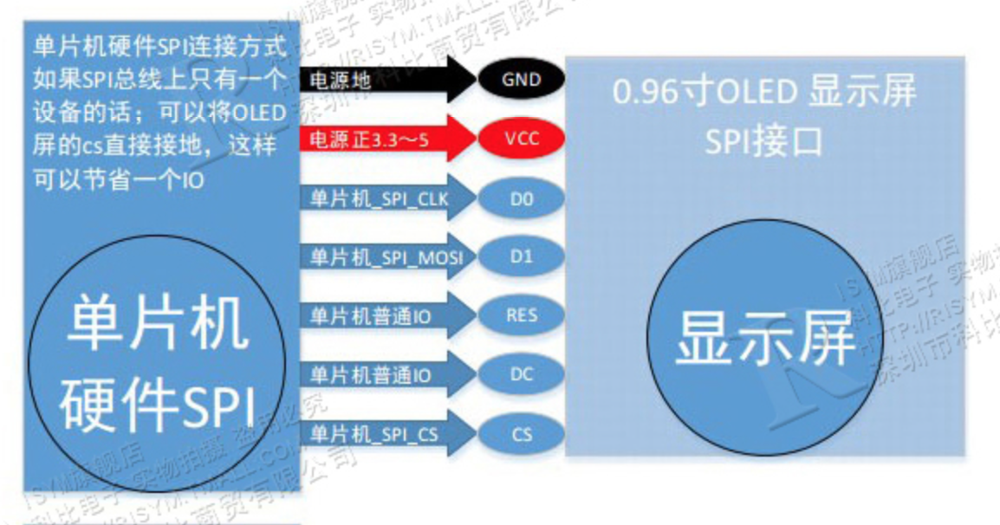
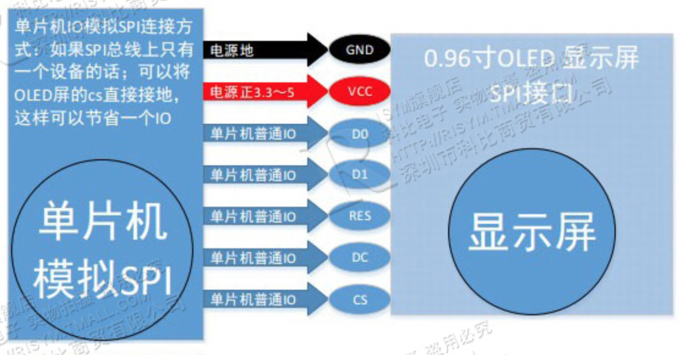
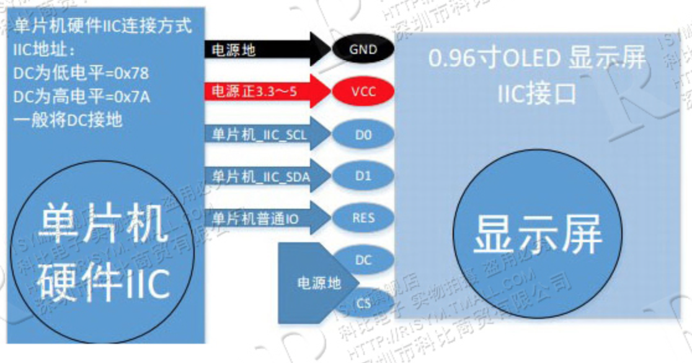
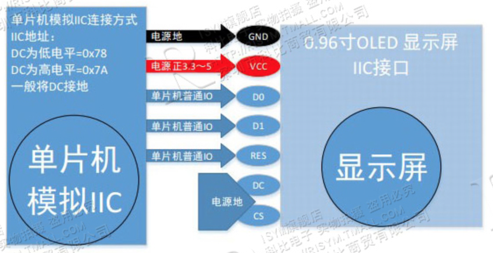
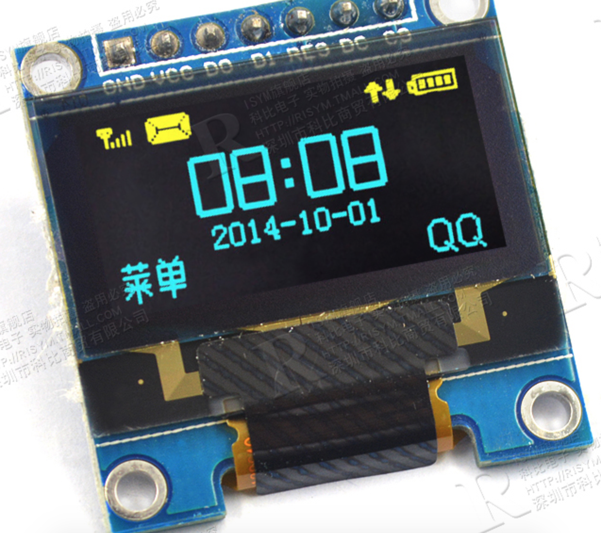

# 0.96寸OLED显示屏模块 黄蓝双色屏幕开发板12864屏STM32 IIC/SPI

淘宝地址：<https://detail.tmall.com/item.htm?_u=g27i0qu5a07a&id=573363075194>

资料下载地址：<https://pan.baidu.com/s/1ArqSpLArCiRvFxc61qd1Qw>

## 产品介绍

- 128 x 64 分辨率屏幕
- STM32 spi iic 7脚
- 无需背光，显示单元能自发光
- 3V~5V电压
- 27.3 x 27.8 x 3.77 mm
- 驱动芯片 SSD1306
- 引脚定义

|引脚名 |作用|
|---|---|
|GND|接地|
|VCC|电源正3~5v|
|D0 |SPI接口为SPI时钟、IIC接口为IIC时钟 |
|D1 |SPI接口为SPI数据线、IIC接口为IIC数据线   |
|RES|ILED复位、OLED上电需要复位   |
|DC |SPI数据/命令选择脚、IIC接口用来设置地址   |
|CS |OLED  SPI片选、低电平有效、如不想用接地   |

- 接线规则

- 产品效果图

