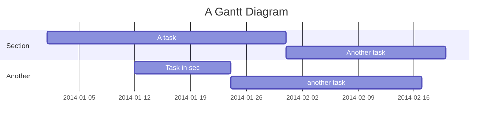

# MarkDown学习笔记

## 1. 代码片段 <!-- 如要带代码高亮效果，3个反引号开始处加上编程语言名 -->

```C
static void help_print_interface(const struct interface *i)
{
    struct method *m;

    for (m = i->methods; strcmp(m->name, "") != 0; m++)
        haltest_info("%s %s %s\n", i->name, m->name,(m->help ? m->help : ""));
}
/* Help completion */
```

```bash
#!/bin/bash
find . -name * | xargs rm  -f {}
```

---

## 2. 引用

> 这是个**引用**
> *世间本没有路*，走的人多了就成了路

## 3. 链接

* 文字链接
        [百度网页](www.baidu.com)
        [blog](https://237833645.github.io)
        <http://www.example.com>
        `http://www.example.com`

* 图片链接

## 4. 插入

* 插入文字

* 插入图片


* 插入表格

<!--
:--- 代表左对齐
:--: 代表居中对齐
---: 代表右对齐
-->

asss | sdad | sdad
-----|:----:|:-----:
sdaasd |das|dsada
sda|safaadsd|dasfasadas

dog | bird | cat
----|------|----
foo | foo  | foo
bar | bar  | bar
baz | baz  | baz

* 插入音乐

## 5. Todo

* [x] todo 1
* [ ] todo 2
  * [ ] todo 3

1. [x] todo 3
2. [ ] todo 4

## 公式

[gs]:(http://latex.codecogs.com/gif.latex?\prod%20\(n_{i}\)+1)

## 流程图

* 一个纯文本的语法怎么画图？
* 将流程图代码包含在\```folw和```之间即可
* 流程图代码分两块，上面一块是创建你的流程（创建元素），然后隔一行，创建流程的走向(连接元素)
* 创建流程（元素）：tag=>type: content:>url
  * tag 是流程图中的标签，在第二段连接元素时会用到。名称可以任意，一般为流程的英文缩写和数字的组合。
  * type 用来确定标签的类型，=>后面表示类型。由于标签的名称可以任意指定，所以要依赖type来确定标签的类型
  * 标签有6种类型：start end operation subroutine condition inputoutput
  * content 是流程图文本框中的描述内容，: 后面表示内容，中英文均可。特别注意，冒号与文本之间一定要有个空格
  * url是一个连接，与框框中的文本相绑定，:>后面就是对应的 url 链接，点击文本时可以通过链接跳转到 url 指定页面
* 指向流程(连接元素)：标识（类别）->下一个标识
  * 使用 -> 来连接两个元素
  * 对于condition类型，有yes和no两个分支，如示例中的cond(yes)和cond(no)
  * 每个元素可以制定分支走向，默认向下，也可以用right指向右边，如示例中cond2(yes,right)。
* 代码例子
> \```flow
st=>start: 开始
e=>end: 登录
io1=>inputoutput: 输入用户名密码
sub1=>subroutine: 数据库查询子类
cond=>condition: 是否有此用户
cond2=>condition: 密码是否正确
op=>operation: 读入用户信息
st->io1->sub1->cond
cond(yes,right)->cond2
cond(no)->io1(right)
cond2(yes,right)->op->e
cond2(no)->io1
> \```

* 效果图

```flow
st=>start: 开始
e=>end: 登录
io1=>inputoutput: 输入用户名密码
sub1=>subroutine: 数据库查询子类
cond=>condition: 是否有此用户
cond2=>condition: 密码是否正确
op=>operation: 读入用户信息
st->io1->sub1->cond
cond(yes,right)->cond2
cond(no)->io1(right)
cond2(yes,right)->op->e
cond2(no)->io1
```

## 序列图

* 语法
> \```sequence
* 标题
> Title: 我是标题
* 对象
> participant A
> participant B as b-alias
* 交互
> sequence A->B: 连接
* 代码片段

> \```sequence
participant A
participant B
A->B: 方法
>\```

* 实际效果

```sequence
participant A
participant B
participant C
A->B: 方法1
B-->A: 方法2
A-->>C: 方法3
B->B: 方法4
C->A: 方法5
```

* 标记分类
> \- 代表实线 ， 主动发送消息，比如 request请求
\> 代表实心箭头 ， 同步消息，比如 AJAX 的同步请求
\-- 代表虚线，表示返回消息，spring Controller return
\>> 代表非实心箭头 ，异步消息，比如AJAX请求

* 代码示例1

> \```sequence
participant A
participant B
participant C
A->B: 方法
B-->C: 请求
C-->>A: 成功
\```

* 效果演示1

```sequence
participant A
participant B
participant C
A->B: 方法
B-->>C: 请求
C-->A: 成功
```

* 效果演示2

```sequence
participant 客户端
participant 控制器
participant 业务
participant 数据库
客户端->控制器: 提交数据店铺
Note right of 客户端: 提交数据JavaScript进行验证
控制器->控制器: 验证数据完整性
Note left of 控制器: 返回错误的字段信息
控制器-->客户端: 数据不完整
控制器->业务: 保存店铺到数据库
业务->业务: save店铺数据
业务-->控制器: 保存出现异常
控制器-->客户端: save异常，提示客户端
业务->数据库: 保存成功
数据库-->业务: success
业务-->控制器: success
控制器-->客户端: success
Note left of 控制器: 返回正确的提示,并跳转到审核第二步
```

## 甘特图


