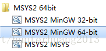

# MSYS2、MinGW使用

---

## 概要描述

MSYS2 （Minimal SYStem 2） 是一个MSYS的独立改写版本，主要用于 shell 命令行开发环境。同时它也是一个在Cygwin （POSIX 兼容性层） 和 MinGW-w64（从"MinGW-生成"）基础上产生的，追求更好的互操作性的 Windows 软件。

### MSYS2是什么

MSYS2 [1]  是MSYS的一个升级版,准确的说是集成了pacman和Mingw-w64的Cygwin升级版, 提供了bash shell等linux环境、版本控制软件（git/hg）和MinGW-w64 工具链。与MSYS最大的区别是移植了 Arch Linux的软件包管理系统 Pacman(其实是与Cygwin的区别)。


### MSYS2特点

- 安装方便
- 自带 pacman 管理，可以使用 pkgtool 来 makepkg
- 较快的源速度（可以修改源地址）
- 自带软件和库较全而且比较新
- 使用mingw-w64工具链,可以编译32位或64位代码（需要自行安装）
- 中文支持好,可以直接输入和浏览中文目录

### MinGW是什么

MinGW，是Minimalist GNUfor Windows的缩写。它是一个可自由使用和自由发布的Windows特定头文件和使用GNU工具集导入库的集合，允许你在GNU/Linux和Windows平台生成本地的Windows程序而不需要第三方C运行时（C Runtime）库。MinGW 是一组包含文件和端口库，其功能是允许控制台模式的程序使用微软的标准C运行时（C Runtime）库（MSVCRT.DLL）,该库在所有的 NT OS 上有效，在所有的 Windows 95发行版以上的 Windows OS 有效，使用基本运行时，你可以使用 GCC 写控制台模式的符合美国标准化组织（ANSI）程序，可以使用微软提供的 C 运行时（C Runtime）扩展，与基本运行时相结合，就可以有充分的权利既使用 CRT（C Runtime）又使用 WindowsAPI功能。

### mingw64、mingw32 MSYS2的区别

- MinGW 的全称是：Minimalist GNU on Windows ，MinGW 就是 GCC 的 Windows 版本 。
- MSYS 是用于辅助 Windows 版 MinGW 进行命令行开发的配套软件包，提供了部分 Unix 工具以使得 MinGW 的工具使用起来方便一些。如果不喜欢庞大的 Cygwin，而且使用不多，可以试试。不过喜欢完整体验、不在乎磁盘占用等等，还是推荐 Cygwin 而不是 MSYS。
- MinGW-w64 与 MinGW 的区别在于 MinGW 只能编译生成32位可执行程序，而 MinGW-w64 则可以编译生成 64位 或 32位 可执行程序。  
- Cygwin是模拟 POSIX 系统，源码移植 Linux 应用到 Windows 下；MinGW 是用于开发 Windows 应用的开发环境。

0. MSYS2系统运行于windows上。
1. MSYS2本身支持一个gcc，这个gcc编译unix代码，编译出来的可执行文件是windows的PE，带msys2xxx.dll可以在windows下运行。
2. MSYS2设计目标是用于在windows上运行mingw的gcc工具链的。
3. MSYS2的mingw有2套，一个是mingw32，一个是mingw64
4. mingw32和mingw64都可以生成win32和win64的“纯净”（不用msys2xxx.dll支持）的PE。
5. MSYS2的那个原始的gcc可以编译unix代码，但支持的函数仅限于POSIX部分，其他系统调用都不支持，如linux的epoll,eventfd等等，所以功能有限，不建议基于这个平台开发商业软件。
6. MSYS2的官方提供了已经用mingw编译的一些开发库，如glibc、libgtk+等，为GTK+程序向windows移植提供了极大的便利。
7. MSYS2上面不支持的包，可以在mingw体系下，用源代码configurate，然后make install。（我已经成功应用了安装了源码包SDL2、FFmpeg等）
- 详细区别可以访问[https://www.cnblogs.com/tshua/p/5932501.html](https://www.cnblogs.com/tshua/p/5932501.html)

---

## 使用

### 安装使用

下载地址：[http://www.msys2.org/](http://www.msys2.org/)

**运行不同的shell执行的是不同的编译环境，不同的环境需要安装不同的编译器**



pacman是MSYS2自带的软件管理工具

### MSYS2使用

- 运行msys2_shell.bat: pacman -Sy 更新本地包数据

- 升级核心包,  之后需要关闭所有 MSYS2 shell，然后运行 autorebase.bat

  ```groovy
  $ pacman -S --needed filesystem msys2-runtime bash libreadline libiconv libarchive libgpgme libcurl pacman ncurses libintl
  ```

- 升级其他包：
  > $ pacman -Su

- 常用命令:
  
  ```groovy
  pacman -Q查看已安装的软件包
  pacman -S -g查看软件组
  pacman -Q -g base-devel查看软件组包含的软件
  pacman -Q -l vim查询软件包的内容
  pacman -Q -s nettle查询软件所在的包
  pacman -h / pacman -S -h 查看工具帮助
  ```

- MSYS2自带的开发环境，安装的包叫 msys2-devel

  ```groovy
    $ pacman -S msys2-devel
    :: 共有 6 组员在组 msys2-devel 中：
    :: 软件库 msys
    1) binutils  2) cocom  3) gcc  4) gcc-fortran  5) msys2-w32api-headers
    6) msys2-w32api-runtime
  ```

### MinGW-w64使用

- pacman -Syu更新系统核心和各种包

  ```groovy
  $ pacman -Syu 更新系统
  $ pacman -S  mingw-w64-x86_64-toolchain 工具链
  $ pacman -S  base-devel git wget perl ruby python2 核心包和工具包
  ```

---

## 总结

- MSYS2可以理解成就是cygwin功能，编译出来的可执行文件，要依赖MSYS2提供的动态链接库msys-2.0.dll，这个 DLL 提供了 Linux 下编程的提供的函数和接口。
  编译 GNU 提供的各种工具，编译工具的环境。
- MinGW-w64是既可以编译源码程序又可以基于winAPI开发windows程序，不再依赖于 msys-2.0.dll，KERNEL32.dll和msvcrt.dll都是 windows 提供的。
  如果源代码就是基于 windows 开发的，那使用 MinGW 的编译环境比较好，编译出来的可执行文件，不用再依赖 MSYS 提供的动态链接库。当然，前提是代码中不能使用 Linux 的东西，即 POSIX 的那套东西。

1. MSYS2的原生gcc是编译unix代码的，生成exe，运行时依赖msys2xxx.dll
2. MYSY2上的mingw32和mingw64的功能是一样的，都是用于编译windows代码（能调用windows API，不能调用unix系统调用）的，生成exe，运行时只依赖windows系统的dll。
3. 至于（2），跟linux上的mingw是一样的。（我以前在一直在linux用mingw交叉编译windows程序。）
4. 开发专业应用软件，不要使用MSYS2的原生gcc平台，这个平台是为了给mingw提供工具链的，是制造工具的工具。

---