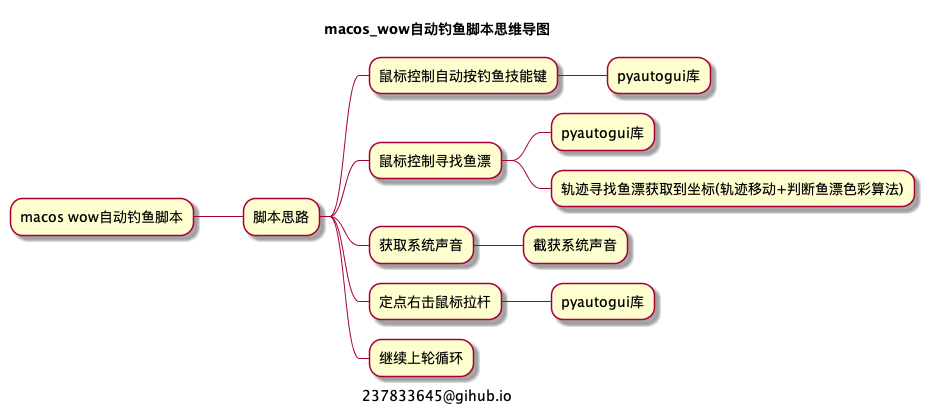

# macos wow自动钓鱼脚本

## 思路整理

<!--

@startmindmap
caption 237833645@gihub.io
title macos_wow自动钓鱼脚本思维导图

* macos wow自动钓鱼脚本
** 脚本思路
*** 鼠标控制自动按钓鱼技能键
**** pyautogui库
*** 鼠标控制寻找鱼漂
**** pyautogui库
**** 轨迹寻找鱼漂获取到坐标(轨迹移动+判断鱼漂色彩算法)
*** 获取系统声音
**** 截获系统声音
*** 定点右击鼠标拉杆
**** pyautogui库
*** 继续上轮循环

@endmindmap
-->

## 问题分解

- pyautogui移动鼠标、点击、定点点击
- 找鱼漂的鼠标移动算法(如何最快寻找)
- 找鱼漂的鼠标移动算法每移动一次需要定点查询色彩判断是否找到
- 如何判断声音

## 功能demo分段

## 钓鱼功能整合

## 参考文档

[辛酸历程]在Mac中使用Python获取屏幕截图 [https://www.cnblogs.com/numbbbbb/p/3236595.html](https://www.cnblogs.com/numbbbbb/p/3236595.html)  
OS X Screen capture from Python/PyObjC[http://neverfear.org/blog/view/156/OS_X_Screen_capture_from_Python_PyObjC](http://neverfear.org/blog/view/156/OS_X_Screen_capture_from_Python_PyObjC)  
dingyaguang117 更新为 pyobjc方式截图； 优化识别速度[https://github.com/dingyaguang117/minesweeper-helper/blob/master/screen_capture.py](https://github.com/dingyaguang117/minesweeper-helper/blob/master/screen_capture.py)  
