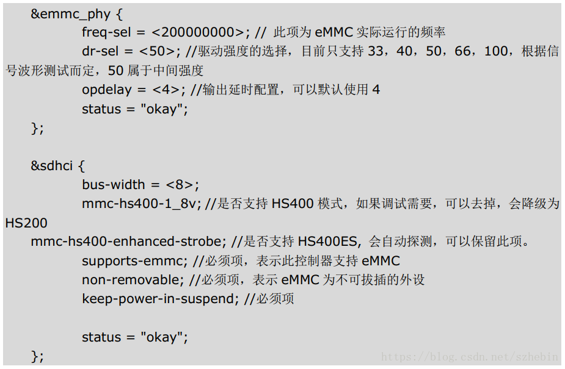
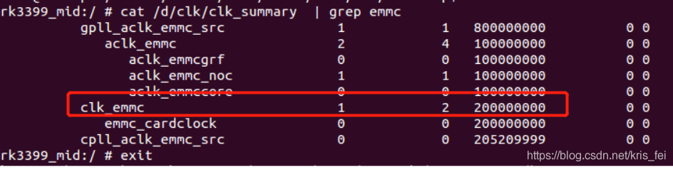

# rk3399 mmc文档整理

## U-Boot MMC Device Driver Analysis

[Rockchip-Developer-Guide-Uboot-mmc-device-driver-analysis.pdf](./res/Rockchip-Developer-Guide-Uboot-mmc-device-driver-analysis.pdf)

---

## dts配置文件解读



---

## 调整eMMC时钟速率

由于板子可能不稳定，需要降低eMMC速率验证测试。

查看当前速率



降低速率到150MHz

```code
diff --git a/arch/arm64/boot/dts/rockchip/rk3399-vop-clk-set.dtsi b/arch/arm64/boot/dts/rockchip/rk3399-vop-clk-set.dtsi
index f13985c..31ed375 100644
--- a/arch/arm64/boot/dts/rockchip/rk3399-vop-clk-set.dtsi
+++ b/arch/arm64/boot/dts/rockchip/rk3399-vop-clk-set.dtsi
@@ -51,7 +51,7 @@
 &sdhci {
    assigned-clocks = <&cru SCLK_EMMC>;
    assigned-clock-parents = <&cru PLL_GPLL>;
-   assigned-clock-rates = <200000000>;
+   assigned-clock-rates = <150000000>;
 };
```

---

## RK3399怎么修改EMMC容量

只要在支持列表，是自动识别的，kernel里面已经做好16G和8G的分区列表，根据识别的型号主动匹配到各自大少的列表进行分区，一般不用改的.

---

## linux rk3399该如何进行emmc读写速度测试

打开开发板电源

- dd的方法：在终端输入命令

```code
1.运行以下命令以测试磁盘的WRITE速度：
$sync; dd if=/dev/zero of=tempfile bs=1M count=1024; sync
2.运行以下命令以查找缓冲区的读取速度：
$dd if=tempfile of=/dev/null bs=1M count=1024
该文件tempfile是由上一条命令刚刚创建的，已缓存在缓冲区中，其读取速度比直接从磁盘读取的实际速度要高得多。
为了获得真正的速度，我们必须清除缓存。

3.清除缓存并直接从磁盘准确测量实际的读取速度
$sudo /sbin/sysctl -w vm.drop_caches=3
$dd if=tempfile of=/dev/null bs=1M count=1024
```

- iozone的方法：

```code
将开发板连接到公网
输入指令下载安装：
$sudo apt-get install iozone3

也可以在PC浏览器下载移植

安装完后开始进行测试:
$iozone -I -aezco -i 0 -i 1 -i 2 -y 64 -g 4G -f iots -Rb hs400.xls

当此应用运行一段时间后，按ctrl+C结束测试，

并在当前目录下发现新增了hs400.xls文件，将这个文件拉到windows中打开，

excel表格产生。
```

---

## eMMC分区号和名字的对应

有时候需要知道mmcblk对应的分区是哪一个，其实驱动已经完成这个功能了，如下：

```code
root@rk3288:/dev/block/platform/ff0f0000.rksdmmc/by-name # ls -l
lrwxrwxrwx root root 2017-01-01 13:41 backup -> /dev/block/mmcblk0p7
lrwxrwxrwx root root 2017-01-01 13:41 boot -> /dev/block/mmcblk0p5
lrwxrwxrwx root root 2017-01-01 13:41 cache -> /dev/block/mmcblk0p8
lrwxrwxrwx root root 2017-01-01 13:41 kernel -> /dev/block/mmcblk0p4
lrwxrwxrwx root root 2017-01-01 13:41 kpanic -> /dev/block/mmcblk0p9
lrwxrwxrwx root root 2017-01-01 13:41 metadata -> /dev/block/mmcblk0p11
lrwxrwxrwx root root 2017-01-01 13:41 misc -> /dev/block/mmcblk0p2
lrwxrwxrwx root root 2017-01-01 13:41 radical_update -> /dev/block/mmcblk0p12
lrwxrwxrwx root root 2017-01-01 13:41 recovery -> /dev/block/mmcblk0p6
lrwxrwxrwx root root 2017-01-01 13:41 resource -> /dev/block/mmcblk0p3
lrwxrwxrwx root root 2017-01-01 13:41 system -> /dev/block/mmcblk0p10
lrwxrwxrwx root root 2017-01-01 13:41 uboot -> /dev/block/mmcblk0p1
lrwxrwxrwx root root 2017-01-01 13:41 userdata -> /dev/block/mmcblk0p13
```

---

## Rockchip的linux的emmc性能分析

Rockchip分支持hs200和hs400模式。如果是hs400，emmc的读可以x2,如果是hs200就不能x2  
像rk3399支持hs400那么emmc颗粒的读性能是:  clk(150M) * (1B (byte) = 8 bit=8 data)  * 效率（70%）* 2 ddr模式 = 210MB/s 左右  
（特别说明/dev/mmcblk1p9是userdata 14G剩余空间做测试，不要在/dev/mmcblk1p8（rootfs）分区做读写测试，防止被破坏。像debian如果有出现分区异常可以resize2fs /dev/mmcblk1p9先）  

比如实际测试emmc的读性能:

```code
# dd if=/dev/mmcblk1p9 of=/dev/null bs=1M count=2000 iflag=direct,nonblock
2000+0 records in
2000+0 records out
2097152000 bytes (2.1 GB, 2.0 GiB) copied, 9.81249 s, 214 MB/s
```

emmc的写性能与emmc的颗粒相关：

```code
dd if=/dev/zero of=/dev/mmcblk1p9 bs=1M count=2000 oflag=direct,nonblock
2000+0 records in
2000+0 records out
2097152000 bytes (2.1 GB, 2.0 GiB) copied, 55.6608 s, 37.7 MB/s
```

---

## SDMMC SDIO eMMC 开发指南

[Rockchip_Developer_Guide_SDMMC_SDIO_eMMC_CN.pdf](./res/Rockchip_Developer_Guide_SDMMC_SDIO_eMMC_CN.pdf)

---
