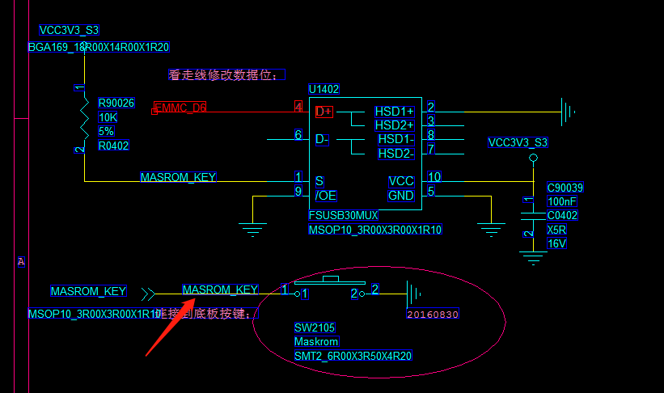

# Rk3399 固件下载

参考文档《Android 开发工具用户手册》路径：“RKTools\windows\AndroidTool\AndroidTool_Release_v2.65”

[Android开发工具手册_v1.2.pdf](./res/Android开发工具手册_v1.2.pdf)

## USB 驱动安装

挖掘机驱动升级前需要先安装驱动，工具路径：

SDK\RKTools\windows\Release_DriverAssitant， 打开“DriverInstall.exe”， 点击
“驱动安装”，提示安装驱动成功即可。

## 挖掘机刷机方式（两种）

### 进入 Maskrom 升级方式

在系统上电前 EMMC_CLKO 对地短路， 使 eMMC 引导失败，从而进入 Maskrom 状态 (蓝宝石主板端使用的是EMMC_D6接地来完成)

具体步骤如下：

```code
1、 连接 USB OTG 到电脑 PC 端，按住主板的 Maskrom 按键不放。
2、 给 EVB 供电 12v，要是已经上电情况下，按下复位按键。
3、 等待会儿烧写工具将显示发现一个 Maskrom 设备，释放 Maskrom 按键。需要注意的是
在 Maskrom 状态下需要同时选择对应的 Loader 才能升级。
4、 烧写工具对应选择 Loader、 Parameter、 Misc、 Kernel、 Resource、 System 等文件。
5、 点击执行，即进入升级状态，在工具的右侧有进度显示栏，显示下载与校验情况。
```

蓝宝石主板端使用Maskrom按键导致是EMMC_D6接地来完成进入Maskrom模式



### 进入 Loader 升级方式

在系统上电前保证 ADKEY_IN 是低电平，系统将进入 Loader 状态。

具体步骤如下:

```code
1、连接 USB OTG 到电脑 PC 端，按住主板的 Vol+/RECOVER 按键不放。
2、给 EVB 供电 12v，要是已经上电情况下，按下复位按键。
3、等待会儿烧写工具将显示发现一个 Loader 设备，释放 Vol+/RECOVER 按键。
4、烧写工具对应选择 Loader、 Parameter、 Misc、 Kernel、 Resource、 System 等文件。
5、点击执行，即进入升级状态，在工具的右侧有进度显示栏，显示下载与校验情况。
```
