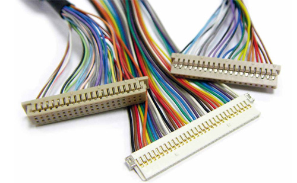
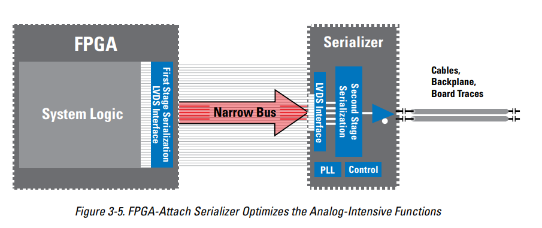
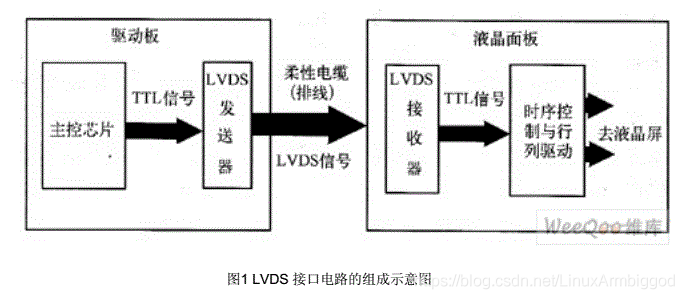
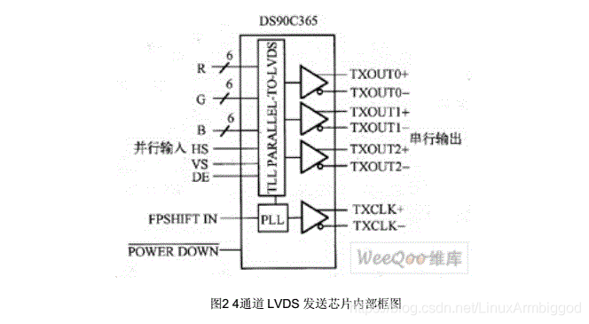

# lvds显示

rk3399内部不支持lvds的硬件接口，需要加入转接芯片mipi转lvds

## 概念学习

LVDS ：Low-Voltage Differential Signaling 低电压差分信号

这种技术的核心是采用极低的电压摆幅高速差动传输数据，可以实现点对点或一点对多点的连接，具有低功耗、低误码率、低串扰和低辐射等特点，其传输介质可以是铜质的PCB连线，也可 以是平衡电缆。  
LVDS在对信号完整性、低抖动及共模特性要求较高的系统中得到了越来越广泛的应用。

标准推荐的最高数据传输速率是655Mbps，而理论上，在一个无衰耗的传输线上，LVDS的最高传输速率可达1.923Gbps  

LVDS接口又称RS-644总线接口，20世纪90年代才出现的一种数据传输和接口技术， 一般在工业领域或行业内部使用。广泛应用于主板显示和液晶屏接口。

## 特性

它在提供高数据传输率的同时会有很低的功耗，另外它还有许多其他的优势：  
1、低至2V的电源电压兼容性  
2、低噪声  
3、高噪声抑制能力  
4、可靠的信号传输  
5、能够集成到系统级IC内  
6、使用LVDS技术的的产品数据速率可以从几百Mbps到2Gbps。  
7、它是电流驱动的，通过在接收端放置一个负载而得到电压，当电流正向流动，接收端输出为1，反之为0。  
8、它的摆幅为250mv-450mv。  
9、此技术基于ANSI/TIA/EIA-644LVDS接口标准。  

## LVDS输出接口电路类型

与TTL输出接口相同，LVDS输出接口也分为以下四种类型：  
（l）单路6位LVDS输出接口  
这种接口电路中，采用单路方式传输，每个基色信号采用6位数据（XOUT0+、XOUT0-、XOUT1+、XOUT1-、XOUT2+、XOUT2-），共18位RGB数据，因此，也称18位或18bitLVDS接口。此，也称18位或18bitLVDS接口。  
（2）双路6位LVDS输出接口  
这种接口电路中，采用双路方式传输，每个基色信号采用6位数据，其中奇路数据为18位，偶路数据为18位，共36位RGB数据，因此，也称36位或36bitLVDS接口。  
（3）单路8位1TL输出接口  
这种接口电路中，采用单路方式传输，每个基色信号采用8位数据，共24位RGB数据，因此，也称24位或24bitLVDS接口。  
（4）双路8位1TL输出位接口  
这种接口电路中，采用双路方式传输，每个基色信号采用8位数据，其中奇路数据为24位，偶路数据为24位，共48位RGB数据，因此，也称48位或48bitLVDS接口  

## LVDS接口详解

- LVDS输出接口概述

LVDS输出接口利用非常低的电压摆浮（约350mV）在两条PCB走线或一对平衡电缆上通过差分进行数据的传输，即低压差分信号输出。  
采用LVDS输出接口，可以使得信号在差分PCB线或平衡电缆上以几百Mbit/s的速率传输，由于采用低压和低电流驱动方式，因此，实现了低噪声和低功耗。

- LVDS接口电路的组成

在液晶显示器中，LVDS接口电路包括两部分，即驱动板侧的LVDS输出驱动电路（LVDS发送器），和液晶面板侧的LVDS输入接口电路（LVDS 接收器）。  
LVDS发送器将驱动板主控芯片输出的17L电平并行RGB数据信号和控制信号转换为低压串行LVDS信号，然后通过驱动板与液晶板之间的柔性电缆（排线）将信号传送到液晶面板侧的LVDS接收器，  
LVDS接收器再将串行信号转换为TTL电平的并行信号，送往液晶面板侧的LVDS接收器，LVDS接收器再将串行信号转换为TTL电平的并行信号，  
送往液晶屏时序控制与行列驱动电路。图1为LVDS接口电路的组成示意图。

- LVDS发送芯片介绍
  - 四通道LVDS发送芯片  
    四通道LVDS发送芯片(DS90C365)内部框图，包含三个数据信号（其中包括RGB,数据是能DE，行同步信号HS，场同步信号VS）通道和一个时钟信号发送通道。  
    4通道LVDS发送芯片主要用于驱动6bit液晶面板。使用4通道LVDS发送芯片可以构成单路6bit LVDS接口电路和奇/偶双路6bit LVDS接口电路。

    
  - 五通道LVDS发送芯片  
    五通道LVDS发送芯片（DS90C385）内部框图，包含了四个数据信号（其中包括RGB，数据使能DE、行同步信号HS、场同步信号VS）通道和一个时钟信号发送通道。  
    五通道LVDS发送芯片主要用于驱动8bit液晶面板，使用五通道LVDS发送芯片主要用来构成单路8bit LVDS接口电路和奇/偶双路8bit LVDS 接口电路。

    

  - 十通道LVDS发送芯片  
    十通道LVDS发送芯片（DS90C387）内部框图。包含八个数据信号（其中包括RGB、数据使能DE、行同步信号HS、场同步信号VS）通道和两个时钟信号发送通道。  
    十通道LVDS发送芯片主要用于驱动8bit液晶面板。使用十通道LVDS发送芯片主要用来构成奇/偶双路8bit LVDS接口电路。

    

## 调试参考文章

- [RK3399 Linux-SDK mipi屏幕驱动及调试](https://blog.csdn.net/sunqinglin4826/article/details/104848529)

- [调试rk3399的LVDS屏](https://dev.t-firefly.com/thread-99971-1-1.html)

- [RK3399 Android7.1移植笔记 DSI转LVDS芯片TC358775添加](https://blog.csdn.net/kris_fei/article/details/85100971)
- [RK3399主板点LVDS屏的原理和具体流程](http://blog.itpub.net/69948385/viewspace-2728308/)
- [[RK3399]点lvds屏【dsi0经过TC358775转换输出lvds】](https://blog.csdn.net/m0_38022615/article/details/110927999)

## 文档相关

[LVDS和M-LVDS电路实施指南.pdf](./res/LVDS和M-LVDS电路实施指南.pdf)

[LVDS_Owner’s_Manual.pdf](./res/LVDS_Owner’s_Manual.pdf)

[详细文档参考网址https://blog.csdn.net/lxllinux/article/details/78969363](https://blog.csdn.net/lxllinux/article/details/78969363)
