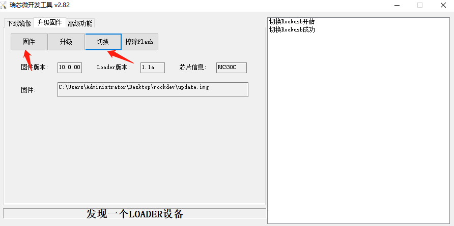

# RK3399 Android10.0 软件开发指南

## 编译

```code
source javaenv.sh
source build/envsetup.sh
lunch rk3399_Android10-userdebug
./build.sh -UKApu -v userdebug -J 64 2>&1 | tee log.log
```

build.sh

```code
usage()
{
   echo "USAGE: [-U] [-CK] [-A] [-p] [-o] [-u] [-v VERSION_NAME]  "
    echo "No ARGS means use default build option                  "
    echo "WHERE: -U = build uboot                                 "
    echo "       -C = build kernel with Clang                     "
    echo "       -K = build kernel                                "
    echo "       -A = build android                               "
    echo "       -p = will build packaging in IMAGE      "
    echo "       -o = build OTA package                           "
    echo "       -u = build update.img                            "
    echo "       -v = build android with 'user' or 'userdebug'    "
    echo "       -d = huild kernel dts name    "
    echo "       -V = build version    "
    echo "       -J = build jobs    "
    exit 1
}
```

## 打包 update.img报错

经过分析是afptool 这个工具是需要更高版本的libstdc++.so.6才能使用，我们的ubuntu系统版本是 “Ubuntu 14.04.5 LTS”

查看本地/usr/lib/x86_64-linux-gnu/libstdc++.so.6版本

```code
$ strings /usr/lib/x86_64-linux-gnu/libstdc++.so.6 | grep GLIBCXX
GLIBCXX_3.4
GLIBCXX_3.4.1
GLIBCXX_3.4.2
GLIBCXX_3.4.3
GLIBCXX_3.4.4
GLIBCXX_3.4.5
GLIBCXX_3.4.6
GLIBCXX_3.4.7
GLIBCXX_3.4.8
GLIBCXX_3.4.9
GLIBCXX_3.4.10
GLIBCXX_3.4.11
GLIBCXX_3.4.12
GLIBCXX_3.4.13
GLIBCXX_3.4.14
GLIBCXX_3.4.15
GLIBCXX_3.4.16
GLIBCXX_3.4.17
GLIBCXX_3.4.18
GLIBCXX_3.4.19
GLIBCXX_DEBUG_MESSAGE_LENGTH


$ strings /usr/lib/x86_64-linux-gnu/libstdc++.so.6 | grep CXXABI
CXXABI_1.3
CXXABI_1.3.1
CXXABI_1.3.2
CXXABI_1.3.3
CXXABI_1.3.4
CXXABI_1.3.5
CXXABI_1.3.6
CXXABI_1.3.7
CXXABI_TM_1

```

```code
Make update.img
start to make update.img...
./afptool: /usr/lib/x86_64-linux-gnu/libstdc++.so.6: version `GLIBCXX_3.4.20' not found (required by ./afptool)
./afptool: /usr/lib/x86_64-linux-gnu/libstdc++.so.6: version `CXXABI_1.3.9' not found (required by ./afptool)
./afptool: /usr/lib/x86_64-linux-gnu/libstdc++.so.6: version `GLIBCXX_3.4.21' not found (required by ./afptool)
Press any key to quit:

```

## 编译后使用windows系统工具RKImageMaker打包update.img

- 编译指令

```code
source javaenv.sh
source build/envsetup.sh
lunch rk3399_Android10-userdebug
./build.sh -UKAp -v userdebug -J 64 2>&1 | tee log.log
```

- 编译完成后拷贝rk3399目录里面的 \RKTools\windows\AndroidTool\rockdev 文件夹到本地windows目录下，在rockdev文件夹下面建立一个Image的文件夹
- 拷贝系统编译生成的img文件到windows系统rockdev工具的目录Image文件夹下
- 使用mkupdate_rk3399.bat打包脚本打包，打包过程截图如下：

```code
C:\Users\Administrator\Desktop\rockdev>rem update.img is new format, Image\update.img is old format, so delete older format
C:\Users\Administrator\Desktop\rockdev>del  Image\update.img
C:\Users\Administrator\Desktop\rockdev>pause
```

- 打包完成会在rockdev文件夹下面生成一个update.img的文件，这个就是下载需要用的固件

## 下载

- 驱动安装
安装\RKTools\windows\DriverAssitant_v5.1.1.zip

- 下载工具
拷贝rk3399目录里面的 \RKTools\windows\AndroidTool\RKDevTool_Release_v2.82.zip到windows系统中，解压

- 导入上面编译打包好的update.img文件到固件选项，插上下载设备开机，切换下载模式下载

    

---

## 多台机器使用相同ssh公钥

在不同机器使用，可以将你的ssh私钥文件id_rsa拷贝到要使用的机器的“~/.ssh/id_rsa”即可
在使用错误的私钥会出现如下提示，请注意替换成正确的私钥。

添加ssh私钥可能出现如下提示错误。

```code
Agent admitted failture to sign using the key
```

在console输入如下命令即可解决。

```code
ssh-add ~/.ssh/id_rsa
```

---

## rk3399 android10.0 测试暗码

打开计算器，在计算器里面输入 000.=  就可以进入测试模式


## 挖掘机开发版android10.0功能测试问题

| 功能名称 | 测试结果 | 备注 |
| :-      | :-     | :-:  |
| rj45  | ok |  |
| hdmi输出显示 | ok |   |
| usb | ok |   |
| usb-hub | ok | |
| 按键  | ok |   |
| sdcard | ok | |
| 恢复出厂设置 | ok | |
| 耳机mic | fail | |
| 耳机声音 | ok | |
| 板载mic  | fail | |
| 板载speaker  | 未测试 | 没有设备 |
| wifi | ok |  |
| bt | ok |  |
| usb-uart | ok | |
| hdmi输入  | 未测试 | 没有测试APK和设备 |
| 红外      | 未测试 | 没有测试APK |
| 充电      | 未测试 | 没有电池设备 |
| 电池      | 未测试 | 没有设备 |
| 投屏      | 横屏显示花屏 |（hdmi界面显示正常） |
| pcie      | 未测试 | 没有设备 |
| GPS       | 不支持 | 没有设备 |
| SIM卡      | 不支持 | 没有设备 |
| edp       | 未测试 | 没有设备 |
| mipi显示   | 未测试 | 没有设备 |
| mipi摄像头  |未测试 | 没有设备 |
| TP         | 未测试 | 没有设备 |
| 重力传感器   | ok | |
| 磁力传感器   | fail | |
| 光距离传感器 | fail |  |
| HALL传感器 | 未测试 | 没有APK |
| 陀螺仪 |    | fail |  |
