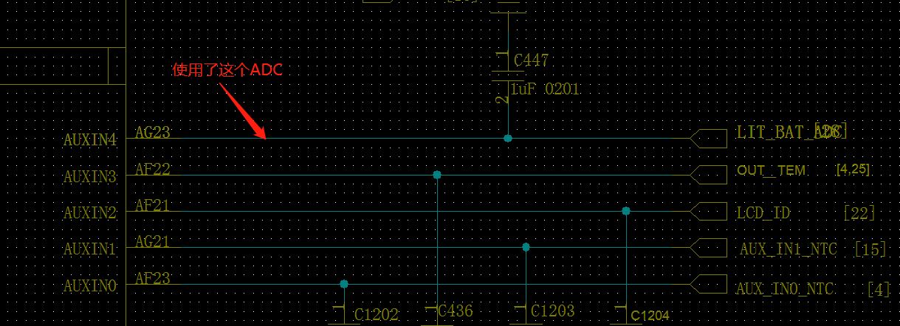
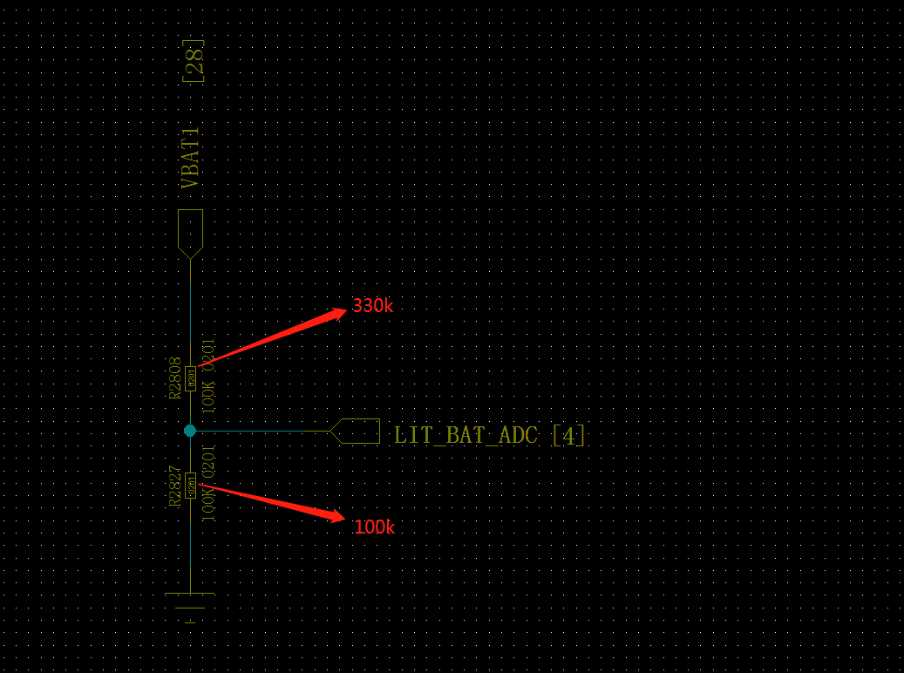
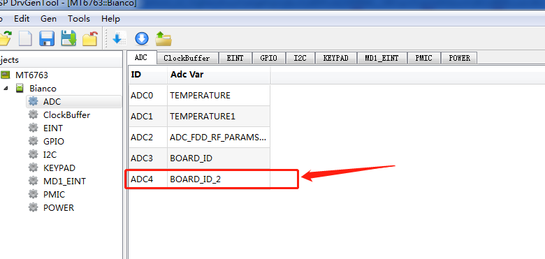

# AUXADC

s809执法仪项目使用了一个备用小电池,用adc检测电池电压

## 原理图




## 系统自带的adc dws配置



## adc检测电压换算方式

分压电阻,MTKadc只支持1.5V adc读取电压,12bit 宽度,所以需要分压检测,在adc读取数据后需要对应分压电阻还原电压值

## dtsi配置

```code
auxadc: auxadc@11001000 {
    compatible = "mediatek,auxadc";
    reg = <0 0x11001000 0 0x1000>;
    interrupts = <GIC_SPI 74 IRQ_TYPE_NONE>;
    clocks = <&infracfg_ao INFRACFG_AO_AUXADC_CG>;
    clock-names = "auxadc-main";
  };
&auxadc {
  adc_channel@ {
    compatible = "mediatek,adc_channel";
    mediatek,temperature0 = <0>;
    mediatek,temperature1 = <1>;
    mediatek,adc_fdd_rf_params_dynamic_custom_ch = <2>;
    mediatek,board_id = <3>;
    mediatek,board_id_2 = <4>;    # 这个是我们需要的adc
    status = "okay";
  };
};

```

## 小电池adc检测代码片段

- ADC原始驱动代码片段

```code
 ret = of_property_read_u32_array(node, "mediatek,board_id_2", &of_value, 1);
    if (ret == 0) {
      sprintf(g_adc_info[used_channel_counter].channel_name, "BOARD_ID_2");
      g_adc_info[used_channel_counter].channel_number = of_value;  //这个就对应了dtsi 4
      pr_warn("[AUXADC_AP] find node BOARD_ID_2:%d\n", of_value);
      used_channel_counter++;
    }

g_adc_info[used_channel_counter].channel_number = of_value;

extern int IMM_get_adc_channel_num(char *channel_name, int len);//可以直接传“BOARD_ID_2”获取num 4

```

- 小电池检测功能驱动代码

```code

//循环10次算adc平均值
static int adc_read_vol(void) {
  int id_volt = 0;
  int ret = 0;
  int i;
  int sum = 0;

  for (i = 0; i < 10; i++) {
    ret = IMM_GetOneChannelValue_Cali(4, &id_volt);
    if (ret != 0)
      BATTERY_DEBUG("id_volt read fail\n");
    else
      BATTERY_DEBUG("id_volt read id_volt = %d\n", id_volt);

    if (id_volt > 0) {
      sum += id_volt;
    } else {
      BATTERY_DEBUG("sec_battery_check() failed\n");
    }
  }

  ret = sum / 10;
  return ret;
}
void sec_battery_check(void) {
  int val = 0;
  int val_tmp = 0;

  BATTERY_FUNC();

  if (get_charger_detect()) {
    BATTERY_DEBUG(
        "AC charger is exist, second batttery charge disable return !!\n");
    sec_battery_ctrl_onoff(0);
    sec_chargeing_on = 0;
    return;
  }

  val = adc_read_vol();
  BATTERY_DEBUG("charger enable  val = %d\n", val);
  val_tmp = val * 43 / 10;      //根据原理图分压电阻,做简单处理
  BATTERY_DEBUG("charger enable  val_tmp = %d\n", val_tmp);
  val = val_tmp;
  BATTERY_DEBUG("charger enable  val = %d\n", val);

  if ((val < 4000000 && val > 0) && sec_chargeing_on == 0) {
    BATTERY_DEBUG("sec bat < 4v ,charger enable  val = %d\n", val);
    sec_battery_ctrl_onoff(1);
    sec_chargeing_on = 1;
  } else if ((val >= 4200000 || sec_bat_full_check()) &&
             sec_chargeing_on == 1) {
    sec_battery_ctrl_onoff(0);
    sec_chargeing_on = 0;
  }
}
EXPORT_SYMBOL(sec_battery_check);

```

- 将导出的小电池电压检测功能函数放到需要检测的函数中

```code
fg_drv_update_hw_status();

+               //wangfeng add for s809 second battery 20200711
+               {
+                       extern void sec_battery_check(void);
+                       sec_battery_check();
+               }
+               //wangfeng add for s809 second battery 20200711
                /*********************/

                if (temp_intr_toggle > 10) {
```

## adc调试技巧

adb读取ADC值(请对应平台代码查看auxadc的驱动代码)

## 小电池检测驱动代码移植包

[s809小电池功能开发代码移植包](./res/second_battery.zip)
