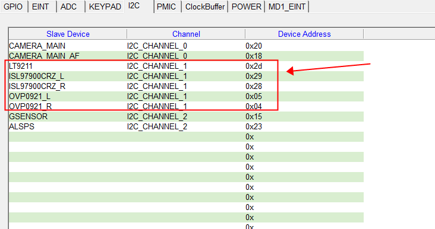

# i2c控制代码

- [i2c控制代码](#i2c控制代码)
  - [dws配置](#dws配置)
  - [i2c控制代码片段](#i2c控制代码片段)
    - [lk阶段](#lk阶段)
    - [kernel阶段](#kernel阶段)
      - [dts片段](#dts片段)
      - [代码片段](#代码片段)
  - [i2c控制代码移植包](#i2c控制代码移植包)

## dws配置



## i2c控制代码片段

### lk阶段

```code
#include <cust_gpio_usage.h>
#include <cust_i2c.h>
#include <platform/mt_gpio.h>
#include <platform/mt_i2c.h>
#include <platform/mt_pmic.h>

//i2c slave address 7 bit
/*
  cust_i2c.h 文件生成的变量可以直接使用

  #define I2C_CHANNEL_1                   1
  #define I2C_LT9211_AUTO_DETECT          FALSE
  #define I2C_LT9211_CHANNEL              I2C_CHANNEL_1
  #define I2C_LT9211_SLAVE_7_BIT_ADDR     0x2d
*/

#define LT9211_SLAVE_ADDR 0x2d
struct mt_i2c_t lt9211_i2c;

int lt9211_write_byte(u8 addr, u8 value);
int lt9211_read_byte(u8 addr, u8 *dataBuffer);

int lt9211_write_byte(u8 addr, u8 value) {
  int ret_code = 0;
  u8 write_data[2];
  unsigned int len;

  write_data[0] = addr;
  write_data[1] = value;

  lt9211_i2c.id = 1; /* I2C0; */ // i2c总线号
  lt9211_i2c.addr = (LT9211_SLAVE_ADDR);
  lt9211_i2c.mode = ST_MODE;
  lt9211_i2c.speed = 100;
  len = 2;

  ret_code = i2c_write(&lt9211_i2c, write_data, len);
  if (ret_code < 0)
    printf("%s: lt9211_write_byte error: ret_code: %d\n", __func__, ret_code);

  // printf("%s: lk success: ret_code: %d\n", __func__, ret_code);

  return ret_code;
}

int lt9211_read_byte(u8 addr, u8 *dataBuffer) {
  int ret_code = 0;
  unsigned int len;
  *dataBuffer = addr;

  lt9211_i2c.id = 1; /* I2C0; */
  lt9211_i2c.addr = (LT9211_SLAVE_ADDR);
  lt9211_i2c.mode = ST_MODE;
  lt9211_i2c.speed = 100;
  lt9211_i2c.st_rs = I2C_TRANS_REPEATED_START;
  len = 1;

  ret_code = i2c_write_read(&lt9211_i2c, dataBuffer, len, len);
  if (ret_code < 0)
    printf("%s:  lk error : ret_code: %d,ic:0x%x\n", __func__, ret_code,
           *dataBuffer);

  // printf("%s: lk success: ret_code: %d, dataBuffer = %x\n", __func__,
  // ret_code, *dataBuffer);

  return ret_code;
}

```

### kernel阶段

#### dts片段

```code
&i2c1 {
  LT9211@2d {
    compatible = "mediatek,LT9211";
    reg = <0x2d>;
  };
};
```

#### 代码片段

```code
#include <linux/string.h>

#include <linux/delay.h>
#include <linux/fs.h>
#include <linux/gpio.h>
#include <linux/i2c.h>
#include <linux/init.h>
#include <linux/input.h>
#include <linux/interrupt.h>
#include <linux/io.h>
#include <linux/irq.h>
#include <linux/kernel.h>
#include <linux/list.h>
#include <linux/module.h>
#include <linux/of.h>
#include <linux/of_gpio.h>
#include <linux/of_irq.h>
#include <linux/platform_device.h>
#include <linux/printk.h>
#include <linux/proc_fs.h> //proc file use
#include <linux/slab.h>
#include <linux/uaccess.h>
#include <mach/gpio_const.h>
#include <mt-plat/mt_gpio.h>


#define I2C_LT9211_ID_NAME "lt9211"
static const struct of_device_id lt9211_of_match[] = {
    {.compatible = "mediatek,LT9211"},
    {},
};

static struct i2c_client *lt9211_i2c_client;
static DEFINE_MUTEX(lt9211_i2c_access);
static int lt9211_probe(struct i2c_client *client,
                        const struct i2c_device_id *id);
static int lt9211_remove(struct i2c_client *client);

struct lt9211_dev {
  struct i2c_client *client;
};

static const struct i2c_device_id lt9211_id[] = {
  {
    .name = I2C_LT9211_ID_NAME,
    .driver_data = 0,
  },
};

static struct i2c_driver lt9211_iic_driver = {
    .id_table = lt9211_id,
    .probe = lt9211_probe,
    .remove = lt9211_remove,
    .driver =
        {
            .owner = THIS_MODULE,
            .name = "lt9211",
            .of_match_table = lt9211_of_match,
        },
};

static int i2c_write_byte(struct i2c_client *client, u8 reg, u8 val) {
  int rc = 0;
  u8 txbuf[512] = {0};

  if (!client) {
    printk("%s i2c_write_byte-> client == null \n", __func__);
    return -EINVAL;
  }

  struct i2c_msg msg[] = {
      {
          .addr = client->addr,
          .flags = 0,
          .len = 2,
          .buf = txbuf,
      },
  };

  txbuf[0] = reg;
  txbuf[1] = val;

  rc = i2c_transfer(client->adapter, msg, 1);
  if (rc < 0) {
    printk("%s i2c_transfer i2c write error rc= 0d%d\n", __func__, rc);
    // rc = -EIO;
    return rc;
  }

  // printk("%s lt9211 success rc= 0d[%d]\n", __func__, rc);

  return rc;
}

static int i2c_read_byte(struct i2c_client *client, u8 reg, u8 *buf, u32 size) {
  int rc = 0;
  u8 rxbuf[512] = {0};

  if (!client || !buf) {
    // printk("%s i2c_write_byte-> client == null || buf == null \n", __func__);
    return -EINVAL;
  }

  struct i2c_msg msg[] = {
      {
          .addr = client->addr,
          .flags = 0,
          .len = 1,
          .buf = rxbuf,
      },
      {
          .addr = client->addr,
          .flags = I2C_M_RD,
          .len = 1,
          .buf = rxbuf,
      },
  };

  rxbuf[0] = reg;

  // printk("%s addr = %x \n", __func__, client->addr);
  rc = i2c_transfer(client->adapter, msg, 2);
  if (rc < 0) {
    printk("%s i2c_transfer error rc=0d%d\n", __func__, rc);
    // rc = -EIO;
    return rc;
  }

  *buf = rxbuf[0];
  // printk("%s lt9211 success rc=0d[%d], rxbuf[0] = 0x%x, *buf = 0x%x\n",
  // __func__, rc, rxbuf[0], *buf);

  return rc;
}

int lt9211_write_bytes(u8 cmd, u8 writeData) {
  int ret = 0;
if (lt9211_i2c_client == NULL) {
    printk("lt9211_write_bytes lt9211_i2c_client == NULL !!\n");
    return -1;
  }
  mutex_lock(&lt9211_i2c_access);

  ret = i2c_write_byte(lt9211_i2c_client, cmd, writeData);
  if (ret < 0) {
    mutex_unlock(&lt9211_i2c_access);
    printk("lt9211_write_bytes i2c_master_send fail ret= 0d%d!!\n", ret);

    return ret;
  }
  mutex_unlock(&lt9211_i2c_access);
  // printk("%s success end ret=0d%d \n", __func__, ret);

  return ret;
}


int lt9211_read_bytes(u8 cmd, u8 *returnData) {
  int ret = 0;
  u8 readData = 0;

  if (lt9211_i2c_client == NULL) {
    printk(" lt9211_read_bytes lt9211_i2c_client == NULL \n");
    return -1;
  }
  mutex_lock(&lt9211_i2c_access);

  ret = i2c_read_byte(lt9211_i2c_client, cmd, &readData, 1);
  if (ret < 0) {
    mutex_unlock(&lt9211_i2c_access);
    printk("lt9211_write_bytes i2c_master_send fail ret= 0d%d!!\n", ret);

    return ret;
  }
  *returnData = readData;

  mutex_unlock(&lt9211_i2c_access);
  // printk("%s success end ret=0d%d readData=0x%x\n", __func__, ret, readData);

  return ret;
}

static int lt9211_probe(struct i2c_client *client,
                        const struct i2c_device_id *id) {
  printk("lt9211_iic_probe\n");
  printk("%s ==>name=%s addr=0x%x\n", __func__, client->name, client->addr);
  lt9211_i2c_client = client;
  return 0;
}
static int lt9211_remove(struct i2c_client *client) {
  printk("lt9211_remove\n");
  lt9211_i2c_client = NULL;
  i2c_unregister_device(client);
  return 0;
}

static int __init lt9211_init(void) {
  printk("lt9211_iic_init\n");

  i2c_add_driver(&lt9211_iic_driver);

  printk("lt9211_iic_init success\n");
  return 0;
}
static void __exit lt9211_exit(void) {
  printk("lt9211_iic_exit\n");
  i2c_del_driver(&lt9211_iic_driver);
}
module_init(lt9211_init);
module_exit(lt9211_exit);
MODULE_AUTHOR("Xiaokuan Shi");
MODULE_DESCRIPTION("MTK lt9211 I2C Driver");

```

## i2c控制代码移植包

- A9-Ai眼镜功能包含了lk和kernel的i2c驱动
  [lcm.override.lcd.zip](./res/lcm.override.lcd.zip)
