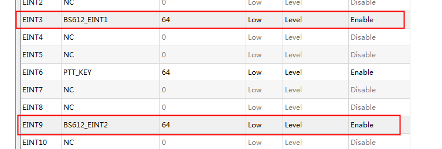

# KEY-EINT

按键驱动代码一般都是使用GPIO的,所以会和GPIO的驱动一起,代码重点还是写按键,GPIO驱动还请参考GPIO驱动的处理

## dws配置中断



## dtsi配置

```code
pirbs612: pirbs612 {
    compatible = "mediatek, pirbs612_driver";
};  
  
bs612_eint1: bs612_eint1 {
    compatible = "mediatek,bs612_eint1";
};

bs612_eint2: bs612_eint2 {
    compatible = "mediatek,bs612_eint2";
};

```

```code
&pio {
    gpio_ctrl_default: gpio_ctrl_default@0 {

    };

    gpio_ctrl_1_high: gpio_ctrl_1_high@0{
        pins_cmd0_dat {
            pins = <PINMUX_GPIO4__FUNC_GPIO4>;
            slew-rate = <1>;
            output-high;
        };
    };
    gpio_ctrl_1_low: gpio_ctrl_1_low@0{
        pins_cmd0_dat {
            pins = <PINMUX_GPIO4__FUNC_GPIO4>;
            slew-rate = <1>;
            output-low;
        };
    };

    gpio_ctrl_2_high: gpio_ctrl_2_high@0{
        pins_cmd0_dat {
            pins = <PINMUX_GPIO90__FUNC_GPIO90>;
            slew-rate = <1>;
            output-high;
        };
    };
    gpio_ctrl_2_low: gpio_ctrl_2_low@0{
        pins_cmd0_dat {
            pins = <PINMUX_GPIO90__FUNC_GPIO90>;
            slew-rate = <1>;
            output-low;
        };
    };

    gpio_ctrl_3_high: gpio_ctrl_3_high@0{
        pins_cmd0_dat {
            pins = <PINMUX_GPIO7__FUNC_GPIO7>;
            slew-rate = <1>;
            output-high;
        };
    };
    gpio_ctrl_3_low: gpio_ctrl_3_low@0{
        pins_cmd0_dat {
            pins = <PINMUX_GPIO7__FUNC_GPIO7>;
            slew-rate = <1>;
            output-low;
        };
    };
};

&pirbs612 {
    pinctrl-names = "default", "gpio_ctrl_1_high", "gpio_ctrl_1_low", "gpio_ctrl_2_high", "gpio_ctrl_2_low", "gpio_ctrl_3_high", "gpio_ctrl_3_low";
    pinctrl-0 = <&gpio_ctrl_default>;
    pinctrl-1 = <&gpio_ctrl_1_high>;
    pinctrl-2 = <&gpio_ctrl_1_low>;
    pinctrl-3 = <&gpio_ctrl_2_high>;
    pinctrl-4 = <&gpio_ctrl_2_low>;
    pinctrl-5 = <&gpio_ctrl_3_high>;
    pinctrl-6 = <&gpio_ctrl_3_low>;
    status = "okay";
};
```

```code
&bs612_eint1 {
  interrupt-parent = <&pio>;
  interrupts = <3 IRQ_TYPE_LEVEL_LOW 3 0>;
  deb-gpios = <&pio 3 0>;
  debounce = <64000>;
  status = "okay";
};

&bs612_eint2 {
  interrupt-parent = <&pio>;
  interrupts = <9 IRQ_TYPE_LEVEL_LOW 9 0>;
  deb-gpios = <&pio 9 0>;
  debounce = <64000>;
  status = "okay";
};
```

## 触发GPIO中断上报按键值代码片段(s915门铃项目人体感应)

```code
#include <linux/delay.h>
#include <linux/init.h>
#include <linux/interrupt.h>
#include <linux/kernel.h>
#include <linux/module.h>
#include <linux/platform_device.h>
#include <linux/slab.h>
#include <linux/types.h>
#include <linux/uaccess.h>

#include <linux/gpio.h>
#include <linux/input.h>
#include <linux/of.h>
#include <linux/of_gpio.h>
#include <linux/of_irq.h>

#include <linux/jiffies.h>

#define PIRBS612_DEBUG_CODE

#define PIRBS612_DEVICE "PIRBS612"
#ifdef PIRBS612_DEBUG_CODE
#undef PIRBS612_DEBUG
#define PIRBS612_DEBUG(a,arg...)  pr_err(PIRBS612_DEVICE ": " a, ##arg)
#define PIRBS612_FUNC()           pr_err(PIRBS612_DEVICE ": %s line=%d\n", __func__, __LINE__)
#else
#define PIRBS612_DEBUG(arg...)
#define PIRBS612_FUNC()
#endif

#define PIRBS612_INPUT_NAME "pirbs612"

/* extern func */
extern long gpio_set_redlight(int level_1024);
extern long gpio_set_greenlight(int level_1024);
extern long gpio_set_bluelight(int level_1024);

/* extern func */

struct input_dev *pirbs612_input_dev;

static int pirbs612_gpio_1 = 0;
static int pirbs612_gpio_2 = 0;

static int pirbs612_setup_eint_1(void);
static int pirbs612_setup_eint_2(void);

static int pirbs612_irq_1;
static int pirbs612_irq_2;

static atomic_t a_flag = ATOMIC_INIT(0);
static atomic_t b_flag = ATOMIC_INIT(0);


static dev_t gpio_ctrl_devno;
static struct class *gpio_ctrl_class = NULL;
static struct device *gpio_ctrl_devices = NULL;
#define GPIO_CTRL_DEVNAME "pribs612_gpio_ctrl"

static struct pinctrl *gpio_ctrl_pin_ctrl = NULL;
static struct pinctrl_state *gpio_ctrl_1_high = NULL;
static struct pinctrl_state *gpio_ctrl_1_low = NULL;
static struct pinctrl_state *gpio_ctrl_2_high = NULL;
static struct pinctrl_state *gpio_ctrl_2_low = NULL;
static struct pinctrl_state *gpio_ctrl_3_high = NULL;
static struct pinctrl_state *gpio_ctrl_3_low = NULL;

extern int pinctrl_select_state(struct pinctrl *p, struct pinctrl_state *state);

static int gpio_ctrl_pinctrl_init(struct platform_device *pdev) {
  int ret = 0;
  gpio_ctrl_pin_ctrl = devm_pinctrl_get(&pdev->dev);
  if (IS_ERR(gpio_ctrl_pin_ctrl)) {
    dev_err(&pdev->dev, "Cannot find gpio_ctrl_pin_ctrl!");
    ret = PTR_ERR(gpio_ctrl_pin_ctrl);
    printk("%s devm_pinctrl_get fail!\n", __func__);
  }

  /*ctrl 1 */
  gpio_ctrl_1_high =
      pinctrl_lookup_state(gpio_ctrl_pin_ctrl, "gpio_ctrl_1_high"); // gpio4
  if (IS_ERR(gpio_ctrl_1_high)) {
    ret = PTR_ERR(gpio_ctrl_1_high);
    printk("%s : pinctrl err, gpio_ctrl_1_high\n", __func__);
  }

  gpio_ctrl_1_low = pinctrl_lookup_state(gpio_ctrl_pin_ctrl, "gpio_ctrl_1_low");
  if (IS_ERR(gpio_ctrl_1_low)) {
    ret = PTR_ERR(gpio_ctrl_1_low);
    printk("%s : pinctrl err, gpio_ctrl_1_low\n", __func__);
  }

  /*ctrl 2 */
  gpio_ctrl_2_high =
      pinctrl_lookup_state(gpio_ctrl_pin_ctrl, "gpio_ctrl_2_high"); // gpio 7
  if (IS_ERR(gpio_ctrl_2_high)) {
    ret = PTR_ERR(gpio_ctrl_2_high);
    printk("%s : pinctrl err, gpio_ctrl_2_high\n", __func__);
  }

  gpio_ctrl_2_low = pinctrl_lookup_state(gpio_ctrl_pin_ctrl, "gpio_ctrl_2_low");
  if (IS_ERR(gpio_ctrl_2_low)) {
    ret = PTR_ERR(gpio_ctrl_2_low);
    printk("%s : pinctrl err, gpio_ctrl_2_low\n", __func__);
  }

  /*ctrl 3 */
  gpio_ctrl_3_high =
      pinctrl_lookup_state(gpio_ctrl_pin_ctrl, "gpio_ctrl_3_high"); // gpio 90
  if (IS_ERR(gpio_ctrl_3_high)) {
    ret = PTR_ERR(gpio_ctrl_3_high);
    printk("%s : pinctrl err, gpio_ctrl_3_high\n", __func__);
  }

  gpio_ctrl_3_low = pinctrl_lookup_state(gpio_ctrl_pin_ctrl, "gpio_ctrl_3_low");
  if (IS_ERR(gpio_ctrl_3_low)) {
    ret = PTR_ERR(gpio_ctrl_3_low);
    printk("%s : pinctrl err, gpio_ctrl_3_low\n", __func__);
  }

  return ret;
}

static ssize_t gpio_ctrl_set_en(struct device *dev,
                                struct device_attribute *attr, const char *buf,
                                size_t count) {
  int status = 0;
  int pinctrl_num = 0;
  sscanf(buf, "%d %d", &pinctrl_num, &status);

  if (gpio_ctrl_pin_ctrl == NULL) {
    printk(
        "\n\n\n\n\ gpio_ctrl_pin_ctrl == 0 Ponit Error !!!!!!!!!!!!! \n\n\n\n");
    return -1;
  }

  if (status) {
    switch (pinctrl_num) {
    case 1:
      if (gpio_ctrl_1_high != 0)
        pinctrl_select_state(gpio_ctrl_pin_ctrl, gpio_ctrl_1_high);
      break;
    case 2:
      if (gpio_ctrl_2_high != 0)
        pinctrl_select_state(gpio_ctrl_pin_ctrl, gpio_ctrl_2_high);
      break;
    case 3:
      if (gpio_ctrl_3_high != 0)
        pinctrl_select_state(gpio_ctrl_pin_ctrl, gpio_ctrl_3_high);
      break;
    default:
      break;
    }

  } else {
    switch (pinctrl_num) {
    case 1:
      if (gpio_ctrl_1_low != 0)
        pinctrl_select_state(gpio_ctrl_pin_ctrl, gpio_ctrl_1_low);
      break;
    case 2:
      if (gpio_ctrl_2_low != 0)
        pinctrl_select_state(gpio_ctrl_pin_ctrl, gpio_ctrl_2_low);
      break;
    case 3:
      if (gpio_ctrl_3_low != 0)
        pinctrl_select_state(gpio_ctrl_pin_ctrl, gpio_ctrl_3_low);
      break;
    default:
      break;
    }
  }
  return count;
}

static ssize_t gpio_ctrl_get_en(struct device *dev,
                                struct device_attribute *attr, char *buf) {
  // unsigned char reg_val;
  ssize_t len = 0;
  // u8 i;
  // for (i = 0; i < 0x30; i++)
  //{
  //  reg_val = i2c_read_reg(i);
  //  len += snprintf(buf + len, PAGE_SIZE - len, "reg%2X = 0x%2X,\n", i,
  //    reg_val);
  //}

  return len;
}
static DEVICE_ATTR(gpio_ctrl_en, 0660, gpio_ctrl_get_en, gpio_ctrl_set_en);

static unsigned int g_in_value;
static ssize_t set_attr_in(struct device *dev, struct device_attribute *attr,
                           const char *buf, size_t count) {
  return count;
}

static ssize_t get_attr_in(struct device *dev, struct device_attribute *attr,
                           char *buf) {
  pr_err("[g_in_value] %d\n", g_in_value);
  return sprintf(buf, "%d\n", g_in_value);
}
static DEVICE_ATTR(in, 0664, get_attr_in, set_attr_in);

static unsigned int g_out_value;
static ssize_t set_attr_out(struct device *dev, struct device_attribute *attr,
                            const char *buf, size_t count) {
  return count;
}

static ssize_t get_attr_out(struct device *dev, struct device_attribute *attr,
                            char *buf) {
  pr_err("[g_in_value] %d\n", g_out_value);
  return sprintf(buf, "%d\n", g_out_value);
}
static DEVICE_ATTR(out, 0664, get_attr_out, set_attr_out);

static struct device_attribute *gpio_ctrl_attr_list[] = {
    &dev_attr_gpio_ctrl_en,
    &dev_attr_in,
    &dev_attr_out,
};

static int gpio_ctrl_create_attr(struct device *dev) {
  int idx, err = 0;
  int num = (int)sizeof(gpio_ctrl_attr_list) / sizeof(gpio_ctrl_attr_list[0]);

  if (!dev)
    return -EINVAL;

  for (idx = 0; idx < num; idx++) {
    device_create_file(dev, gpio_ctrl_attr_list[idx]);
  }

  return err;
}

static int pirbs612_gpio_device(struct platform_device *dev) {
  int ret = 0;

  ret = gpio_ctrl_pinctrl_init(dev);
  if (ret != 0) {
    printk("[%s] failed to init gpio_ctrl pinctrl.\n", __func__);
    return ret;
  } else {
    printk("[%s] Success to init gpio_ctrl pinctrl.\n", __func__);
  }

  ret = alloc_chrdev_region(&gpio_ctrl_devno, 0, 1, GPIO_CTRL_DEVNAME);
  if (ret) {
    printk("[gpio_ctrl] alloc_chrdev_region fail: %d\n", ret);
    goto exit_check_functionality_failed;
  } else {
    printk("[gpio_ctrl] major: %d, minor: %d\n", MAJOR(gpio_ctrl_devno),
           MINOR(gpio_ctrl_devno));
  }

  gpio_ctrl_class = class_create(THIS_MODULE, "gpio_ctrl");
  if (IS_ERR(gpio_ctrl_class)) {
    printk("[gpio_ctrl_probe] Unable to create class, err = %d\n",
           (int)PTR_ERR(gpio_ctrl_class));
    goto exit_check_functionality_failed;
  }

  gpio_ctrl_devices = (struct device *)device_create(
      gpio_ctrl_class, NULL, gpio_ctrl_devno, NULL, GPIO_CTRL_DEVNAME);
  if (NULL == gpio_ctrl_devices) {
    printk("[gpio_ctrl_probe] device_create fail\n");
    goto exit_check_functionality_failed;
  }

  if (gpio_ctrl_create_attr(gpio_ctrl_devices) != 0) {
    printk("[gpio_ctrl_probe] create_attr fail\n");
    goto exit_check_functionality_failed;
  }

  return ret;

exit_check_functionality_failed:
  return -1;
}

static irqreturn_t pirbs612_eint_func_1(int irq, void *desc) {
  int ptt_value = 0;
  // PIRBS612_FUNC();
  ptt_value = gpio_get_value(pirbs612_gpio_1);
  pr_err("pirbs612_eint_func_1 ptt_value:%d\n", ptt_value);

  disable_irq_nosync(pirbs612_irq_1);
  if (ptt_value == 0) {
    irq_set_irq_type(pirbs612_irq_1, IRQ_TYPE_EDGE_RISING);

    input_report_key(pirbs612_input_dev, KEY_F1, 1);
    input_sync(pirbs612_input_dev);
    input_report_key(pirbs612_input_dev, KEY_F1, 0);
    input_sync(pirbs612_input_dev);

    atomic_set(&a_flag, 1); // 记录原子变量a_flag ,用于进出入检查
    if (atomic_read(&b_flag) == 1) {
      atomic_set(&b_flag, 0);
      atomic_set(&a_flag, 0);
      // g_in_value++;
      // gpio_set_redlight(1); // sensor a  触发
      input_report_key(pirbs612_input_dev, KEY_F6, 1);
      input_sync(pirbs612_input_dev);
      input_report_key(pirbs612_input_dev, KEY_F6, 0);
      input_sync(pirbs612_input_dev);
    }
  } else {
    irq_set_irq_type(pirbs612_irq_1, IRQ_TYPE_EDGE_FALLING);
    gpio_set_redlight(0); // sensor a  为触发

    input_report_key(pirbs612_input_dev, KEY_F2, 1);
    input_sync(pirbs612_input_dev);
    input_report_key(pirbs612_input_dev, KEY_F2, 0);
    input_sync(pirbs612_input_dev);

    atomic_set(&a_flag, 0); // 记录原子变量a_flag ,用于进出入检查
  }
  enable_irq(pirbs612_irq_1);

  return IRQ_HANDLED;
}

static irqreturn_t pirbs612_eint_func_2(int irq, void *desc) {
  int ptt_value = 0;
  // PIRBS612_FUNC();
  ptt_value = gpio_get_value(pirbs612_gpio_2);
  pr_err("pirbs612_eint_func_2 ptt_value:%d\n", ptt_value);

  disable_irq_nosync(pirbs612_irq_2);
  if (ptt_value == 0) {
    irq_set_irq_type(pirbs612_irq_2, IRQ_TYPE_EDGE_RISING);

    input_report_key(pirbs612_input_dev, KEY_F3, 1);
    input_sync(pirbs612_input_dev);
    input_report_key(pirbs612_input_dev, KEY_F3, 0);
    input_sync(pirbs612_input_dev);

    atomic_set(&b_flag, 1); // 记录原子变量b_flag ,用于进出入检查
    if (atomic_read(&a_flag) == 1) {
      atomic_set(&a_flag, 0);
      atomic_set(&b_flag, 0);
      // g_out_value++;
      // gpio_set_bluelight(1); // sensor a  触发
      input_report_key(pirbs612_input_dev, KEY_F5, 1);
      input_sync(pirbs612_input_dev);
      input_report_key(pirbs612_input_dev, KEY_F5, 0);
      input_sync(pirbs612_input_dev);
    }
  } else {
    irq_set_irq_type(pirbs612_irq_2, IRQ_TYPE_EDGE_FALLING);

    // gpio_set_bluelight(0); // sensor a  未触发
    input_report_key(pirbs612_input_dev, KEY_F4, 1);
    input_sync(pirbs612_input_dev);
    input_report_key(pirbs612_input_dev, KEY_F4, 0);
    input_sync(pirbs612_input_dev);

    atomic_set(&b_flag, 0); // 记录原子变量b_flag ,用于进出入检查
  }
  enable_irq(pirbs612_irq_2);

  return IRQ_HANDLED;
}

static int pirbs612_setup_eint(void) {

  unsigned int g_gpio_ptt_deb_1 = 0;
  unsigned int g_gpio_ptt_deb_2 = 0;

  struct device_node *node_pirbs612_1;
  struct device_node *node_pirbs612_2;

  int ptt_value_1 = 0;
  int ptt_value_2 = 0;

  u32 ints[2] = {0, 0};

  int ret = 0;

  PIRBS612_FUNC();

  /**************************************************************************************************************/
  node_pirbs612_1 = of_find_compatible_node(NULL, NULL, "mediatek,bs612_eint1");

  if (node_pirbs612_1)
    pr_err("find irq node success!!\n");
  else
    pr_err("null irq node!!\n");

  if (node_pirbs612_1) {
    pirbs612_gpio_1 = of_get_named_gpio(node_pirbs612_1, "deb-gpios", 0);
    gpio_request(pirbs612_gpio_1, "gpio_bs612_eint1");
    pr_err("pirbs612_gpio_1 = %d!!\n", pirbs612_gpio_1);
    ptt_value_1 = gpio_get_value(pirbs612_gpio_1);
    pr_err("ptt_value_1 = %d\n", ptt_value_1);

    of_property_read_u32_array(node_pirbs612_1, "debounce", ints,
                               ARRAY_SIZE(ints));
    gpio_request(ints[0], "bs612_eint1");
    // gpio_set_debounce(ints[0], ints[1]);
    // pr_err("ints[0] = %d, ints[1] = %d!!\n", ints[0], ints[1]);

    pirbs612_irq_1 = irq_of_parse_and_map(node_pirbs612_1, 0);
    pr_err("pirbs612_irq_1 = %d\n", pirbs612_irq_1);
    if (!pirbs612_irq_1) {
      pr_err("irq_of_parse_and_map fail!!\n");
      return -EINVAL;
    }

    if (request_irq(
            pirbs612_irq_1, pirbs612_eint_func_1,
            (ptt_value_1 ? IRQ_TYPE_EDGE_FALLING : IRQ_TYPE_EDGE_RISING),
            "BS612_EINT1-eint", NULL)) {
      pr_err("IRQ LINE NOT AVAILABLE!!\n");
      return -EINVAL;
    }
    // enable_irq(pirbs612_irq_1);
  } else {
    pr_err("null irq node!!\n");
    return -EINVAL;
  }

  /**************************************************************************************************************/
  node_pirbs612_2 = of_find_compatible_node(NULL, NULL, "mediatek,bs612_eint2");
  if (node_pirbs612_2)
    pr_err("find irq node success!!\n");
  else
    pr_err("null irq node!!\n");

  if (node_pirbs612_2) {
    pirbs612_gpio_2 = of_get_named_gpio(node_pirbs612_2, "deb-gpios", 0);
    gpio_request(pirbs612_gpio_2, "gpio_bs612_eint2");
    pr_err("pirbs612_gpio_2 = %d!!\n", pirbs612_gpio_2);
    ptt_value_2 = gpio_get_value(pirbs612_gpio_2);
    pr_err("ptt_value_2 = %d\n", ptt_value_2);

    of_property_read_u32_array(node_pirbs612_2, "debounce", ints,
                               ARRAY_SIZE(ints));
    gpio_request(ints[0], "bs612_eint2");
    // gpio_set_debounce(ints[0], ints[1]);
    // pr_err("ints[0] = %d, ints[1] = %d!!\n", ints[0], ints[1]);

    pirbs612_irq_2 = irq_of_parse_and_map(node_pirbs612_2, 0);
    pr_err("pirbs612_irq_2 = %d\n", pirbs612_irq_2);
    if (!pirbs612_irq_2) {
      pr_err("irq_of_parse_and_map fail!!\n");
      return -EINVAL;
    }

    if (request_irq(
            pirbs612_irq_2, pirbs612_eint_func_2,
            (ptt_value_2 ? IRQ_TYPE_EDGE_FALLING : IRQ_TYPE_EDGE_RISING),
            "BS612_EINT2-eint", NULL)) {
      pr_err("IRQ LINE NOT AVAILABLE!!\n");
      return -EINVAL;
    }
    // enable_irq(pirbs612_irq_2);
  } else {
    pr_err("null irq node!!\n");
    return -EINVAL;
  }
  /**************************************************************************************************************/

  return 0;
}

static void pirbs612_input_register(void) {
  int err;

  pirbs612_input_dev = input_allocate_device();
  if (!pirbs612_input_dev) {
    err = -ENOMEM;
    pr_err("failed to allocate input device\n");
    goto exit_input_register_device_failed;
  }

  __set_bit(EV_KEY, pirbs612_input_dev->evbit);
  __set_bit(EV_SYN, pirbs612_input_dev->evbit);

  __set_bit(KEY_F1, pirbs612_input_dev->keybit);
  __set_bit(KEY_F2, pirbs612_input_dev->keybit);
  __set_bit(KEY_F3, pirbs612_input_dev->keybit);
  __set_bit(KEY_F4, pirbs612_input_dev->keybit);
  __set_bit(KEY_F5, pirbs612_input_dev->keybit);
  __set_bit(KEY_F6, pirbs612_input_dev->keybit);

  pirbs612_input_dev->name = PIRBS612_INPUT_NAME;
  err = input_register_device(pirbs612_input_dev);
  if (err) {
    pr_err("pirbs612_input_register: failed to register input device\n");
    goto exit_input_register_device_failed;
  }

exit_input_register_device_failed:
  input_free_device(pirbs612_input_dev);
}

static int pirbs612_probe(struct platform_device *dev) {
  int ret = 0;

  PIRBS612_FUNC();

  if (pirbs612_gpio_device(dev) != 0) {
    return 0;
    printk("[gpio_ctrl_probe] pirbs612_gpio_device fail\n");
  }

  /* power on*/
  if (gpio_ctrl_1_high != 0)
    pinctrl_select_state(gpio_ctrl_pin_ctrl, gpio_ctrl_1_high);
  if (gpio_ctrl_2_high != 0)
    pinctrl_select_state(gpio_ctrl_pin_ctrl, gpio_ctrl_2_high);
  if (gpio_ctrl_3_high != 0)
    pinctrl_select_state(gpio_ctrl_pin_ctrl, gpio_ctrl_3_high);
  /* power on*/

  pirbs612_input_register();
  pirbs612_setup_eint();

  return 0;
}

static int pirbs612_remove(struct platform_device *dev) {
  PIRBS612_FUNC();
  input_unregister_device(pirbs612_input_dev);

  return 0;
}

#ifdef CONFIG_OF
static const struct of_device_id pirbs612_of_match[] = {
    {
        .compatible = "mediatek, pirbs612_driver",
    },
    {},
};
#endif
const struct dev_pm_ops pirbs612_pm_ops = {
    .suspend = NULL,
    .resume = NULL,
};

static struct platform_driver pirbs612_driver = {
    .probe = pirbs612_probe,
    .shutdown = NULL,
    .remove = pirbs612_remove,
    .driver =
        {
            .owner = THIS_MODULE,
            .name = "pirbs612",
            .pm = &pirbs612_pm_ops,
#ifdef CONFIG_OF
            .of_match_table = pirbs612_of_match,
#endif
        },
};

static int pirbs612_mod_init(void) {
  PIRBS612_FUNC();

  if (platform_driver_register(&pirbs612_driver) != 0) {
    PIRBS612_DEBUG("unable to register pirbs612 driver\n");
    return -1;
  }

  return 0;
}

static void pirbs612_mod_exit(void) {
  PIRBS612_FUNC();

  platform_driver_unregister(&pirbs612_driver);
}

module_init(pirbs612_mod_init);
module_exit(pirbs612_mod_exit);

MODULE_DESCRIPTION("Rinlink pirbs612 driver");
MODULE_AUTHOR("AL <wuzhiyong@rinlink.com>");
MODULE_LICENSE("GPL");
```

## 代码移植包

[s915门铃项目人体红外检测代码](./res/PIRBS612.zip)
