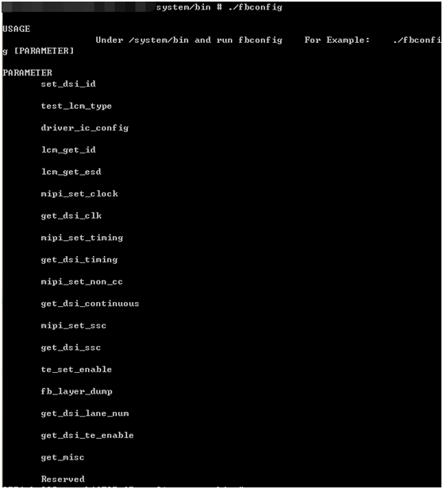
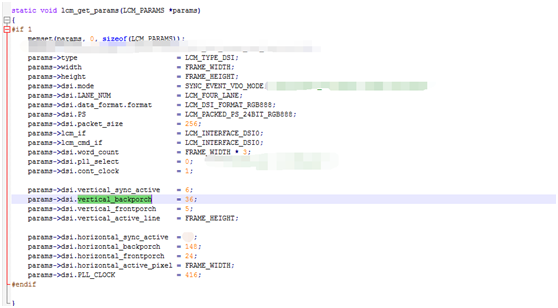

# LCD调试技巧

- [LCD调试技巧](#lcd调试技巧)
  - [屏幕使用fbconfig/PanelMaster来调试LCM驱动](#屏幕使用fbconfigpanelmaster来调试lcm驱动)

## 屏幕使用fbconfig/PanelMaster来调试LCM驱动

内置的工具里面有一个fbconfig来修改mipi的timging信号。
首先是开启的方式是源文件在
> vendor\mediatek\proprietary\hardware\fbconfig_tool\common

使用时需要打开Project中的宏改为MTK_EMULATOR_SUPPORT=yes
当然会出现有些工程不是在该目录下，比如external下，我们通过find -name fbconfig.c文件也可以找到，可以直接进入该目录，使用mm 进行编译，然后make snod,最后下载进去。

当然！打开宏可能会出现问题，我们可以使用以上方法直接mm编译进系统。

主要的使用是mipi_set_timing 使用该命令来设置我们的mipi timing

HPW -> horizontal_active_pixel      VPW -> vertical_active_line
HFP -> horizontal_frontporch        VFP -> vertical_frontporch
HBP -> horizontal_backporch         VBP -> vertical_backporch

这里的代码对应的修改是：

当然CLK也能设置：mipi_set_clock

代码实际作用是在：ddp_dsi.c中可以直接看到操作寄存器。

另外还有一个功能我觉着可能会用到，就是抓取layer的图像。使用
./fbconfig fb_layer_dump 1能够dump出layer 1的图像，存储在/data/layer1_dump.bmp。这样就可以查看layer每一层的 信息一共4层
