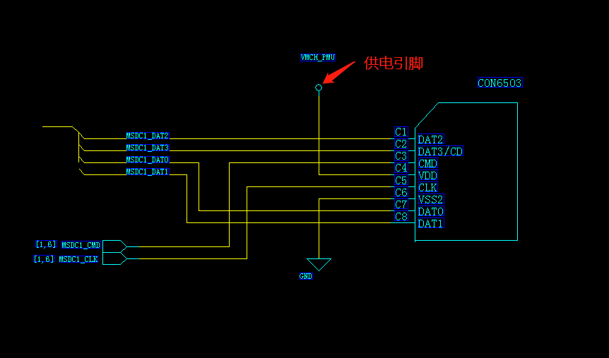
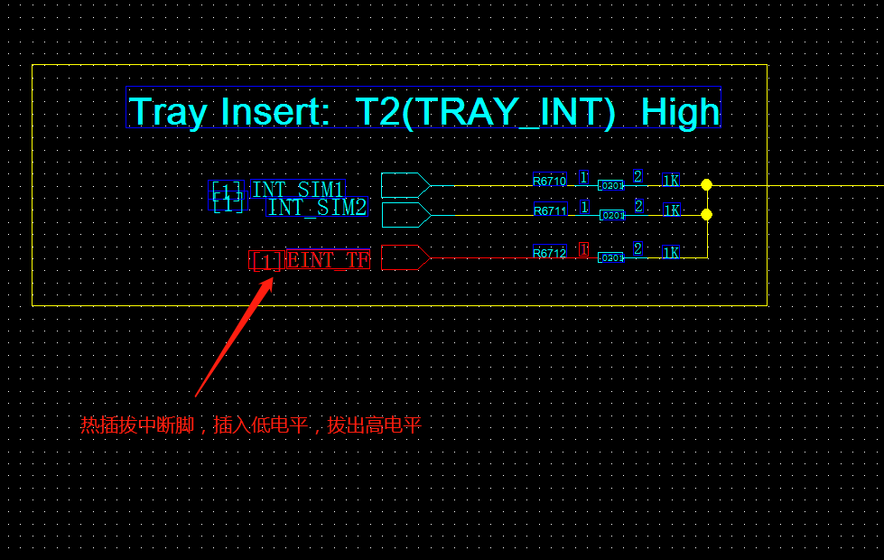
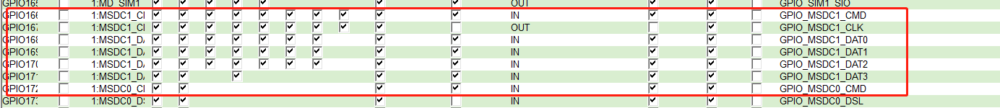
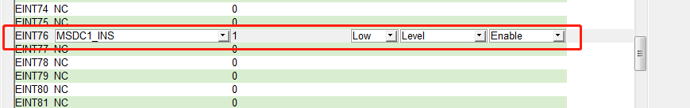
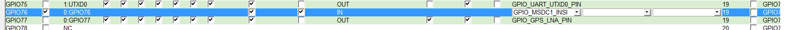

# TF-Card 调试

- [TF-Card 调试](#tf-card-调试)
  - [硬件原理图](#硬件原理图)
  - [软件配置参考](#软件配置参考)
  - [关键代码截图](#关键代码截图)
  - [详细的TF-Card技术介绍](#详细的tf-card技术介绍)
  - [调试过程中问题总结](#调试过程中问题总结)

## 硬件原理图




## 软件配置参考





```c
mt6735m.dtsi文件
mtk-msdc.0 {
  compatible = "simple-bus";
  #address-cells = <1>;
  #size-cells = <1>;
  ranges = <0 0 0 0xffffffff>;

  /* EMMC */
  mmc0: msdc0@11230000{
    compatible = "mediatek,mt6735m-mmc";
    reg = <0x11230000 0x10000  /* MSDC0_BASE   */
    0x10000e84 0x2>;    /* FPGA PWR_GPIO, PWR_GPIO_EO */
    interrupts = <GIC_SPI 79 IRQ_TYPE_LEVEL_LOW>;
    status = "disabled";
  };

  // CPU mmc总线 配置
  /* TF-card */
  mmc1: msdc1@11240000{
    compatible = "mediatek,mt6735m-mmc";
    reg = <0x11240000 0x10000  /* MSDC1_BASE   */
    0x10000e84 0x2>;    /* FPGA PWR_GPIO, PWR_GPIO_EO */
    interrupts = <GIC_SPI 80 IRQ_TYPE_LEVEL_LOW>;
    status = "disabled";
  };

/* only used for old way of DCT, can be removed in new platform */
  msdc1_ins: default {
    compatible = "mediatek, msdc1_ins-eint";
  };
};

// dws中断配置生成的dtsi
&msdc1_ins {
  interrupt-parent = <&eintc>;
  interrupts = <2 IRQ_TYPE_LEVEL_LOW>;
  debounce = <2 1000>;
  status = "okay";
};

&mmc1 {
  clk_src = /bits/ 8 <MSDC30_CLKSRC_200MHZ>;
  bus-width = <4>;
  max-frequency = <200000000>;
  msdc-sys-suspend;
  sd_need_power;                    /* sd_need_power flag位存在TF-Card的power不会随系统power suspend和resume影响，一直有电 */
  cap-sd-highspeed;
  sd-uhs-sdr12;
  sd-uhs-sdr25;
  sd-uhs-sdr50;
  sd-uhs-sdr104;
  sd-uhs-ddr50;
  pinctl = <&mmc1_pins_default>;
  pinctl_sdr104 = <&mmc1_pins_sdr104>;
  pinctl_sdr50 = <&mmc1_pins_sdr50>;
  pinctl_ddr50 = <&mmc1_pins_ddr50>;
  register_setting = <&mmc1_register_setting_default>;
  host_function = /bits/ 8 <MSDC_SD>;
  cd_level = /bits/ 8 <MSDC_CD_HIGH>; /* #define MSDC_CD_HIGH   (1)   #define MSDC_CD_LOW   (0)*/
  cd-gpios = <&pio 2 0>;            /* GPIO2为热插拔中断脚 */
  /*non-removable;*/                  /* 此flag为是不支持热插拔功能 */
  status = "okay";
};

&pio {
mmc1_pins_default: mmc1@default {
  pins_cmd {
    drive-strength = /bits/ 8 <3>;
  };
  pins_dat {
    drive-strength = /bits/ 8 <3>;
  };
  pins_clk {
    drive-strength = /bits/ 8 <3>;
  };
};

mmc1_pins_sdr104: mmc1@sdr104 {
  pins_cmd {
    drive-strength = /bits/ 8 <2>;
  };
  pins_dat {
    drive-strength = /bits/ 8 <2>;
  };
  pins_clk {
    drive-strength = /bits/ 8 <3>;
  };
};

mmc1_pins_sdr50: mmc1@sdr50 {
  pins_cmd {
    drive-strength = /bits/ 8 <2>;
  };
  pins_dat {
    drive-strength = /bits/ 8 <2>;
  };
  pins_clk {
    drive-strength = /bits/ 8 <3>;
  };
};

mmc1_pins_ddr50: mmc1@ddr50 {
  pins_cmd {
    drive-strength = /bits/ 8 <2>;
  };
  pins_dat {
    drive-strength = /bits/ 8 <2>;
  };
  pins_clk {
    drive-strength = /bits/ 8 <3>;
  };
};

mmc1_register_setting_default: mmc1@register_default {
  dat0rddly      = /bits/ 8 <0>;
  dat1rddly      = /bits/ 8 <0>;
  dat2rddly      = /bits/ 8 <0>;
  dat3rddly      = /bits/ 8 <0>;
  datwrddly      = /bits/ 8 <0>;
  cmdrrddly      = /bits/ 8 <0>;
  cmdrddly       = /bits/ 8 <0>;
  cmd_edge = /bits/ 8 <MSDC_SMPL_FALLING>;
  rdata_edge = /bits/ 8 <MSDC_SMPL_FALLING>;
  wdata_edge = /bits/ 8 <MSDC_SMPL_FALLING>;
};
};


```

## 关键代码截图

```c
  /* dts cd_level 热插拔状态设置, cd_level为高 */
  if (!(mmc->caps & MMC_CAP_NONREMOVABLE)) {
    level = __gpio_get_value(cd_gpio);
    if (host->hw->cd_level)
      host->card_inserted = (level == 0) ? 0 : 1;     /* 读取cd_gpio引脚状态，低电平为拔出，高电平为插入  [cd_level 配置为 MSDC_CD_HIGH ] */
    else
      host->card_inserted = (level == 0) ? 1 : 0;     /* 读取cd_gpio引脚状态，低电平为插入，高电平为拔出  [cd_level 配置为 MSDC_CD_LOW ] */
  } else { /* TODO Check DAT3 pins for card detection */
    host->card_inserted = 1;
  }


```

## 详细的TF-Card技术介绍

1. [深入理解SD卡协议 https://www.jianshu.com/p/6272e4cb1eeb ](https://www.jianshu.com/p/6272e4cb1eeb)

2. [SD卡 TF卡 接口引脚定义 https://blog.csdn.net/u010783226/article/details/92064456](https://blog.csdn.net/u010783226/article/details/92064456)

## 调试过程中问题总结

1. 注意看卡座和卡拖的中断脚触发方式，有的是电平，有的是边缘，如果是边缘触发的方式需要修改代码
2. 调试一定要用对应项目的卡座和卡托，避免调试ok后，实际项目生产有问题
3. 如何关闭热插拔支持: dws里面关闭掉中断配置，dts里面加入non-removable;
