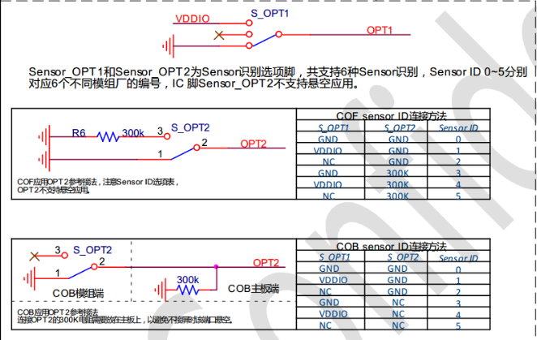
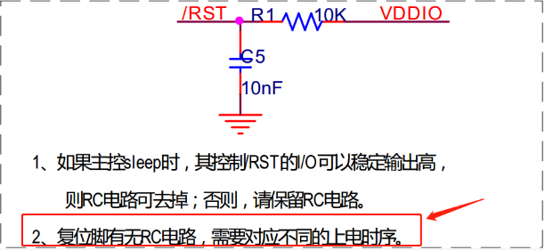
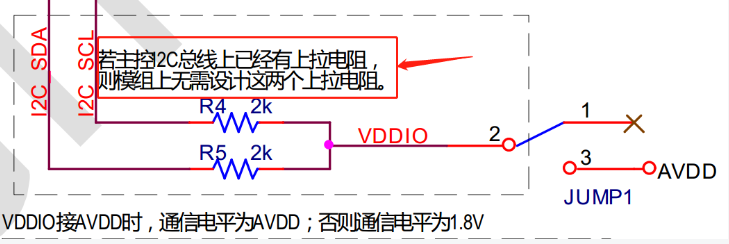
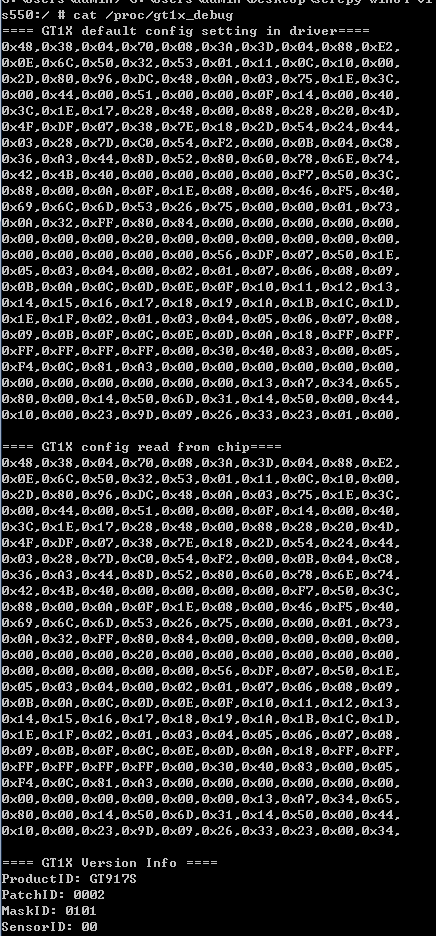

# TP调试技巧总结

## GOODIX

### GT917S

- datasheet 
- 原理图
- 驱动移植包
- 驱动移植文档
- 调试技巧
  - Sensor id
    Sensor id 需要和模组厂确认OPT1和OPT2的接线方式

    

  - config 文件
    配置参数向模组厂寻要，通过上面的Sensor id方式得出对应代码的GTP_CFG_GROUP[X]，把参数填入对应Sensor id的group表中（此方式只针对没有固化配置到IC的方式）

  - 中断触发方式

    > 当有触摸时， GT917S 每个扫描周期均会通过 INT 脚发出一个下降沿脉冲信号， 通知主 CPU 读取坐标信息

  - 固化配置功能

    > GT917S 支持固化配置功能， 可在芯片 Flash 中保存一组固化类型的参数。 保存了固化类型参数后的 GT917S 只会与主控进行 I2C 通讯， 不会接收主控下发的非固化类型配置。

  - 复位脚RC电路
  
    
  
  - i2c设计
  
    

- 调试问题总结
  - 芯片都是GT917S，模组厂不一样，需要兼容
    GT915S, 不通模组厂兼容方式是通过 sensor id来区分，这样就是在不同的模组厂合入config文件。
    1. 读取模组的sensor id
        > cat /proc/gt1x_debug

    

## 