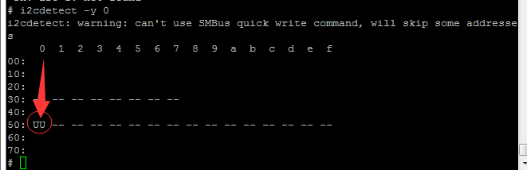
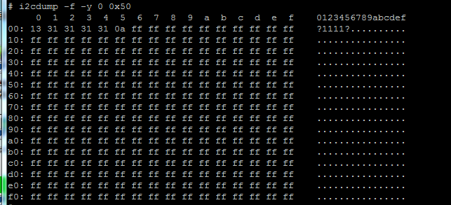
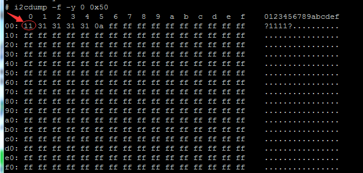

# i2c-tools工具

- [i2c-tools工具](#i2c-tools工具)
  - [i2c-tools工具使用](#i2c-tools工具使用)
    - [下载](#下载)
    - [移植](#移植)
    - [编译](#编译)
    - [使用](#使用)
    - [mtk平台android系统移植包供使用参考](#mtk平台android系统移植包供使用参考)

## i2c-tools工具使用

使用前提：

使用i2c-tools，的命令i2cdetect , i2cdump. i2cget. i2cset，本质上是在userspace操作i2c，这就需要内核的支持，即在/dev下有i2c-x 的字符设备节点存在。

编译内核的时候需要打开CONFIG_I2C_CHARDEV，

或者make menuconfig    device drivers---> I2C support ---> I2C device interface

编译kernel/i2c/i2c-dev.c

### 下载

下载地址：[https://i2c.wiki.kernel.org/index.php/I2C_Tools](https://i2c.wiki.kernel.org/index.php/I2C_Tools)

```c
https://mirrors.edge.kernel.org/pub/software/utils/i2c-tools/
git clone git://git.kernel.org/pub/scm/utils/i2c-tools/i2c-tools.git
git clone git://git.kernel.org/pub/scm/utils/i2c-tools/i2c-tools.git -b i2c-tools-3.1
```

本地下载文件：

[res/i2c-tools-4.1.tar.gz](res/i2c-tools-4.1.tar.gz)

```bash
解压 tar -zxvf i2c-tools-4.1.tar.gz
```

### 移植

- 解压包发到android源码extern目录下,我们只使用源码包tools目录下的文件

- 编写Android.mk

```bash
LOCAL_PATH := $(call my-dir)

######################################################
include $(CLEAR_VARS)
LOCAL_MODULE_TAGS := optional
LOCAL_C_INCLUDES += $(LOCAL_PATH) $(LOCAL_PATH)/linux/include
LOCAL_SRC_FILES :=  tools/i2cbusses.c \
                    tools/util.c
LOCAL_MODULE := i2c-tools
include $(BUILD_STATIC_LIBRARY)
######################################################


######################################################
include $(CLEAR_VARS)
LOCAL_MODULE_TAGS := optional
LOCAL_SRC_FILES :=  tools/i2cdetect.c
LOCAL_MODULE:=i2cdetect
LOCAL_CPPFLAGS += -DANDROID
LOCAL_SHARED_LIBRARIES:=libc
LOCAL_STATIC_LIBRARIES := i2c-tools
LOCAL_C_INCLUDES += $(LOCAL_PATH) $(LOCAL_PATH)/linux/include
include $(BUILD_EXECUTABLE)
######################################################

######################################################
include $(CLEAR_VARS)
LOCAL_MODULE_TAGS := optional
LOCAL_SRC_FILES :=  tools/i2cdump.c
LOCAL_MODULE:=i2cdump
LOCAL_CPPFLAGS += -DANDROID
LOCAL_SHARED_LIBRARIES:=libc
LOCAL_STATIC_LIBRARIES := i2c-tools
LOCAL_C_INCLUDES += $(LOCAL_PATH) $(LOCAL_PATH)/linux/include
include $(BUILD_EXECUTABLE)
######################################################

######################################################
include $(CLEAR_VARS)
LOCAL_MODULE_TAGS := optional
LOCAL_SRC_FILES :=  tools/i2cset.c
LOCAL_MODULE:=i2cset
LOCAL_CPPFLAGS += -DANDROID
LOCAL_SHARED_LIBRARIES:=libc
LOCAL_STATIC_LIBRARIES := i2c-tools
LOCAL_C_INCLUDES += $(LOCAL_PATH) $(LOCAL_PATH)/linux/include
include $(BUILD_EXECUTABLE)
######################################################

######################################################
include $(CLEAR_VARS)
LOCAL_MODULE_TAGS := optional
LOCAL_SRC_FILES :=  tools/i2cget.c
LOCAL_MODULE:=i2cget
LOCAL_CPPFLAGS += -DANDROID
LOCAL_SHARED_LIBRARIES:=libc
LOCAL_STATIC_LIBRARIES := i2c-tools
LOCAL_C_INCLUDES += $(LOCAL_PATH) $(LOCAL_PATH)/linux/include
include $(BUILD_EXECUTABLE)
######################################################
```

- 修改头文件及相关连接文件的定义

```bash
1. 将include/linux/i2c-dev.h 文件复制到tools目录中
2. 修改所有tools目录里面的头文件为 #include "i2c-dev.h"
```

- 开启内核i2c-dev设备节点支持
  
```bash
  CONFIG_I2C_CHARDEV=y
```

### 编译

编译完成后在tools/文件夹下会有如下几个可执行文件，i2cdetect, i2cdump, i2cget, i2cset

```bash
mmm extern/i2c-tools
make snod

adb remount
adb sync
adb reboot
```

### 使用
  
1、查询罗列出I2C的控制器总线数目

```bash
# i2cdetect -l
i2c-0   i2c             OMAP I2C adapter                        I2C adapter
i2c-1   i2c             OMAP I2C adapter                        I2C adapter
```

查询i2c总线上挂接的设备及设备的地址

```bash
# i2cdetect -y 0
```



从上图可看出，在i2c 总线0上有1个设备地址为0x50

```bash
0 -------  i2c-0，
-y-------  取消用户交互，直接执行
-f --------强制执行
```

通过i2c读出eeprom的所有的内容

```bash
# i2cdump -f -y 0 0x50
```



通过i2c写入内容到eeprom

```bash
# i2cset -y -f 0 0x50 0x00 0x11
```

```bash
0   -------  i2c-0，
-y  -------  取消用户交互，直接执行
-f   -------  强制执行
0x50：I2C设备地址
0x00：寄存器地址
0x11：要写入的值
```

再次读取发现数据改变了，写入成功：

```bash
# i2cdump -f -y 0 0x50
```



### mtk平台android系统移植包供使用参考

下载地址：
[../驱动移植包/common/android-i2c-tools移植包.zip](../驱动移植包/common/android-i2c-tools移植包.zip)
