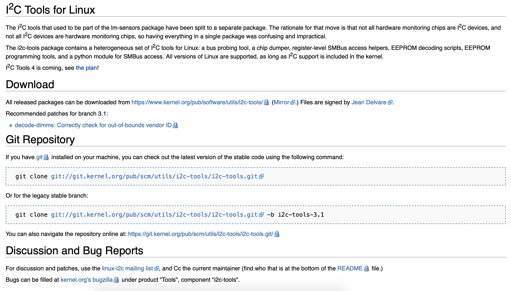

# I2C调试技巧

- [I2C调试技巧](#i2c调试技巧)
  - [i2c-tools工具使用](#i2c-tools工具使用)
    - [下载](#下载)
    - [移植](#移植)
    - [编译](#编译)
    - [使用](#使用)
    - [mtk平台android系统移植包供使用参考](#mtk平台android系统移植包供使用参考)

## i2c-tools工具使用

### 下载

下载地址：[https://i2c.wiki.kernel.org/index.php/I2C_Tools](https://i2c.wiki.kernel.org/index.php/I2C_Tools)

```c
https://mirrors.edge.kernel.org/pub/software/utils/i2c-tools/
git clone git://git.kernel.org/pub/scm/utils/i2c-tools/i2c-tools.git
git clone git://git.kernel.org/pub/scm/utils/i2c-tools/i2c-tools.git -b i2c-tools-3.1
```



本地下载文件：

[res/i2c-tools-4.1.tar.gz](res/i2c-tools-4.1.tar.gz)

```shell
解压 tar -zxvf i2c-tools-4.1.tar.gz
```

### 移植

### 编译

### 使用

### mtk平台android系统移植包供使用参考

