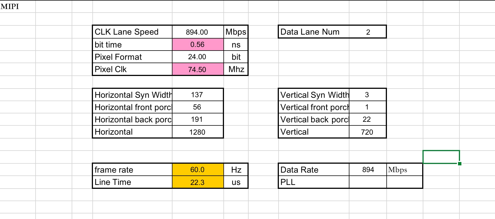
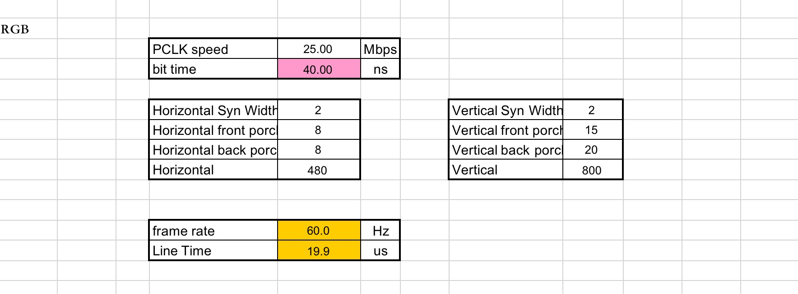

# LCD调试技巧

- [LCD调试技巧](#lcd调试技巧)
  - [MIPI_Video mode公式.xls表](#mipi_video-mode公式xls表)
  - [屏幕使用fbconfig/PanelMaster来调试LCM驱动](#屏幕使用fbconfigpanelmaster来调试lcm驱动)
  - [LCD android端旋转90度patch](#lcd-android端旋转90度patch)

## MIPI_Video mode公式.xls表

excel表中的CLK Lane Speed 和Data Rate是一个意思

- mipi时序调试



- rgb时序调试



- 下载  [MIPI_Video mode公式.xls](res/MIPI_Video%20mode公式.xls)

- 详细mipi时序讲解请参考总结文档 [技术总结报告/#lcd_mipi技术总结](https://237833645.github.io/doc/work/mtk_work/技术总结报告/lcd_mipi.html)

---

## 屏幕使用fbconfig/PanelMaster来调试LCM驱动

内置的工具里面有一个fbconfig来修改mipi的timging信号。
首先是开启的方式是源文件在
> vendor\mediatek\proprietary\hardware\fbconfig_tool\common

```bash
使用时需要打开Project中的宏改为
MTK_EMULATOR_SUPPORT=yes
内核修改
CONFIG_MTK_EMULATOR_SUPPORT=y
```

当然会出现有些工程不是在该目录下，比如external下，我们通过find -name fbconfig.c文件也可以找到，可以直接进入该目录，使用mm 进行编译，然后make snod,最后下载进去。

**当然！打开宏可能会出现问题，我们可以使用以上方法直接mm编译进系统。**


主要的使用是mipi_set_timing 使用该命令来设置我们的mipi timing

HPW -> horizontal_active_pixel      VPW -> vertical_active_line
HFP -> horizontal_frontporch        VFP -> vertical_frontporch
HBP -> horizontal_backporch         VBP -> vertical_backporch

这里的代码对应的修改是：


当然CLK也能设置：mipi_set_clock

代码实际作用是在：ddp_dsi.c中可以直接看到操作寄存器。

另外还有一个功能我觉着可能会用到，就是抓取layer的图像。使用
./fbconfig fb_layer_dump 1能够dump出layer 1的图像，存储在/data/layer1_dump.bmp。这样就可以查看layer每一层的 信息一共4层

---

## LCD android端旋转90度patch

```c
diff --git a/base/cmds/bootanimation/BootAnimation.cpp b/base/cmds/bootanimation/BootAnimation.cpp
index b183f02..4ca3135 100644
--- a/base/cmds/bootanimation/BootAnimation.cpp
+++ b/base/cmds/bootanimation/BootAnimation.cpp
@@ -326,11 +326,11 @@ status_t BootAnimation::readyToRun() {
     if (status)
         return -1;
     /// M: The tablet rotation maybe 90/270 degrees, so set the lcm config for tablet
-    SurfaceComposerClient::setDisplayProjection(dtoken, DisplayState::eOrientationDefault, Rect(dinfo.w, dinfo.h), Rect(dinfo.w, dinfo.h));
+    SurfaceComposerClient::setDisplayProjection(dtoken, DisplayState::eOrientation90, Rect(dinfo.h, dinfo.w), Rect(dinfo.h, dinfo.w));

     // create the native surface
     sp<SurfaceControl> control = session()->createSurface(String8("BootAnimation"),
-            dinfo.w, dinfo.h, PIXEL_FORMAT_RGB_565);
+            dinfo.h, dinfo.w, PIXEL_FORMAT_RGB_565);

     SurfaceComposerClient::openGlobalTransaction();
     control->setLayer(0x2000010);
diff --git a/base/services/core/java/com/android/server/policy/PhoneWindowManager.java b/base/services/core/java/com/android/server/policy/PhoneWindowManager.java
index 1c5ded9..6026db7 100644
--- a/base/services/core/java/com/android/server/policy/PhoneWindowManager.java
+++ b/base/services/core/java/com/android/server/policy/PhoneWindowManager.java
@@ -6720,7 +6720,7 @@ public class PhoneWindowManager implements WindowManagerPolicy {
                     if (preferredRotation >= 0) {
                         return preferredRotation;
                     }
-                    return Surface.ROTATION_0;
+                    return Surface.ROTATION_90;
             }
         }
     }
diff --git a/base/services/core/java/com/android/server/wm/WindowManagerService.java b/base/services/core/java/com/android/server/wm/WindowManagerService.java
index b345ea5..934a9f9 100644
--- a/base/services/core/java/com/android/server/wm/WindowManagerService.java
+++ b/base/services/core/java/com/android/server/wm/WindowManagerService.java
@@ -568,7 +568,7 @@ public class WindowManagerService extends IWindowManager.Stub
     /** All DisplayContents in the world, kept here */
     SparseArray<DisplayContent> mDisplayContents = new SparseArray<>(2);

-    int mRotation = 0;
+    int mRotation = 1;
     int mForcedAppOrientation = ActivityInfo.SCREEN_ORIENTATION_UNSPECIFIED;
     boolean mAltOrientation = false;

diff --git a/native/services/surfaceflinger/DisplayDevice.cpp b/native/services/surfaceflinger/DisplayDevice.cpp
index 835d94a..ce69acd 100644
--- a/native/services/surfaceflinger/DisplayDevice.cpp
+++ b/native/services/surfaceflinger/DisplayDevice.cpp
@@ -185,7 +185,7 @@ DisplayDevice::DisplayDevice(
     }

     // initialize the display orientation transform.
-    setProjection(DisplayState::eOrientationDefault, mViewport, mFrame);
+    setProjection(DisplayState::eOrientation90, mViewport, mFrame);
 }

 DisplayDevice::~DisplayDevice() {

```