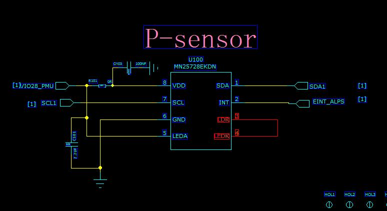
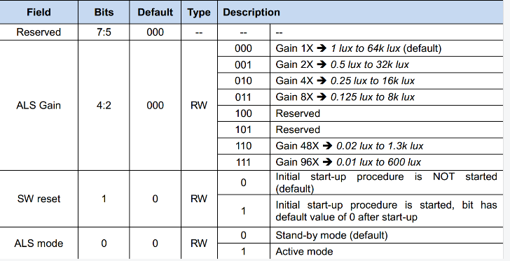

# 传感器调试总结

- [传感器调试总结](#传感器调试总结)
  - [光线距离](#光线距离)
    - [LTR-553ALS-WA](#ltr-553als-wa)
  - [重力](#重力)
  - [指南针](#指南针)
  - [陀螺仪](#陀螺仪)
  - [计步](#计步)
  - [压力](#压力)
  - [温湿度](#温湿度)
  - [气体](#气体)
  - [霍尔](#霍尔)
  - [血压](#血压)

## 光线距离

### LTR-553ALS-WA

- 规格书 [LTR-553ALS-WA_2019-07-29.PDF](res/LTR-553ALS-WA_2019-07-29.PDF)

- 原理图

    

- 驱动移植代码 [ltr559-易景.rar](res/ltr559-易景.rar)

- 调试问题总结
  - 光线传感器需要调整在暗环境下的灵敏度，修改0x80寄存器LTR559_ALS_CONTR，调节als的gain
  
    

    调整光线传感器灵敏度驱动代码修改2处

    第一处：

    ```c
    static int ltr559_als_enable(struct i2c_client *client, int enable)
    {
        //struct ltr559_priv *obj = i2c_get_clientdata(client);
        int err=0;
        u8 regdata=0;
        //if (enable == obj->als_enable)
        //return 0;

        regdata = ltr559_i2c_read_reg(LTR559_ALS_CONTR);

        if (enable == 1) {
            APS_LOG("ALS(1): enable als only \n");
            regdata = 0x1c;                                                         // 修改此值
            err = ltr559_i2c_write_reg(LTR559_ALS_CONTR, regdata);
        } else {
            APS_LOG("ALS(1): disable als only \n");
            regdata = 0x00;
            err = ltr559_i2c_write_reg(LTR559_ALS_CONTR, regdata);
        }

        if(err<0)
        {
            APS_ERR("ALS: enable als err: %d en: %d \n", err, enable);
            return err;
        }

        //obj->als_enable = enable;

        msleep(WAKEUP_DELAY);

        return 0;

    }
    ```

    第二处：

    ```c
    // Enable ALS to Full Range at startup
        als_gainrange = ALS_RANGE_600;                      /*ALS_RANGE_1300;*/ //修改这里，让gain变为最灵敏的0x1c， LTR559_ALS_CONTR = 0x80

        init_als_gain = als_gainrange;

        switch (init_als_gain)
        {
            case ALS_RANGE_64K:
                res = ltr559_i2c_write_reg(LTR559_ALS_CONTR, MODE_ALS_Range1);
                break;

            case ALS_RANGE_32K:
                res = ltr559_i2c_write_reg(LTR559_ALS_CONTR, MODE_ALS_Range2);
                break;

            case ALS_RANGE_16K:
                res = ltr559_i2c_write_reg(LTR559_ALS_CONTR, MODE_ALS_Range3);
                break;

            case ALS_RANGE_8K:
                res = ltr559_i2c_write_reg(LTR559_ALS_CONTR, MODE_ALS_Range4);
                break;

            case ALS_RANGE_1300:
                res = ltr559_i2c_write_reg(LTR559_ALS_CONTR, MODE_ALS_Range5);
                break;

            case ALS_RANGE_600:
                res = ltr559_i2c_write_reg(LTR559_ALS_CONTR, MODE_ALS_Range6);
                break;

            default:
                res = ltr559_i2c_write_reg(LTR559_ALS_CONTR, MODE_ALS_Range1);
                APS_ERR("proxmy sensor gainrange %d!\n", init_als_gain);
                break;
        }
    ```

    抓取log查看暗环境als值，修改dts里面的值对应关系

## 重力

## 指南针

- 指南针测试APK下载   [指南针.apk](./res/指南针.apk)
- 指南针方向调试


## 陀螺仪

## 计步

## 压力

## 温湿度

## 气体

## 霍尔

## 血压
