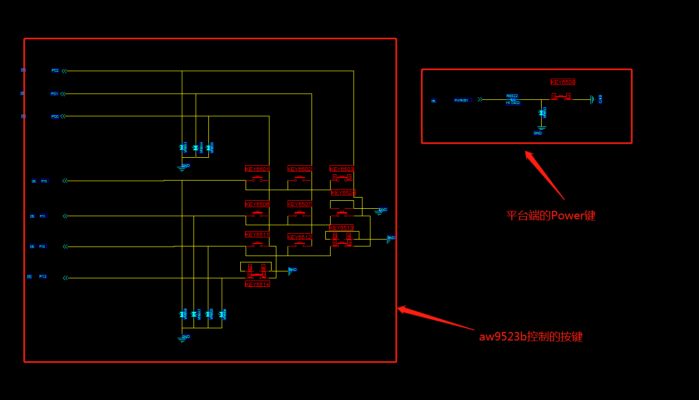
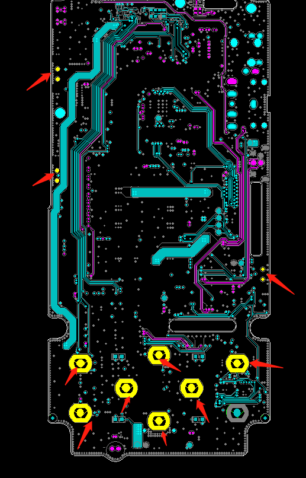
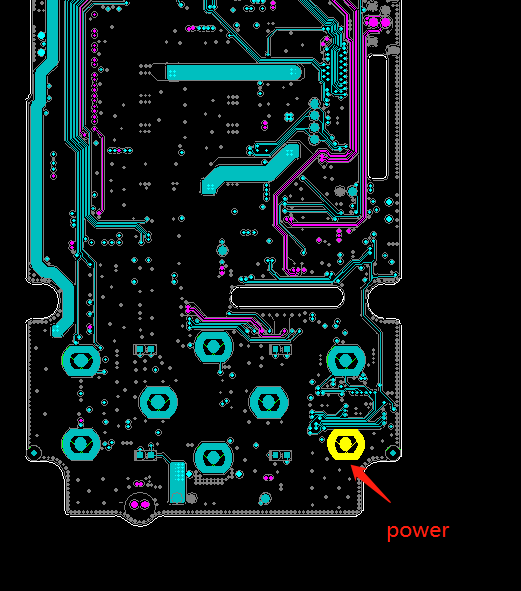
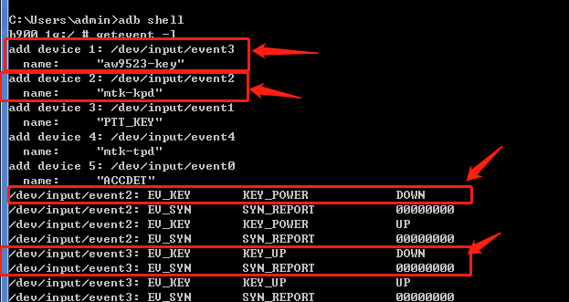

# ATA 按键配置及开发

## 开发背景

1. MTK在ATA测试模式中已经是有默认的按键测试选项,只需要相应的客制化就可以,分为KCOL和KROW组成的按键及PMU端的按键(power、reset),
2. 外扩按键芯片的需要单独的进行开发(T8项目带了一个AW9523的按键芯片)

T8原理图 (带aw9523b扩展按键)





## 客制化内容

- 加入要测试的按键对应表

  ```code
  //文件名  cust_keys.h

  #define KEYS_PWRKEY_MAP \
    {                     \
      KEY_POWER, "Power"  \
    }

  #define DEFINE_KEYS_KEYMAP(x) \
    struct key x[] = {          \
        KEYS_PWRKEY_MAP,        \
        {KEY_MENU, "Menu"},     \
        {KEY_ENTER, "Enter"},   \
        {KEY_BACK, "Back"},     \
        {KEY_UP, "Up"},         \
        {KEY_DOWN, "Down"},     \
        {KEY_LEFT, "Left"},     \
        {KEY_RIGHT, "Right"},   \
        {KEY_CAMERA, "Camera"}, \
        {KEY_F1, "F1"},         \
        {KEY_F8, "F8"},         \
  }

  ```

- 增加按键对应测试表数组(带扩展按键的按键值较多,超出了系统给的默认值10个按键)

  ```code
  //文件名  utils.cpp
  - struct key keys_keymap[10];
  + struct key keys_keymap[30];

  //文件名  ftm_keys.c
  - extern struct key keys_keymap[10];
  + extern struct key keys_keymap[30];
  ```

- 扩展按键驱动代码是增加的新的input设备驱动,需要在测试项中单独对event节点进行修改

  adb shell查看event截图

  截图中显示:
  1. aw9523的 event节点为 /dev/input/event3
  2. 系统默认的power按键节点为 /dev/input/event2

  

  下面为修改的代码片段
  1. 删除默认的按键支持只留下主板支持的power键
  2. 单独增加aw9523的按键测试逻辑项

  ```code
  //文件名  ftm_keys.c

  //此函数是增加的独立测试aw9523b的event3事件里面的按键值
  void ftm_save_aw9523_key_map(int key_code)
  {
    switch (key_code)
    {
    case KEY_BACK:
      keys_keymap[keys_num].code = key_code;
      memcpy(keys_keymap[keys_num].name, "Back", 4);
      keys_num++;
      break;
    case KEY_F1:
      keys_keymap[keys_num].code = key_code;
      memcpy(keys_keymap[keys_num].name, "F1", 2);
      keys_num++;
      break;
    case KEY_F8:
      keys_keymap[keys_num].code = key_code;
      memcpy(keys_keymap[keys_num].name, "F8", 2);
      keys_num++;
      break;
    case KEY_CAMERA:
      keys_keymap[keys_num].code = key_code;
      memcpy(keys_keymap[keys_num].name, "Camera", 6);
      keys_num++;
      break;
    case KEY_MENU:
      keys_keymap[keys_num].code = key_code;
      memcpy(keys_keymap[keys_num].name, "Menu", 4);
      keys_num++;
      break;
    case KEY_ENTER:
      keys_keymap[keys_num].code = key_code;
      memcpy(keys_keymap[keys_num].name, "Enter", 5);
      keys_num++;
      break;
    case KEY_UP:
      keys_keymap[keys_num].code = key_code;
      memcpy(keys_keymap[keys_num].name, "Up", 2);
      keys_num++;
      break;
    case KEY_DOWN:
      keys_keymap[keys_num].code = key_code;
      memcpy(keys_keymap[keys_num].name, "Down", 4);
      keys_num++;
      break;
    case KEY_LEFT:
      keys_keymap[keys_num].code = key_code;
      memcpy(keys_keymap[keys_num].name, "Left", 4);
      keys_num++;
      break;
    case KEY_RIGHT:
      keys_keymap[keys_num].code = key_code;
      memcpy(keys_keymap[keys_num].name, "Right", 5);
      keys_num++;
      break;

    default:
      LOGD(TAG " kpd = %d", key_code);
      break;
    }
  }

  //原生按键测试函数,删除掉其他没有用的按键值,只留下power键(我们项目不带VolUp,VolDown等)
  void ftm_save_key_map(int key_code)
  {
    switch (key_code)
    {
    case KEY_POWER:
      keys_keymap[keys_num].code = key_code;
      memcpy(keys_keymap[keys_num].name, "Power", 5);
      keys_num++;
      break;
    default:
      LOGD(TAG " kpd = %d", key_code);
      break;
    }
  }


  void ftm_get_key_map(void)
  {
    char buffer[80];
    char name[64];
    int version;
    int fd, key_code = 0, m;
    LOGD(TAG " start get key map device");
    char buf[256] = {
        0,
    };
    for (m = 0; m < 32; m++)
    {
      sprintf(name, "/dev/input/event%d", m);
      if ((fd = open(name, O_RDONLY, 0)) >= 0)
      {
        // LOGD(TAG " kpd kpd_fd = %d", fd);
        ioctl(fd, EVIOCGNAME(sizeof(buf)), buf);
        if (memcmp(buf, "mtk-kpd", 7) == 0 ||
            memcmp(buf, "mtk-pmic-keys", 13) ==
                0)
        { /*add for pmic keys upstream driver*/
          // LOGD(TAG " kpd name = %s", buf);
          ioctl(fd, EVIOCGBIT(EV_KEY, sizeof(mask)), mask);
          for (key_code = 0; key_code < KEY_CNT; key_code++)
          {
            if (test_bit(key_code))
            {
              ftm_save_key_map(key_code);
            }
          }
          close(fd);
          /*break;*/ /*disable for pmic keys upstream driver*/
        }
        else if (memcmp(buf, "aw9523-key", 10) == 0)            //加入aw9523-key这个event3的独立检测按键选项
        {
          ioctl(fd, EVIOCGBIT(EV_KEY, sizeof(mask)), mask);
          for (key_code = 0; key_code < KEY_CNT; key_code++)
          {
            if (test_bit(key_code))
            {
              ftm_save_aw9523_key_map(key_code);                //调用按键测试功能
            }
          }
          close(fd);
        }
        else
        {
          close(fd);
        }
      }
      else
      {
        LOGD(TAG "open device failed");
      }
    }
  }

  ```

## 代码移植包供参考

[t8-ata.zip](./res/t8-ata.zip)

## 总结
