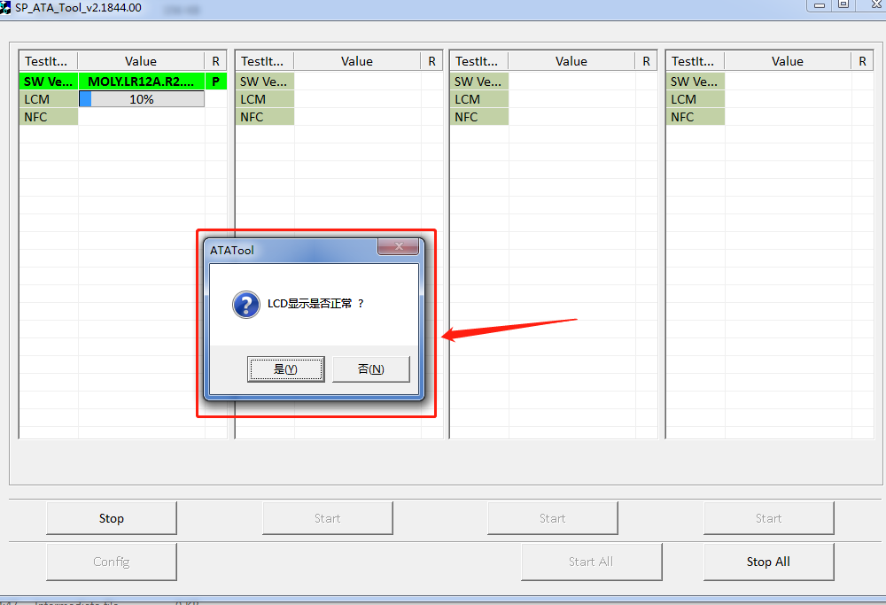

# ATA LCD配置及开发

## 开发背景

项目使用的lcd不是手机项目的统一mipi标准,各种总线的都有,spi,mipi,i2c等,所以需要修改掉原生ata的测试方式,添加AfxMessageBox

## 客制化内容

ata代码路径添加AfxMessageBox相关代码:

工具运行截图如下:


## 关健代码相关修改

```c++
// ATA_DLL\TestItem\src\ATA_DLL_TestItem_LCM.cpp

E_ATADLL_RESULT CTestItem_LCM::RunATA10()
{
  E_ATADLL_RESULT testResultCode;
  ClearATResPool();
  test_handle->m_commonCFG.cbTestProgess(test_handle->handle_index, E_LCD, 10);

  ATResult atret;
  string atstr = "";
#ifdef __ATA20__
  if (IsAutoMode())
  {
    atstr = "AT+LCM=1,1";
  }
  else
  {
    atstr = "AT+LCM=1,2";
  }
#else
  atstr = "AT+LCM";
#endif
  atstr += CR;
  test_handle->m_comm_handle->WriteCommand(atstr.c_str(), atstr.length(),
                                           ATTIMEOUT, false, atret);

#if 1 // wangfeng add for lcd test AfxMessageBox check
  int check =
      AfxMessageBox("LCD显示是否正常? ", MB_ICONQUESTION | MB_YESNO, 0);
  if (check == IDYES)
  {
    AddLog("[OK] LCM test ok from target.");
    test_handle->m_testCNF->bLCMDetected = true;
    testResultCode = E_ATADLL_RESULT_SUCCESS;
    test_handle->m_commonCFG.cbTestProgess(test_handle->handle_index, E_LCD,
                                           100);
    return testResultCode;
  }
  else if (check == IDNO)
  {
    AddLog("[LCM fail] LCM test fail.");
    test_handle->m_testCNF->bLCMDetected = false;
    testResultCode = E_ATADLL_RESULT_FAILED;
    test_handle->m_commonCFG.cbTestProgess(test_handle->handle_index, E_LCD,
                                           100);
    return testResultCode;
  }
#endif // wangfeng add for lcd test AfxMessageBox check

  if (!GetATResponse(atret))
  {
    AddLog("[LCM ERROR] %s response timeout.", atstr.c_str());
    test_handle->m_testCNF->bLCMDetected = false;
    return E_ATADLL_RESULT_AT_RESPONSE_TIMEOUT;
  }
  test_handle->m_commonCFG.cbTestProgess(test_handle->handle_index, E_LCD, 60);

  char lcm_str[1024];
  int m_iWholeCmdLen = atret.resultLst[0].eleLst[0].str_value.length();
  memset(lcm_str, 0x0, sizeof(char) * 1024);
  memcpy(lcm_str, atret.resultLst[0].eleLst[0].str_value.c_str(),
         m_iWholeCmdLen);
  lcm_str[m_iWholeCmdLen] = '\0';

  // char *temp_str = strstr(lcm_str, "pass");
  if (NULL != strstr(lcm_str, "pass"))
  {
    AddLog("[OK] LCM test ok from target.");
    test_handle->m_testCNF->bLCMDetected = true;
    testResultCode = E_ATADLL_RESULT_SUCCESS;
  }
  else if (NULL != strstr(lcm_str, "fail"))
  {
    AddLog("[LCM fail] LCM test fail.");
    test_handle->m_testCNF->bLCMDetected = false;
    testResultCode = E_ATADLL_RESULT_FAILED;
  }
  if (NULL != strstr(lcm_str, "Cannot find"))
  {
    AddLog("[LCM ERROR]LCM Not support !");
    test_handle->m_testCNF->bLCMDetected = false;
    testResultCode = E_ATADLL_RESULT_NOT_SUPPORT;
  }
  else if (NULL != strstr(lcm_str, "not test"))
  {
    AddLog("[LCM ERROR] LCM not test.");
    test_handle->m_testCNF->bLCMDetected = false;
    testResultCode = E_ATADLL_RESULT_NOT_TEST;
  }
  test_handle->m_commonCFG.cbTestProgess(test_handle->handle_index, E_LCD, 100);

  return testResultCode;
}

```

## 代码移植包供参考

## 总结
