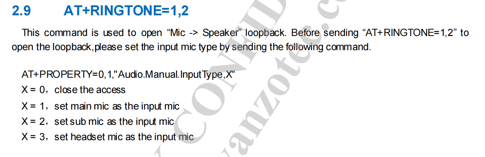

# ATA SOUND配置及开发

## 客制化内容

- S600项目: 是有mic和speaker的，mic是主mic，无第二个mic，只有一个speaker
  > 测试问题，默认情况下ata在测试speaker选项的时候是自带了mic的loopback测试的，也就是说ata的speaker测试包含了mic功能。
  > 安装我们项目的特殊情况是需要客制化的，不然会发出2次测试声音一次是主mic，第二次是sub mic，所以关闭sub mic测试功能
  > 修改文件factory.ini 和 factory.chn.ini

  ```code
  Audio.Mic.Sets=1，2; 将这个1，2 修改为 0，1  ，这个修改就是告诉系统只测试一个mic的loopback

  ```

  

## 关健代码相关修改

## 代码移植包供参考

## 总结
