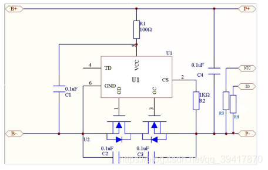
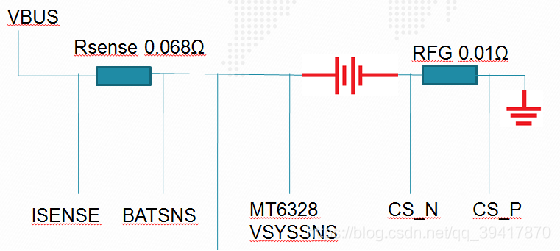

# mtk充电原理及代码架构

------------------------------------

## 硬件原理介绍

参考文档 [MTK驱动模块_4 battery-硬件原理介绍](https://blog.csdn.net/qq_39417870/article/details/98100361)

battery作为手机的供电系统，提供至关重要的作用，关系手机续航，性能的稳定。本节先从batter的硬件原理开始介绍。

battery的内部结构:

电池内部结构：B+，B-,分别接锂电芯的正负极，一个封装好的电池留给外部的接口共计4个，分别P+，P-，NTC，ID；下面分别介绍：P+：电池正极p-：电池负极

NTC引脚：用来测试电池温度的，NTC电阻集成在电池中，目前我们一般做的电池的规格里面的NTC电阻为47K，也就是电池内部结构图中R3的阻值为47K。（NTC电阻呈负相关系数，这样我们外部可以进行一个上拉电阻，PMIC通过采集NTC脚的电压来获得温度值。）

ID脚：ID脚内部其实也就是一个R4电阻，这个ID脚我们用来做电池兼容的，假设让电池厂商A把R4的阻值设为1k，让电池厂商B把R4阻值设为10K，这样我们外部接同样的上拉电阻，采用ADC来测量ID引脚就可以得到不同的电压大小以区分不同厂商的电池。

------------------------------------

接到主板上的充电回路

电池容量计算：

(增加/消耗)电容计算方式：

V(rfg) = V(cs_p) – V(cs_n)

Δ Q = i(rfg) * Δ t

Q = ∫ i dt

------------------------------------

电量为电流对时间的积分，
从而计算出消耗的电量

各电阻、电压的作用

1、RFG测量电阻，电池电量通过RFG计算。

2、Rsense电阻，做充电使用，连接到充电IC，做电流控制。

3、开机时，PMIC会读取VSYSSNS的电压，在zcv表格中匹配，作为电池的初始电量Q0，接着通过计算Rsesense 及 RFG的 流过的电流，通过库伦积分法，就可以计算出电池的电量了，精确跟踪电池的变化

------------------------------------

## 代码架构和流程

参考文档：[【 MTK驱动模块_5 】battery2--代码架构和流程
](https://blog.csdn.net/qq_39417870/article/details/98172104)

## 文档参考如下

- [代码架构和流程](https://blog.csdn.net/qq_39417870/article/details/98172104)
- [MTK Battery系统](http://www.voidcn.com/article/p-bklswglr-xp.html)
- [MTK Android Driver ：battery](http://www.voidcn.com/article/p-ndkgksdb-pe.html)
- [MTK battery 原理](http://www.voidcn.com/article/p-btvhcgse-sn.html)
