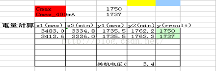
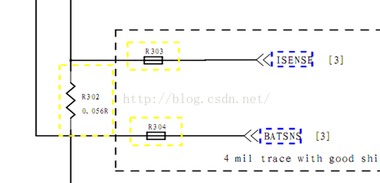

# 充电zcv客制化

  参考文档 [MTK65XX平台充电调试总结 （转载）](https://www.cnblogs.com/reality-soul/articles/4786989.html)

## 配置电池温度检测相关参数 (cust_battery_meter_table.h)

- A．目前热敏电阻有两种规格：10K和47K。由电池工程师提供参数

    ```code
    #define BAT_NTC_10 1
    #define BAT_NTC_47 0
    ```

- B．在配置热敏电阻参数的同时，也要根据原理图，配置温度检测上拉电阻以及参考电压。

    ```code
    #define RBAT_PULL_UP_R             16000  //对应原理图中的R311
    #define RBAT_PULL_UP_VOLT          2800   //对应原理图中的VBATREF
    ```

## 更新电池充放电参数

  电池充放电参数由电池工程师向电池厂家索取。根据提高的测试数据，我们可以获得各温度下最大放电容量，各温度下的内阻—电压表、放电深度—电压表。

- A.  更新各温度下对应的最大放电容量（头文件：cust_battery_meter.h）

    

    ```code
    #define Q_MAX_POS_50 1750  //Cmax
    #define Q_MAX_POS_25 1763
    #define Q_MAX_POS_0 1756
    #define Q_MAX_NEG_10 1726

    #define Q_MAX_POS_50_H_CURRENT 1737 //Cmax_400mA
    #define Q_MAX_POS_25_H_CURRENT 1717
    #define Q_MAX_POS_0_H_CURRENT 1214
    #define Q_MAX_NEG_10_H_CURRENT 966
    ```

- B.  更新“内阻---电压转换表”和“放电深度百分比---电压”转换表（头文件：cust_battery_meter_table.h)
  
    ```code
    上图是电池充放电测试参数中的一个截图
    OCV：电池空载电压CV:电池负载电压
    mAh：放电容量DOD：放电深度百分比
    R：电池内阻：
    从表格中提取 R----OCV 对应温度的r_profile_t2数组
    从表格中提取DOD---OCV到对应温度的battery_profile_t2数组中
    注意数组的元素个数都要一致。
    ```

## 配置充电电流：(cust_charging.h)

  ```code
  #define USB_CHARGER_CURRENT_SUSPEND         0                             // def CONFIG_USB_IF
  #define USB_CHARGER_CURRENT_UNCONFIGURED    CHARGE_CURRENT_70_00_MA       // 70mA
  #define USB_CHARGER_CURRENT_CONFIGURED      CHARGE_CURRENT_550_00_MA      // 500mA
  #define USB_CHARGER_CURRENT                 CHARGE_CURRENT_550_00_MA      //500mA
  #define AC_CHARGER_CURRENT                  CHARGE_CURRENT_800_00_MA
  #define NON_STD_AC_CHARGER_CURRENT          CHARGE_CURRENT_1050_00_MA
  #define CHARGING_HOST_CHARGER_CURRENT       CHARGE_CURRENT_1050_00_MA
  #define APPLE_0_5A_CHARGER_CURRENT          CHARGE_CURRENT_550_00_MA
  #define APPLE_1_0A_CHARGER_CURRENT          CHARGE_CURRENT_650_00_MA
  #define APPLE_2_1A_CHARGER_CURRENT          CHARGE_CURRENT_800_00_MA
  ```

## 配置电流检测电阻：（cust_battery_meter.h）

  ```code
  #define CUST_R_SENSE         56  //56 mOhm
  ```

  充电电流检测电阻

  

## 开机初始化电量的调试

调试开机初始化电量的意义在于，尽量获取准确的电量，为后续积分算法进行电量积分提供一个准确的参考。

源代码：battery_common.c  battery_meter.c  (充电算法采用SOC_BY_SW_FG)

工作流程：BAT_thread()  ->  battery_meter_initial() -> oam_init()

- oam_init()函数中先获取HW_OCV和V_BAT_SENSE两路电压，其中HW_OCV是通过PMIC_AUXADC_ADC_OUT_WAKEUP_PCHR寄存器获取的，这是PMIC上电时检测到的电池开路电压值，这个有时候是有一定误差的，所以必须同时获取V_BAT_SENSE的电压，也就是当前的电池电压值。

- 根据系统是否接入充电器，与V_BAT_SENSE对比，判断HW_OCV的合理性。如果不合理，需要采取措施纠正。这就是这部分调试的要点。要根据按power键、接USB、接AC等情景，搜集数据，进行调试。保证初始电压以及电量尽量接近真实的电池开路电压.
- 确定好系统启动时电池电量以后，还要跟上次系统关机时系统保留到RTC中的电量做对比，假如当前启动测得的电量和RTC中保留的电量误差在20%（这个值可以根据具体情况调整），那么选择RTC中保留电量为合法。这么做有两个目的，一个是判断是否为同一块电池，还有就是保证同一块电池在开机前后电量不会出现大的波动。电池管理驱动程序在运行的时候，会随时更新电量值，刷新到RTC的寄存器RTC_AL_HOU中，每次开机启动时，oam_init()会调用dod_init，dod_init函数会读取RTC_AL_HOU寄存器的值，这个如果是0，表明是第一次刷机后开机，如果不为0，则为上次关机时候的电池电量。

## 充放电算法的调试

  充放电算法的原理就是库仑积分法，调试的主要问题放电曲线和充电曲线。

  源代码：battery_meter.c       oam_run();

- 放电曲线的调试

    放电曲线主要调试 d5_count_time 在 gFG_Is_Charging == KAL_FALSE 时候的值，主要根据电池容量。

- 充电曲线的调试

    充电曲线首先要根据电池容量和标称充电电流的大小，估算一下电量从0%到100%需要多少的充电时间.
    还有就是从90%到100%这一阶段的充电时间的调试，会影响到电池是否能完全充满。在这一阶段一方面是通过charging_full_check()这个函数获取充电IC中充电状态寄存器的值和充电电流来判断电池是否充满；另外一方面就是通过调整这个阶段的时间来判断。

## 考虑接触点电阻

  电池接触点处一般会有20~40mho的电阻，这个阻值在大电流（1.5-2A）充电的时候，会对充电算法有一定的影响。所以在调试的时候要考虑这个电阻的存在，尤其是大电流充电的时候。在函数mtk_imp_tracking中计算开路电压的时候，可以通过宏定义FG_METER_RESISTANCE的调整去补充上这个接触点电阻。

## 充电IC中DPM功能影响

使用的BQ24158,BQ24296芯片中都会有一个DPM功能，这个DPM功能是在充电过程中，当输入源输入功率无法提供支持设置的或者默认的充电电流时，会降低VBUS的电压，以保证在功率不变的情况下提供足够的充电电流，当VBUS降低到Vin_dpm以下时，又及时调整充电电流保证VBUS电压不至于太低导致无法识别。由于这个DPM设置不合理导致的问题就是插入USB的时候，“正在充电”的过程持续一会立马消失了。这就是因为由于电脑提供的USB最大充电电流为450mA，而Vin_dpm和USB充电电流设置过大，导致电脑的USB接口提供的功率不足，于是充电IC的DPM功能发挥作用，把VBUS拉低到4.5V以下，USB掉线了。

## MT6732平台重开机前后HW_OCV不变的问题

现象是这样的：第一次开机的时候HW_OCV是3.67V，直接重启系统后，HW_OCV还是3.67V，没有变化。这个现象直接导致在关机充电下按电源键启动系统的时候，开机开路电压检测偏差极大的问题。解决这个问题需要重置AUXADC寄存器。在mtk_wdt.c中修改如下：

  ```code
  void wdt_arch_reset(char mode)

  {

      ……

      mt6325_upmu_set_rg_auxadc_rst(0x01);

      mt6325_upmu_set_rg_auxadc_reg_rst(0x01);

      ……

  }
  ```
