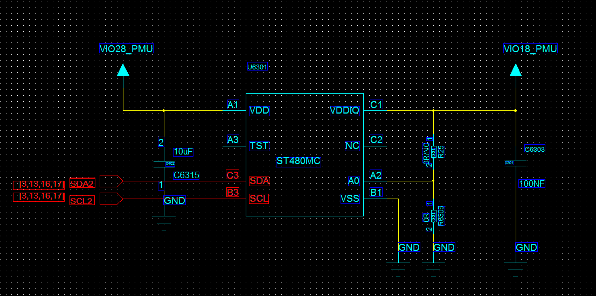
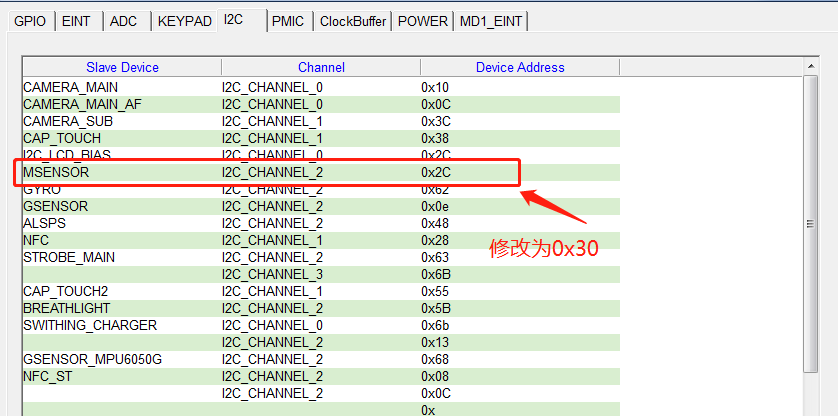
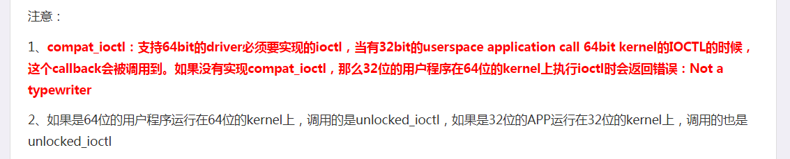

# MMC3680KJ指南针调试MTK6737 Android 7.0调试

- [MMC3680KJ指南针调试MTK6737 Android 7.0调试](#mmc3680kj指南针调试mtk6737-android-70调试)
  - [原理图](#原理图)
  - [官方提供的说明文档](#官方提供的说明文档)
  - [代码调试流程及代码片段](#代码调试流程及代码片段)
    - [dws/dtsi配置](#dwsdtsi配置)
    - [makefile编写(android、内核)](#makefile编写android内核)
    - [移植内核驱动代码](#移植内核驱动代码)
    - [移植hal运行daemo](#移植hal运行daemo)
    - [加入init.rc](#加入initrc)
    - [配置selinux](#配置selinux)
  - [代码移植包差分包](#代码移植包差分包)
  - [小结](#小结)

## 原理图



## 官方提供的说明文档

[MMC3680KJ芯片规格书](./res/MMC3680KJ Datasheet Rev.A.pdf)  
[FAE原始移植包](./res/MMC3680KJ_MTK_70.rar)  

## 代码调试流程及代码片段

  |步骤 | 工作内容|
  | --- | --- |
  | 1  | dws/dtsi配置  |
  | 2  | makefile编写(android、内核) |
  | 3  | 移植内核驱动代码  |
  | 4  | 移植hal运行daemo  |
  | 5  | 加入init.rc |
  | 6  | 配置selinux |
  | 7  | 编译  |
  | 8  | 查看生成结果  |

### dws/dtsi配置

- dws配置

  

- dtsi配置
  
  ```code
  cust_mag@30 {
    compatible = "mediatek,mmc3680x";
    i2c_num = <2>;
    i2c_addr = <0x30 0 0 0>;
    direction = <4>;
    power_id  = <0xffff>;
    power_vol = <0>;
    is_batch_supported  = <0>;
  };
  ```

### makefile编写(android、内核)

- android makefile

  ```code
  CUSTOM_HAL_MSENSORLIB = memsicd3680x
  MTK_AUTO_DETECT_MAGNETOMETER=no
  CUSTOM_KERNEL_MAGNETOMETER=mmc3680x
  ```

- device/mediatek/mt6797/device.mk

  ```code
   PRODUCT_PACKAGES += memsicd3416x
  +PRODUCT_PACKAGES += memsicd3680x
   PRODUCT_PACKAGES += s62xd smartsensor
  ```

- kernel makefile

  内核主Makefile

  ```code
  CONFIG_MTK_HWMON=y
  CONFIG_MTK_AUTO_DETECT_MAGNETOMETER=
  CONFIG_CUSTOM_KERNEL_MAGNETOMETER=y
  CONFIG_MTK_MMC3680X=y
  ```

  MSENSOR驱动总控制makefile
  
  ```code
  ifeq ($(CONFIG_MTK_MMC3680X),y)
  obj-y   +=  mmc3680x/
  endif
  ```
  
  MSENSOR驱动总控制Kconfig
  
  ```code
  source "drivers/misc/mediatek/magnetometer/mmc3680x/Kconfig"
  ```

### 移植内核驱动代码

- 添加编译目录支持（略）

### 移植hal运行daemo

- vendor\vanzo\libs\memsicd3680x\Android.mk

  ```code
  LOCAL_PATH := $(call my-dir)
  include $(CLEAR_VARS)
  LOCAL_MODULE = memsicd3680x
  LOCAL_MODULE_CLASS = EXECUTABLES
  LOCAL_MODULE_OWNER = mtk
  LOCAL_PROPRIETARY_MODULE = true
  LOCAL_SHARED_LIBRARIES = libc++
  LOCAL_MULTILIB = 64
  LOCAL_SRC_FILES_64 = arm64/memsicd3680x
  LOCAL_MODULE_TAGS = optional
  include $(BUILD_PREBUILT)

  include $(CLEAR_VARS)
  LOCAL_MODULE = memsicd3680x
  LOCAL_MODULE_CLASS = EXECUTABLES
  LOCAL_MODULE_OWNER = mtk
  LOCAL_PROPRIETARY_MODULE = true
  LOCAL_SHARED_LIBRARIES = libc++
  LOCAL_MULTILIB = 32
  LOCAL_SRC_FILES_32 = arm/memsicd3680x
  LOCAL_MODULE_TAGS = optional
  include $(BUILD_PREBUILT)
  ```

- vendor\vanzo\libs

  ```code
  vendor\vanzo\libs\memsicd3680x\Android.mk
  vendor\vanzo\libs\memsicd3680x\arm\
  vendor\vanzo\libs\memsicd3680x\arm64
  ```

### 加入init.rc

- device/mediatek/mt6735/init.mt6735.rc

  ```code
  +service memsicd3680x /system/bin/memsicd3680x
  +    disabled
  +    user system
  +    group system
  +
  ```

### 配置selinux

- te问题，baise、full、bsp都添加一遍

- mediatek/common/sepolicy/bsp/memsicd3416x.te

- mediatek/common/sepolicy/msensord.te

  ```code
  allow msensord ctl_akmd09912_prop:property_service set;
  +allow msensord ctl_memsicd3680x_prop:property_service set;
  allow msensord ctl_bmm050d_prop:property_service set;
  ```

- mediatek/common/sepolicy/property.te

  ```code
  type ctl_akmd09912_prop, property_type;
  +type ctl_memsicd3680x_prop, property_type;
  type ctl_bmm050d_prop, property_type;
  ```

- mediatek/common/sepolicy/property_contexts

  ```code
  ctl.akmd09912     u:object_r:ctl_akmd09912_prop:s0
  +ctl.memsicd3680x     u:object_r:ctl_memsicd3680x_prop:s0
  ctl.geomagneticd     u:object_r:ctl_geomagneticd_prop:s0
  ```

- mediatek/common/sepolicy/shell.te

  ```code
  allow shell memsicd3416x_exec:file rx_file_perms;
  +allow shell memsicd3680x_exec:file rx_file_perms;
  allow shell mobile_log_d_exec:file rx_file_perms;
  ```

## 代码移植包差分包

[MMC3680KJ带提交查分包.zip](./res/MMC3680KJ带提交查分包.zip)

## 小结

- uart log提示如下，adb shell查找memsicd3680x在/vendor/bin/memsicd3680x，修改init.rc

  ```code
  cannot find '/system/bin/memsicd3680x' (No such file or directory), disabling 'memsicd3680x'
  ```

- uart log提示如下, 根据系统其他ok的传感器添加对应的selinux支持

  ```code
  Service memsicd3680x does not have a SELinux domain defined.
  ```
  
- daemo里面报的错误 memsicd3680x异常退出,  使用了32位的Daemon，系统是64位的，所以换成64位的Daemon

  ```code
  [   35.499151] <0>.(0)[500:memsicd3680x][name:mmc3680x&]<<-MMC3680X ERROR->> [line=1464]mmc3680x_compat_ioctl not supported = 0x40028324
  ```

  解决方式如下截图描述:  

  

  修改方式如下: 删除32位的Daemon，只留下64位Daemon，Android.mk如下

  ```code
  LOCAL_PATH := $(call my-dir)
  include $(CLEAR_VARS)
  LOCAL_MODULE = memsicd3680x
  LOCAL_MODULE_CLASS = EXECUTABLES
  LOCAL_MODULE_OWNER = mtk
  LOCAL_PROPRIETARY_MODULE = true
  LOCAL_SHARED_LIBRARIES = libc++
  LOCAL_MULTILIB = 64
  LOCAL_SRC_FILES_64 = arm64/memsicd3680x
  include $(BUILD_PREBUILT)

  #include $(CLEAR_VARS)
  #LOCAL_MODULE = memsicd3680x
  #LOCAL_MODULE_CLASS = EXECUTABLES
  #LOCAL_MODULE_OWNER = mtk
  #LOCAL_PROPRIETARY_MODULE = true
  #LOCAL_SHARED_LIBRARIES = libc++
  #LOCAL_MULTILIB = 32
  #LOCAL_SRC_FILES_32 = arm/memsicd3680x
  #include $(BUILD_PREBUILT)

  ```
