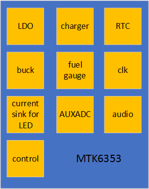
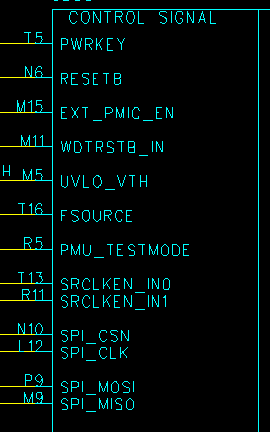
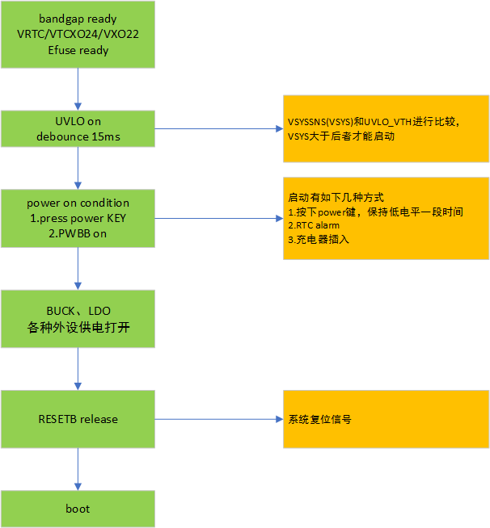
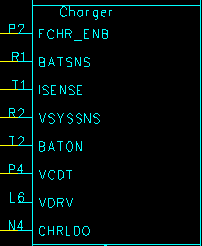
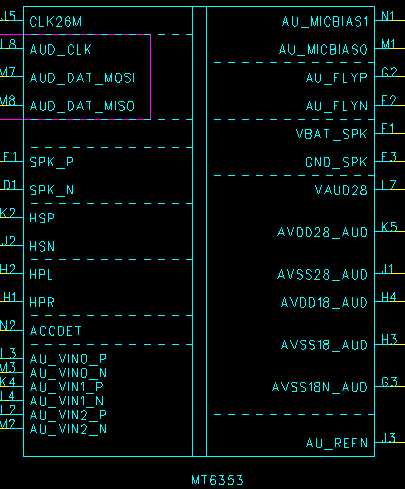
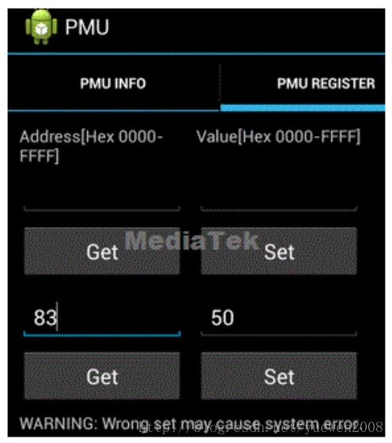

# pmic

## pmic mtk6353 介绍

参考文档 [mtk-pmic](https://www.cnblogs.com/ant-man/p/9199735.html)

简单介绍了mtk6353这颗pmic各部分的功能

### 功能框图

  6353主要由如下几部分组成

  

  | 序号 | 名称|
  |---| ---   |
  | 1 | 电平转换：LDO和buck|
  | 2 | LED驱动current sink|
  | 3 | RTC|
  | 4 | 电压检测AUXADC|
  | 5 | 控制信号：上下电时序，系统复位，异常处理|
  | 6 | 充电控制|
  | 7 | audio codec|
  | 8 | 电量计fuel gauge|

### 各部分介绍

- 电平转换：LDO和buck

  这部分给系统各个模块进行供电，输入输出压差较大、负载电流较大的使用buck电路；压差小，负载小的使用LDO实现。

- 控制信号

  控制信号由如下的control pin组成

  

  | pin名| 描述 |
  |---  | --- |
  | PWRKEY |  power按键 |
  | RESETB |  系统复位信号，power on/off阶段由pmic传给BB端进行复位 |
  | EXT_PMIC_EN |  external PMIC使能信号 |
  | WDTRSTB_IN |  看门狗复位信号 |
  | UVLO_VTH |  under-voltage lockout，系统供电电压小于该值时，pmic将关闭（除了VRTC） |
  | FSOURCE |  EFUSE power source |
  | PMU_TESTMODE |  正常工作时直接接GND |
  | SRCLKEN_IN0/1 |  source clock enable pin |
  | SPI |  spi接口负责BB与PMIC的通讯 |

  power按键启动流程如下：

  

- USB battery charger

  

  | pin名| 描述 |
  |---  | --- |
  | FCHR_ENB |  强制关闭充电 |
  | BATSNS&ISENSE |  充电电流检测 |
  | VSYSSNS |  接系统供电VSYS |
  | BATON |  用于检测电池温度 |
  | VCDT   |  充电电压检测 |
  | VDRV |  充电电流输出驱动 |
  | CHRLDO |  CHRLDO电压输出 |

- 电量计

  

  CS_P/N检测电池GND pin对地电阻上流过的电流，计算电池充放电的电荷量。

- audio

  

  | pin名| 描述 |
  |---  | --- |
  | AUD_CLK/DAT |  mtk专用的audio通讯接口 |
  | SPK_P/N |  芯片内置speak |
  | ACCDET |  耳机插入检测 |
  | AU_VIN0_P/N |  音频信号输入，从MAIN MIC、SUB MIC或者耳机输入 |
  | HPL/R |  耳机左右声道输出 |
  | HSP/N |  听筒输出信号 |
  | AU_MICBIAS0/1 |  MIC的偏置电压，跟MIC的灵敏度相关 |

## pmic寄存器读取与设置

参考文档 [【MTK】pmic寄存器读取与设置](https://blog.csdn.net/yuewen2008/article/details/78330018?utm_source=blogxgwz0)

在产品的调试过程中或者Eservice处理中，经常会遇到读取或者设置pmic寄存器的情况，以下会介绍几种方式，方便大家调试用。

- adb方式

  ```code
  读取0x330的值：
  cd /sys/devices/platform/mt-pmic
  echo 330 > pmic_access
  cat pmic_access //Read 0x330 register value

  将0x330设置为F08:
  echo 330 f08 > pmic_access //Set 0x330 registers by value 0xf08
  cat pmic_access
  ```

  需要注意的是，无论是read还是set命令，user版本均无法使用。有些branch的eng版本，set命令可能也无法生效。所以需要set完之后cat一下，查看设置是否生效。

- APK 方式

  拨号界面使用##3646633##进入工模-》hardware testing-》power-》PMU-》PMU register中

  

- CODE方式：

  该方式可以直接读取寄存器的bit位的值，以读取0x330的bit4~5为例：

  ```code
  //读原型
  pmic_read_interface(unsigned int RegNum, unsigned int *val, unsigned int MASK, unsigned int SHIFT)
  
  //读取的是两个bit，所以 mask 是 11 即 0x3，因为读取的是 bit4~5,所以 shift 是4;
  pmic_read_interface(0x330,&val,0x3,4);


  //写原型
  pmic_config_interface(unsigned int RegNum, unsigned int val, unsigned intMASK, unsigned int SHIFT)

  //直接设置0x330的bit4~5为 10，即0x2：
  pmic_config_interface(0x330,0x2,0x3,4);

  ```

- 总结：

  1.无论是采用哪种方法进行pmic寄存器的设置，都需要在设置后再读取确认是否已写入.尤其是发现寄存器写了，但并没有生效的情况;

  2.无论是调节CV点、还是充电电流、或者LDO/Buck电压，均可查阅相应平台的pmic datesheet来获取寄存器信息，然后按照以上方式进行调试.
