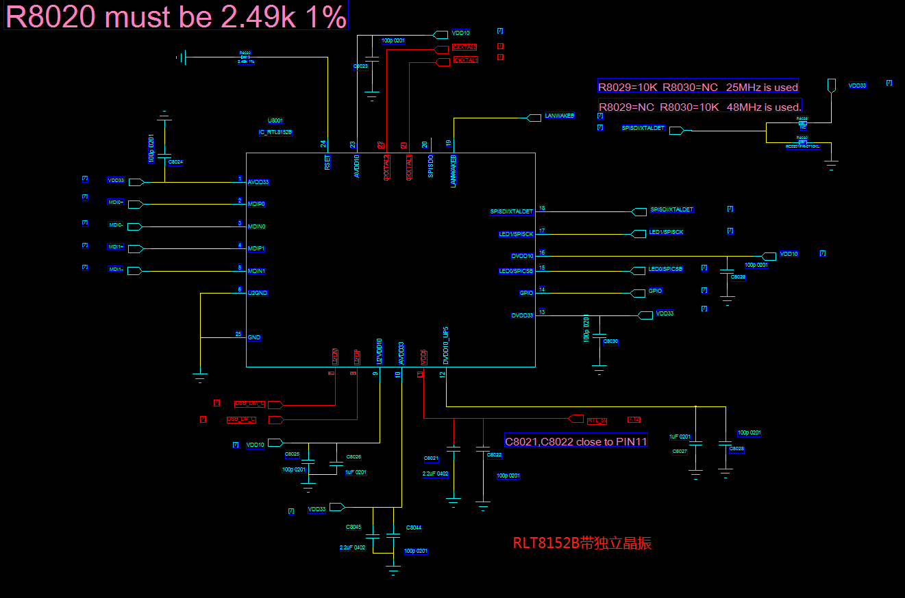
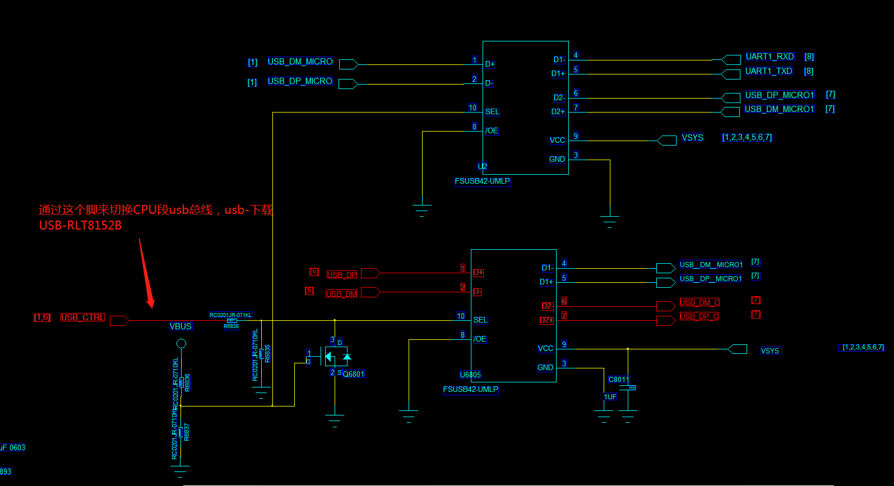
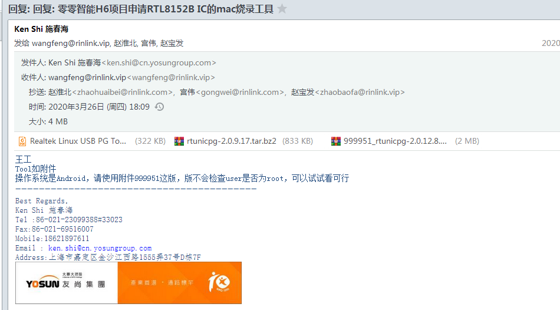

# RTL8152B调试 MTK6739 Android-O

- [RTL8152B调试 MTK6739 Android-O](#rtl8152b调试-mtk6739-android-o)
  - [原理图](#原理图)
  - [官方提供的说明文档](#官方提供的说明文档)
    - [邮件截图](#邮件截图)
  - [代码调试片段](#代码调试片段)
  - [代码移植过程](#代码移植过程)
  - [代码移植包差分包](#代码移植包差分包)
  - [小结](#小结)

## 原理图

通过otg-en脚来输出5V电压给RTL8152B 芯片，通过usb_ctrl脚来控制usb总线切换到usb口还是和RTL8152B通信（MTK平台只支持一个USB口），所以网卡能用usb口就不能用

<div align=left></div>
<div align=left></div>
<div align=left></div>

## 官方提供的说明文档

- [文档 Realtek Linux USB PG Tool User Guide.pdf](./res/Realtek%20Linux%20USB%20PG%20Tool%20User%20Guide.pdf)
- [官网下载驱动移植包 r8152.53.56-2.12.0.tar](./res/r8152.53.56-2.12.0.tar)
- [配置文件烧入mac地址工具 rtunicpg-2.0.9.17.tar.bz2](./res/rtunicpg-2.0.9.17.tar.bz2)
- [配置文件烧入mac地址工具 999951_rtunicpg-2.0.12.8.tar.bz2](./res/999951_rtunicpg-2.0.12.8.tar.bz2)

### 邮件截图  

<div align=left></div>

## 代码调试片段

- 驱动代码移植
  不支持CDC-ECM driver 不能使用mtk平台自带的驱动文件，需要用官网的驱动文件替换掉  

- MTK6739平台宏开关

```makefile
# [Otg]
CONFIG_USB_MTK_OTG=y
CONFIG_USB_MTK_HDRC_HCD=y

# [RJ45 RTL8152B] : poes_lan_rtl8152b  gpio_ctrl
#CONFIG_USB_NET_CDCETHER=n
CONFIG_USB_PEGASUS=y
CONFIG_USB_USBNET=y
CONFIG_USB_RTL8152=y     //这里用了默认系统的宏控
CONFIG_USB_BELKIN=y
CONFIG_USB_ARMLINUX=y
```

- otg代码

```c
; drivers/misc/mediatek/usb20/mt6739/usb20_host.c

 #if CONFIG_MTK_GAUGE_VERSION == 30
-               charger_dev_enable_otg(primary_charger, true);
-               charger_dev_set_boost_current_limit(primary_charger, 1500000);
+               //charger_dev_enable_otg(primary_charger, true);
+               //charger_dev_set_boost_current_limit(primary_charger, 1500000);
 #else
-               set_chr_enable_otg(0x1);
-               set_chr_boost_current_limit(1500);
+               //set_chr_enable_otg(0x1);
+               //set_chr_boost_current_limit(1500);
 #endif
        } else if (!is_on && vbus_on) {
 #if CONFIG_MTK_GAUGE_VERSION == 30
-               charger_dev_enable_otg(primary_charger, false);
+               //charger_dev_enable_otg(primary_charger, false);
 #else
-               set_chr_enable_otg(0x0);
+               //set_chr_enable_otg(0x0);
 #endif

```

## 代码移植过程

1. 将r8152.53.56-2.12.0.tar 解压到drivers/net/usb/ 目录下，替换掉原有的drivers/net/usb/r8152.c 文件
2. 将rtunicpg-2.0.9.17.tar.bz2工具解压到drivers/net/usb/ 目录下，可以将drivers/net/usb/EF8152B.cfg 和 drivers/net/usb/rtunicpg-arm-cortex 编译到系统的可执行目录里
    rtunicpg-arm-cortex 的和EF8152B.cfg这个文件配合使用，参考 “Realtek Linux USB PG Tool User Guide.pdf” 文档。
3. android系统请使用 999951_rtunicpg-2.0.12.8.tar.bz2 文件
4. 调试过程中 adb shell rtunicpg-arm-cortex 命令使用：

```bash
; 查找网卡命令
./rtunicpg-x86_64 /s

返回内容如下：
*************************************************************************
* RTUNicPG - EFUSE/EEPROM/FLASH Programming Utility for
* RTL8152/RTL8153 Family USB FE/GBE Network Adapter
* Version : v1.0.0.15-1
* Copyright (C) Realtek Semiconductor Corp. 2013. All Rights Reserved.
*************************************************************************
0 eth1 VID:0BDA PID:8153 bcdDevice:3000 00:E0:4C:68:00:A2 path:1                //找出来的网卡0
1 eth4 VID:0BDA PID:8152 bcdDevice:2000 00:E0:4C:36:A0:1A path:2                //找出来的网卡1

; 写入网卡mac地址

rtunicpg-x86_64 /# 0 /efuse /nodeid 00E04C360001        //写入网卡0 nodeid mac地址为 00E04C360001
```

rtunicpg-x86_64 工具使用注意事项：

```code
1. USB Ethernet cannot work fine without programing (mac address is needed at least);
2. USB Ethernet can be programmed in windows, linux and android, we provide programming tool for each of the 3 OS;
3. In Linux and android operating system, CDC-ECM driver is enough for USB Ethernet to work , but Realtek driver is
needed for programing;
4. If you want to program LED_SEL_CFG to efuse only, you can mask all the other line value by adding “;” in the front of
each line except LED_SEL_CFG line;
5. All commands should be executed by root user.
```

## 代码移植包差分包

- rtl8152b驱动合入代码 [po_lan_rtl8152b.zip](./res/po_lan_rtl8152b.zip)
- USB_CTRL引脚控制USB切换驱动代码 [gpio_ctrl.zip](./res/gpio_ctrl.zip)

## 小结

android系统是默认就带有mac随机获取的功能，所以不需要按文档里面讲的，不需要对ic进行烧入mac地址，这个需要android工程师使用Ethernet相关API
