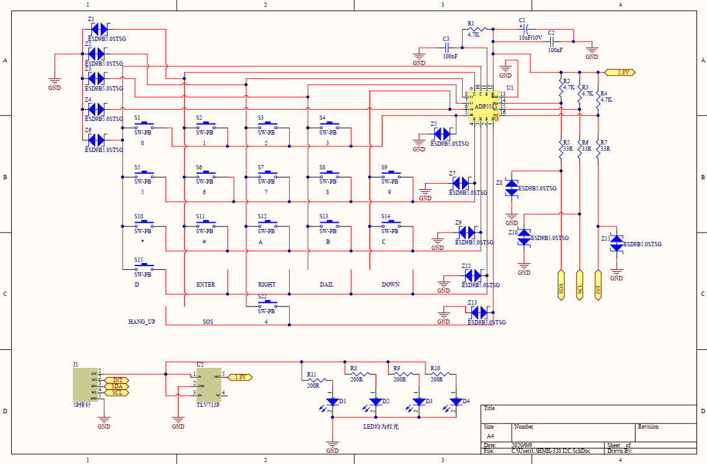

# MTK 6737 adp5585 (ADP5585ACPZ-03-R7) 驱动

## 描述

TM7-plus车载台需要调试一个手咪功能,使用了adp5585的芯片,供应商不提供驱动,互联网驱动只有adp5589这个芯片的,且不适合MTK平台

## 调试资料

[adp5585规格书](./res/ADP5585.pdf)

[手咪原理图1](./res/HMK-320%20I2C.pdf)

[手咪原理图2](./res/HMK-320%20microphone.pdf)

[adp5585官网介绍(参考 https://www.analog.com/en/products/adp5589.html#)](https://www.analog.com/en/products/adp5589.html#)

## 原理图

- 主板原理图

- 手咪原理图

- adp5585按键规格书

## 调试问题

- 使用的芯片是  ADP5585ACPZ-03-R7 使用的i2c的地址是0x30
- 硬件原理图上i2c0总线的上拉需要pmu单独提供
- 互联网上的驱动代码不适合我这里的应用,参考技术支持提供的一个测试demo的程序 uart.c [链接](./res/UART.c)

## 移植代码包

[adp5585驱动代码移植包](./res/adp5585.zip)

## 总结
