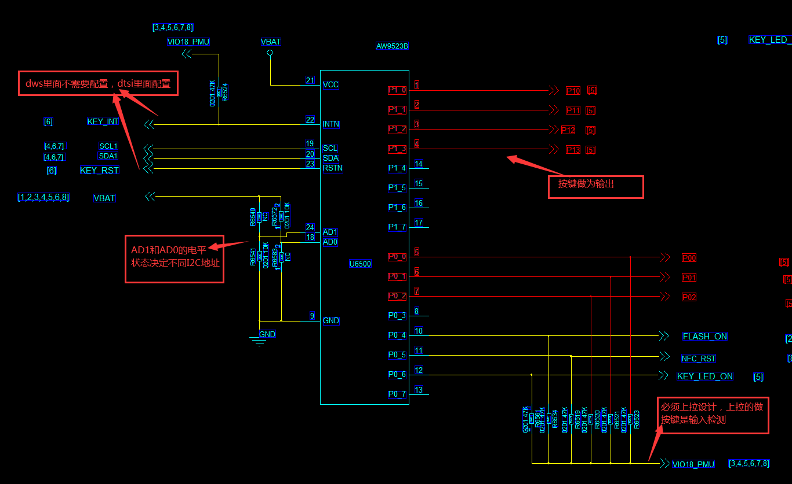

# aw9523b kernel4.4 Porting

Author：  wangfeng
Date：    2020-04-04
Mail：    <237833645@qq.com>

## 移植前准备

- 艾为拿到按键驱动移植代码拿最新的代码包
  AW9523B_Android_Mtk_Matrix_Key_Driver_V1.0-KERNEL4.4

- [艾为移植文档PDF下载](AW9523B_Android_Mtk_Matrix_Key_Driver_V1.0-KERNEL4.4/Document/AW9523B_Matrix_Key_Driver_Porting.pdf)

- [aw9523b datasheet](AW9523B.PDF)

- 查看原理图理解原理
  

## 合入代码注意事项

- 合入驱动时注意dtsi直接在对应的i2c节点下面添加，dws的中断和reset都不需要配置，都在dtsi里面修改

## 项目功能客制化注意事项

- dtsi修改（注：aw9523,input_port_mask = <0x0007>配置了是输入检测的脚 0xff00是P1段、0x00ff是P0段，0x0007就是P0_0、P0_1、P0_2为按键输入检测脚，输入检测的必须是要带有外部1.8v上拉的，P1段就作为按键输出脚，通过扫描方式，配置的时候需要看清原理图）

    ```c
    aw9523_led@59 {  //0x59 是通过规格书和AD1及AD0的定义查询
        compatible = "awinic,aw9523b";
        reg = <0x59>; //addr
        reset-gpio = <&pio 117 0x00>;   //根据硬件复位修改
        irq-gpio = <&pio 118 0x00>;     //根据硬件中断修改
        status = "okay";
        aw9523,key_enable = <1>; //支持按键功能开关
        aw9523,led_enable = <0>; //支持led功能开关
        aw9523,gpio_enable = <1>; //支持gpio功能开关
        aw9523,key {
            aw9523,input_port_mask = <0x0007>; // 0000 0000 0000 0111 Identifies the pin port for the output here: P0_0-P0_2
            aw9523,output_port_mask = <0x0F00>; //0000 1111 0000 0000 Identifies the pin port for the input. here: P1_0-P1_3
        };
        .....
    }
    ```

- 按键值客制化：
  key_map[0]是P0_0脚和P1_0脚对应的按键值
  key_map[1]是P0_0脚和P1_1脚对应的按键值
  key_map[2]是P0_0脚和P1_2脚对应的按键值
  key_map[3]是P0_0脚和P1_3脚对应的按键值
  key_map[4]是P0_1脚和P1_0脚对应的按键值
  key_map[5]是P0_1脚和P1_1脚对应的按键值
  .....
  按照输入检测最小的管脚值为第一个，后面的跟上输出脚从小到大硬件按键对应值

  注意注意:
  >没有接按键的对应角也要按照dtsi配置的输入和输出线补上空按键值
  F12就是补上的没有实际意义，主要是解决软件代码算法一致性，不然按键定义会和算法错乱出现上报按键值不是配置的按键值问题

    ```c
    static KEY_STATE key_map[]={
        //name    code          val
        {"BACK",  KEY_BACK,     0},   //p0_0 ~ p1_0
        {"OK",    KEY_OK,       0},   //P0_0 ~ P1_1
        {"LEFT",  KEY_LEFT,     0},   //p0_0 ~ P1_2
        {"F2",    KEY_F2,       0},   //p0_0 ~ P1_3

        {"MENU",  KEY_MENU,     0},   //p0_1 ~ p1_0
        {"DOWN",  KEY_DOWN,     0},   //P0_1 ~ P1_1
        {"RIGHT", KEY_RIGHT,    0},   //P0_1 ~ P1_2
        {"F12",   KEY_F12,      0},   //F12没有接按键补齐作用

        {"UP",    KEY_UP,       0},   //p0_2 ~ p1_0
        {"F1",    KEY_F1,       0},   //p0_2 ~ p1_1
        {"CAM",   KEY_CAMERA,   0},   //p0_2 ~ p1_2
        {"F12",   KEY_F12,      0},   //F12没有接按键补齐作用
    };
    ```

## 项目调试问题

- [H900_1G-T8]项目

  1. 合入驱动后按按键getevent获取不到任何的按键值上报
      >dtsi里面的input_port_mask和output_port_mask值配置反了导致

  2. 开机后进入界面后重启、抓取log发现是nfc一直重试i2c通讯失败且一直重试
      >nfc的reset脚是通过aw9523b扩展IO来控制的，我们项目nfc功能是先调试好的，在aw9523没有正常工作时，nfc是无法正常工作的、下面代码片段是加入到aw9523里面去控制nfc的（供后续GPIO使用做代码参考）

      ```c
      void aw9523_gpio_p05(int on)
      {
          unsigned char val;

          i2c_read_byte(aw9523_i2c_client,P0_OUTPUT,&val);
          if(on){
              i2c_write_byte(aw9523_i2c_client,P0_OUTPUT, val | 0x20);
          } else {
              i2c_write_byte(aw9523_i2c_client,P0_OUTPUT, val & 0xdf);
          }
      }
      EXPORT_SYMBOL(aw9523_gpio_p05);  
      ```

  3. 按键测试getevent时发现按下一个按键会触发3到4个键值对
      >把按键值和对应的io和FAE沟通，FAE增加修改代码如下，问题解决

      ```c
      input_val &= ~(0x01 << i);

      reg_val[0] = input_val & 0xff;          //加入的代码
      reg_val[1] = (input_val >> 8) & 0xff;   //加入的代码
      i2c_write_multi_byte(p_aw9523->client, P0_CONFIG, reg_val, sizeof(reg_val)/sizeof(reg_val[0]));
      ```
