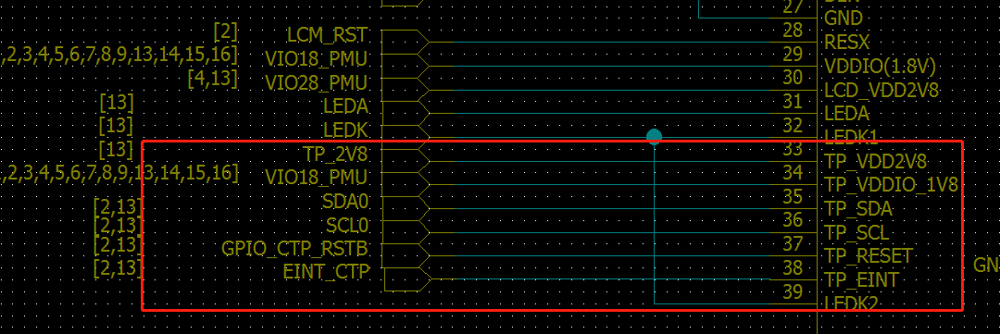
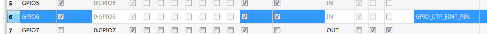
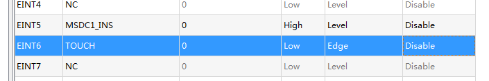
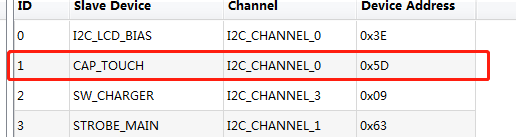
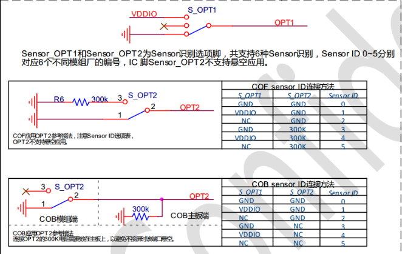
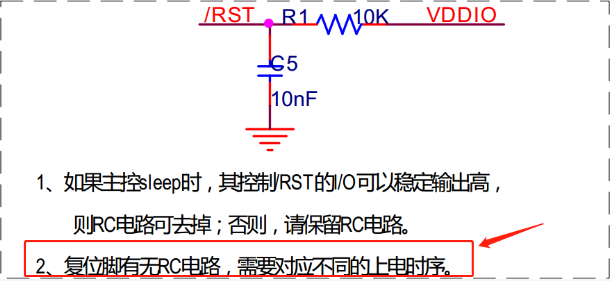
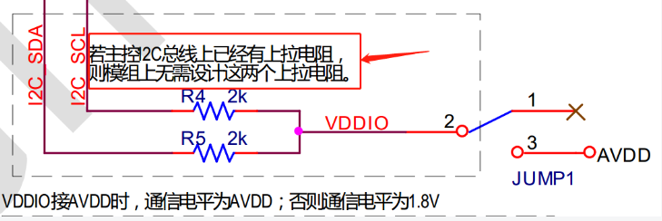
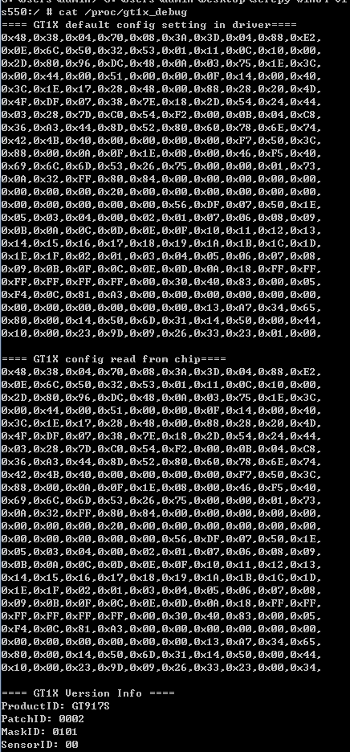

# GOODIX gt917s调试

## 相关资料

- 原理图
- [GT917S_Datasheet_V0.1.pdf](./res/GT917S_Datasheet_V0.1.pdf)
- [GT1X Driver Porting Guide_for_MTK_20160729_Rev.03.pdf](./res/GT1X%20Driver%20Porting%20Guide_for_MTK_20160729_Rev.03.pdf)
- [原厂提供的驱动移植包](./res/GT917S原始驱动移植.zip)

## 点亮调试

### dws配置







### dtsi配置

```code
/* 此dtsi已经验证过是可以不用配置dws直接用dtsi也是可以工作的 */
&i2 c0 {
    cap_touch_mtk:cap_touch@5d {
    compatible = "mediatek,cap_touch";
    reg = <0x5d>;
    status = "okay";
    };
};


touch: touch {
    compatible = "mediatek,mt6739-touch";
    /* VTOUCH-supply = <&mt_pmic_vgp1_ldo_reg>; */
};

&touch {
    interrupt-parent = <&pio>;
    interrupts = <6 IRQ_TYPE_EDGE_FALLING 6 0>;
    status = "okay";
};


/* TOUCH start */

&pio {
    ctp_pins_default: eint0default {
    };
    ctp_pins_eint_as_int: eint@0 {
        pins_cmd_dat {
          pins = <PINMUX_GPIO6__FUNC_GPIO6>;
          slew-rate = <0>;
          bias-disable;
        };
    };
    ctp_pins_eint_output0: eintoutput0 {
        pins_cmd_dat {
          pins = <PINMUX_GPIO6__FUNC_GPIO6>;
          slew-rate = <1>;
          output-low;
        };
    };
    ctp_pins_eint_output1: eintoutput1 {
        pins_cmd_dat {
          pins = <PINMUX_GPIO6__FUNC_GPIO6>;
          slew-rate = <1>;
          output-high;
        };
    };
    ctp_pins_rst_output0: rstoutput0 {
          pins_cmd_dat {
          pins = <PINMUX_GPIO8__FUNC_GPIO8>;
          slew-rate = <1>;
          output-low;
        };
    };
    ctp_pins_rst_output1: rstoutput1 {
          pins_cmd_dat {
            pins = <PINMUX_GPIO8__FUNC_GPIO8>;
            slew-rate = <1>;
            output-high;
        };
    };
    ctp_pins_ldoen_output0: ldoenoutput0 {
          pins_cmd_dat {
            pins = <PINMUX_GPIO106__FUNC_GPIO106>;
            slew-rate = <1>;
            output-low;
        };
    };
    ctp_pins_ldoen_output1: ldoenoutput1 {
          pins_cmd_dat {
            pins = <PINMUX_GPIO106__FUNC_GPIO106>;
            slew-rate = <1>;
            output-high;
        };
    };
};

&touch {
    tpd-resolution = <720 1440>;
    use-tpd-button = <0>;
    tpd-key-num = <3>;
    tpd-key-local= <139 172 158 0>;
    tpd-key-dim-local = <90 883 100 40 230 883 100 40 370 883 100 40 0 0 0 0>;
    tpd-max-touch-num = <5>;
    tpd-filter-enable = <1>;
    tpd-filter-pixel-density = <106>;
    tpd-filter-custom-prameters = <0 0 0 0 0 0 0 0 0 0 0 0>;
    tpd-filter-custom-speed = <0 0 0>;
    pinctrl-names = "default", "state_eint_as_int", "state_eint_output0", "state_eint_output1",
          "state_rst_output0", "state_rst_output1", "state_ldoen_output0", "state_ldoen_output1";
    pinctrl-0 = <&ctp_pins_default>;
    pinctrl-1 = <&ctp_pins_eint_as_int>;
    pinctrl-2 = <&ctp_pins_eint_output0>;
    pinctrl-3 = <&ctp_pins_eint_output1>;
    pinctrl-4 = <&ctp_pins_rst_output0>;
    pinctrl-5 = <&ctp_pins_rst_output1>;
    pinctrl-6 = <&ctp_pins_ldoen_output0>;
    pinctrl-7 = <&ctp_pins_ldoen_output1>;
    status = "okay";
};
/* TOUCH end */


```

## 兼容调试(不同模组厂的相同ic)

- 兼容调试过程

  - Sensor id 需要和模组厂确认OPT1和OPT2的接线方式

    

  - config 文件
    配置参数向模组厂寻要，通过上面的Sensor id方式得出对应代码的GTP_CFG_GROUP[X]，把参数填入对应Sensor id的group表中（此方式只针对没有固化配置到IC的方式）

  - 中断触发方式

    > 当有触摸时， GT917S 每个扫描周期均会通过 INT 脚发出一个下降沿脉冲信号， 通知主 CPU 读取坐标信息

  - 固化配置功能

    > GT917S 支持固化配置功能， 可在芯片 Flash 中保存一组固化类型的参数。 保存了固化类型参数后的 GT917S 只会与主控进行 I2C 通讯， 不会接收主控下发的非固化类型配置。

  - 复位脚RC电路
  
    
  
  - i2c设计
  
    

- 调试问题总结
  - 芯片都是GT917S，模组厂不一样，需要兼容
    GT915S, 不通模组厂兼容方式是通过 sensor id来区分，这样就是在不同的模组厂合入config文件。
    1. 读取模组的sensor id
        > cat /proc/gt1x_debug

    

## 点亮驱动移植包

[S550-GT917S一二供兼容驱动代码](./res/S550-GT917S一二供兼容驱动代码.zip)
