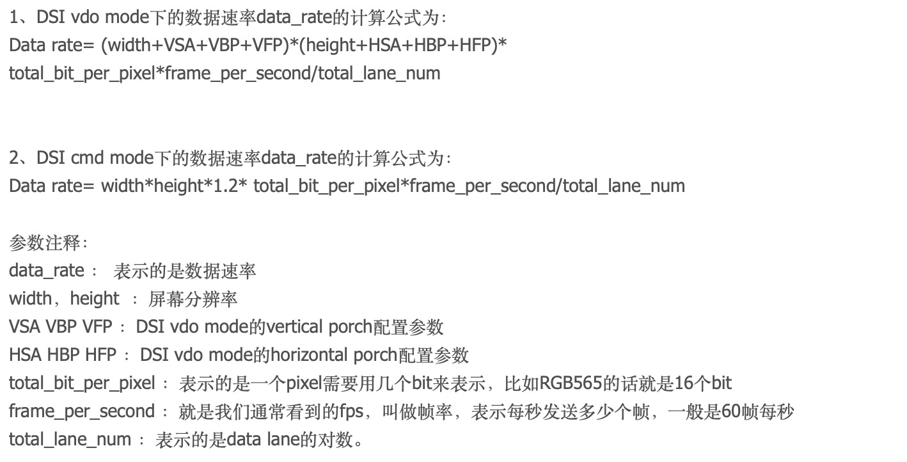
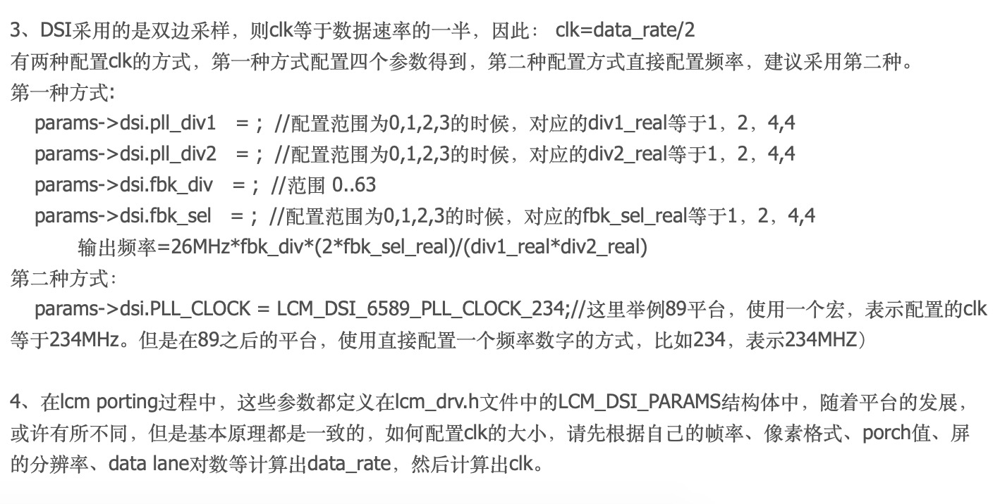
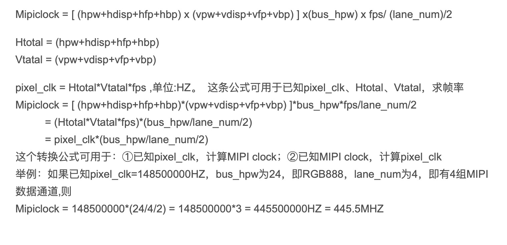

# LCD_MIPI技术总结

## mipi LCD 的CLK时钟频率与显示分辨率及帧率的关系

我们先来看一个公式：

Mipiclock = [ (width+hsync+hfp+hbp) x (height+vsync+vfp+vbp) ] x(bus_width) x fps/ (lane_num)/2

即mipi 屏的传输时钟频率（CLKN,CLKP）等于(屏幕分辨率宽width+hsync+hfp+hbp)x ( 屏幕分辨率高height+vsync+vfp+vbp) x(RGB显示数据宽度) x 帧率/ (lane_num)/2

简单解释下：

      一帧画面需要的数据量为(单位bit)：FRAME_BIT = (屏幕有效显示宽度+hsync+hfp+hbp) x ( 屏幕有效显示高度+vsync+vfp+vbp) x(RGB显示数据宽度24)

     一秒钟内需要传输的数据量为(单位bps)：FRAME_BIT  x  fps（帧率）。

     那为何要除以lane_num----因为mipi通讯协议中，一个CLOCK几个lane是可以同时传输数据的。

     为何又要除以2----因为根据mipi通讯协议，CLK_N、CLK_P这两根时钟线的上升沿/下降沿可以获取到数据。

因此我们可以得出如下结论：

1.在相同的时钟频率下，lane数越多，则单位时间内可以传输的数据越多。若显示帧率固定不变，则可以支持的更大的分辨率；而分辨率固定不变的情况下，则我们可以考虑支持更高的帧率显示。

2.在lane数固定的情况下，提高传输的时钟频率，则单位时间内也可以传输更多的显示数据。进而我们可以考虑是提高帧率还是提高分辨率，或两者做出平衡。

那么我们是否可以任意无限制的提高mipi的传输时钟频率及lane数目呢？mipi通讯协议对此进行了限制，一组CLOCK最高只能支持4组lane,一组lane的传输速度最高只能支持到1 Gbps。也就是说一组CLOCK最高只能支持到4 Gbps速度传输。

此时就引出了一个新问题：4Gbps速度传输，是满足不了现在市场上推出的4K电视的带宽要求的，怎么办？答案是使用8组lane，使用两组clock来传输。

下面我们以展讯7731平台下EK79023这款LCD 驱动IC的配置参数进行实例说明：

```c
static struct timing_rgb lcd_ek79023_mipi_timing = {
         .hfp = 100,  /* unit: pixel */
         .hbp = 60,
         .hsync = 24,
         .vfp = 22, /*unit:line*/
         .vbp = 10,
         .vsync = 2,
};

static struct info_mipi lcd_ek79023_mipi_info = {
         .work_mode  = SPRDFB_MIPI_MODE_VIDEO,
         .video_bus_width =24, /*18,16*/
         .lan_number =         2,
         .phy_feq=660*1000,
         .h_sync_pol =SPRDFB_POLARITY_POS,
         .v_sync_pol = SPRDFB_POLARITY_POS,
         .de_pol =SPRDFB_POLARITY_POS,
         .te_pol =SPRDFB_POLARITY_POS,
         .color_mode_pol =SPRDFB_POLARITY_NEG,
         .shut_down_pol =SPRDFB_POLARITY_NEG,
         .timing =&lcd_ek79023_mipi_timing,
         .ops = NULL,
};

struct panel_spec lcd_ek79023_mipi_spec = {
         .width = 600,
         .height = 1024,
         .fps =57,//62,//67,//52,//57,//60,
         .type =LCD_MODE_DSI,
         .direction =LCD_DIRECT_NORMAL,
         .info = {
                   .mipi =&lcd_ek79023_mipi_info
         },
         .ops =&lcd_ek79023_mipi_operations,
};
```

从中可知，该LCD的分辨率为600 x 1024，帧率为57 HZ。

一帧图像的数据量为：FRAME_BIT=(600+24+100+60) x (1024+2+22+10) x(24)=19907328 bit

一秒钟的数据量为：19907328  x 57 = 1134.717696  Mbps

所需的mipi时钟频率为：1134717696/2(lane)/2= 283.679424 Mhz

一组lane的传输速度是：283.679424  x  2= 576.358848 Mbps

---

## 如何配置DSI时钟频率







---

Excel公式表 ( 此表可以快速计算 )

### mipi 时序配置


而dsi在clock的上升沿和下降沿都会采集数据，所以在计算clock时应为Data Rate的一半，对应前面的420MHz，那么clock应设置为210MHz（注意在计算clock时，clock * 2应比Data Rate稍大）。

表中的CLK Lane Speed 和Data Rate是一个意思, **[ PLL = Data Rate / 2 ]**

参考文档：[https://blog.csdn.net/zuoyioo7/article/details/79021459](https://blog.csdn.net/zuoyioo7/article/details/79021459)

---

### RGB时序配置


[MIPI_Video-mode公式.xls](res/MIPI_Video%20mode公式.xls)

