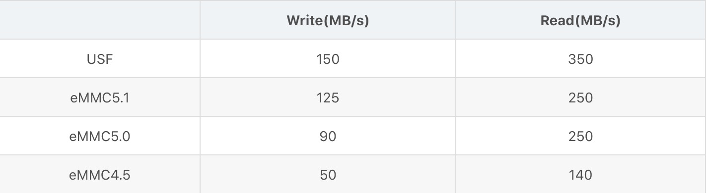
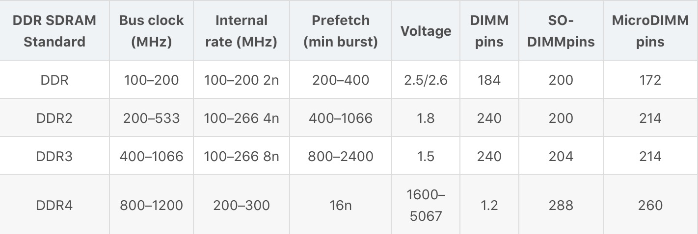
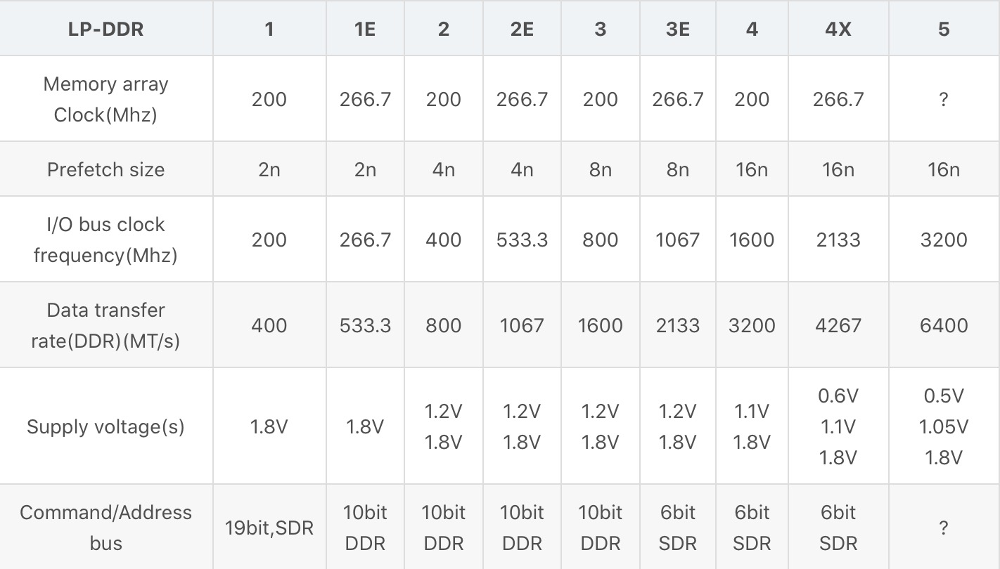
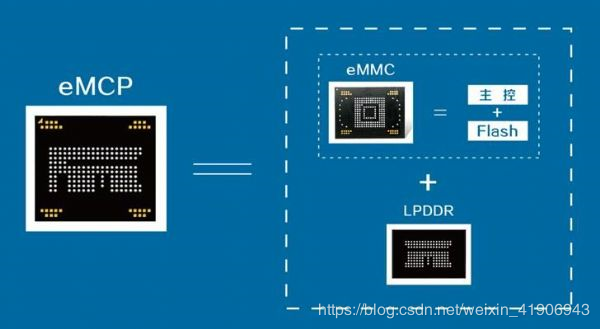

# Memory存储

参考资料：
[eMMC/eMCP将成为移动设备嵌入式存储主导技术](http://blog.fang.com/39645797/16299159/articledetail.htm)

## 术语解析

- [ EMMC ]

由一个嵌入式存储解决方案组成，带有MMC（多媒体卡）接口、快闪存储器设备及主控制器。所有都在一个小型的BGA 封装。接口速度高达每秒400MBytes，eMMC具有快速、可升级的性能。同时其接口电压可以是1.8V或者是3.3V。

- [ DDR(Double Data Rate双倍速率) ]

- [ LPDDR(Low Power Double Data Rate) ]

由于输入/输出接口数据传输速度最高可达3200Mbps，是通常使用的DDR3 DRAM的两倍，新推出的8Gb LPDDR4内存可以支持超高清影像的拍摄和播放,并能持续拍摄2000万像素的高清照片。
与LPDDR3内存芯片相比，LPDDR4的运行电压降为1.1伏，堪称适用于大屏幕智能手机和平板电脑、高性能网络系统的最低功耗存储解决方案。以2GB内存封装为例，比起基于4Gb LPDDR3芯片的2GB内存封装，基于8Gb LPDDR4芯片的2GB内存封装因运行电压的降低和处理速度的提升，最大可节省40%的耗电量。同时，新产品的输入/输出信号传输采用三星独有的低电压摆幅终端逻辑(LVSTL, Low Voltage Swing Terminated Logic)，不仅进一步降低了LPDDR4芯片的耗电量，并使芯片能在低电压下进行高频率运转，实现了电源使用效率的最优化。
由上表格可以看到 LPDDR 相比 DDR 速度更快 功耗更低 但是缺点是 由于电压低没法离cpu太远 走线上比较要求。

- [ EMCP内部结构 ]

## 调试方法

- 查询项目主板BOM对应的memory型号，去MTK网站下载QVL时序文件包，注意要对应好CPU平台及memory的类型【 EMCP、LPDDR2等 】
下载回来的时序将时序文件客制化到preloader的excel表中，注意分区也需要客制化
- 如果MTK网站的QVL中没有查到memory的型号，说明mtk还未认证此memory，可以尝试如下方案解决：
  - 咨询供应商此memory和别的哪颗memory时序、类型相似，到mtk网站下载相似的memory时序
  - 按照mempry容量大小查询mtk默认excel表中其他芯片的时序文件进行对比分析，使用一个最接近的时序，分区也是一样的方式处理
  - 时序文件中分为emmc时序和ddr时序，emmc id可以可以查找对应id使用对应的时序，ddr使用相似的ddr时序

