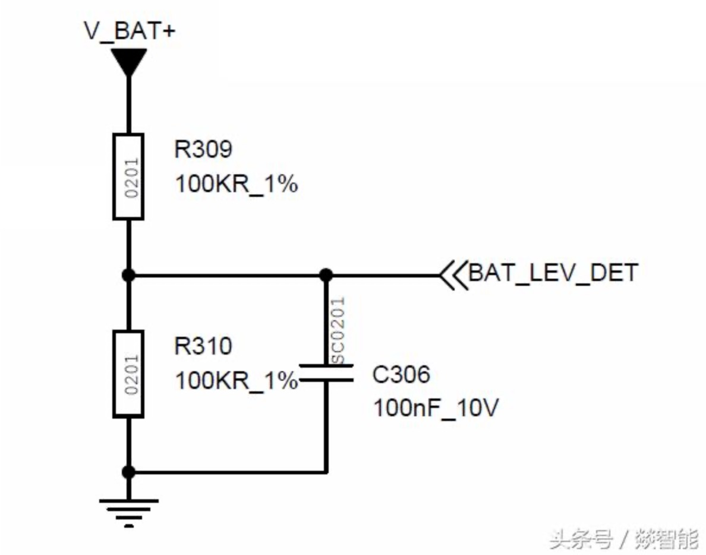

# mtk ADC 采样

## 原理图

图：电池分压后给ADC采样
ADC,Analog-to-Digital Converter，把模拟信号转换成数字信号。
ADC的应用范围很广，麦克风音频数据的采样、电压电流信号的采样、模拟传感器输出的数据的量化等。
受限于精度、量程、采样速度等，GPIO的ADC一般不做太复杂的应用，大部分时候只做电压采集。
如上图，把GPIO口配置成为ADC模式，采集电池电压，用于做电池电量显示。这个做法只适合做简单的电池电压显示，
如果要做类似智能手机的百分之一精度的电池电量管理，还需要外加更高精度的ADC和电池补偿算法。

GPIO做ADC，最常遇到的问题是：

一，不是所有的GPIO口可以做ADC使用，一定要看清楚规格书！

二，ADC有电压域限制的，3V供电的ADC测量不到超过3V的电压。

例如上面第一张图，MCU用3V电池供电，此时GPIO/ADC的供电电压是3V，最大量程也是3V，可以测量到电池电压。

而第二张图锂离子电池电压是4.2V，MCU供电是3V，GPIO/ADC工作电压也是3V，就量不到这么高的电压了。

超出量程测量出来的都是一样的。因此利用电阻分压，把4.2V的电池电压折半降低到2.1V，给3V量程的ADC使用。

## mtk adc驱动代码

[功能开发代码/AUXADC代码.md](./../功能开发代码/AUXADC代码.md)
