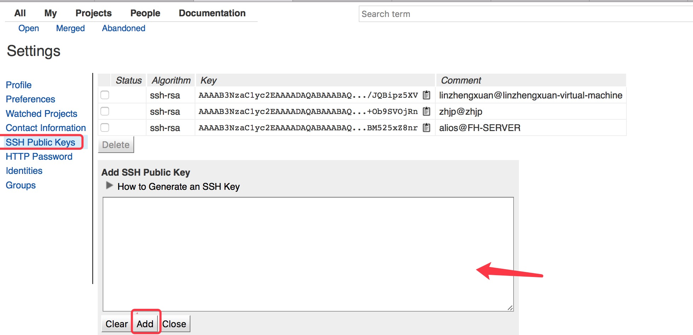

# 阿里文档汇总

## 阿里文档地址

[阿里OS文档连接地址](https://developer.alios.cn/#/md%2Fdevelopercenter%2F%E5%A6%82%E4%BD%95%E8%8E%B7%E5%BE%97%E5%92%8C%E4%BD%BF%E7%94%A8%E6%BA%90%E7%A0%81%2F%E4%BD%BF%E7%94%A8%E6%8C%87%E5%8D%97%2F%E6%90%AD%E5%BB%BA%E7%BC%96%E8%AF%91%E7%8E%AF%E5%A2%83.md?docversion=0)

## Gerrit配置

- 阿里gerrit账号和密码

网页地址  |  <http://gerrit-custom2.yunos.com:8080>
--|--
账号  |  gomtel.zhengxuan.lin
密码  |  gomtel.zhengxuan.lin.9kj7

- 配置gerrit

  - cat ~/.ssh/id_rsa.pub  复制内容粘贴到gerrit账号管理的SSH Public Keys中

    

- 下载repo工具，并将repo工具添加到环境变量（此处不详细介绍）
- 配置ssh-config
  - 查看~/.ssh/config文件是否存在如不存在创建此文件并设置权限为644
  - 添加如下信息到~/.ssh/config文件中：

    ```bash
    Host    gerrit-custom2.yunos.com
    Port    29418
    User    gomtel.zhengxuan.lin
    ```

## 代码库下载地址

- 远程下载repo地址

> repo init -u ssh://gerrit-custom2.yunos.com:29418/repo/yunos/tianmu -b rel_watch_s01_r2_hht_yunospick

- 更新代码 repo sync

- 本地git下载地址（此仓库已经作废)

> git clone git@192.168.1.174:rel_watch_s01_r2_hht_yunospick/base.git

## 代码编译指令

- 配置环境依赖
  - 操作系统:  ubuntu12.04
  - 编译器：   gcc&g++ 4.6
  - ~~配置编译依赖库:~~

    > ~~cd xmake/ ; ./xmake.sh~~
    ~~命令行 选择 300~~

  - 安装nodejs：

    > cd xmake/ ; ./setup_node.sh

- 编译前代码遍历环境配置 (工程名：gomtel_q9 版本类型：user )
    >cd xmake && ./mk_yunos.sh gomtel_q9 user config --enable-cntr-rt=no --enable-cntr-cvg=no --enable-cntr-hal=no --enable-unified-surface=yes --with-permission=no --enable-jsaot=on --enable-closed-source && source xdirs && xmake && xmake image-stripped

- ~~编译 (终端未关闭前提下，都可以使用下面的指令来编译而不需要每次都配置‘编译前代码遍历环境配置’)
    source xdirs && xmake~~

- 编译后生成img目录: prebuilts/images/工程名/

## 代码提交

- 到对应提交的代码仓库目录下使用git提交指令
- push使用下面指令推到gerrit上

    ```bash
    git push extyunos HEAD:refs/for/rel_watch_s01_r2_hht_yunospick
    ```

- 请经常repo sync 更新代码库，保证和阿里代码同步

## 软件下载方式

- 展讯平台下载

    使用展讯ResearchDownload工具下载 pac包地址在编译后生成img目录下面。

    同展讯下载方式

## 阿里系统使用小技巧

- [阿里OS adb下载][5241dcc6]

[5241dcc6]: adb-yunos4.0.tar.gz

- 技巧表单

名称  |  内容
--|--
adb抓取log  | adb -host logctl
adb shell  |  adb -host shell

> 指令调用工程测试模式 | sendlink page://EqcFactoryMode.yunos.com/FactoryList
